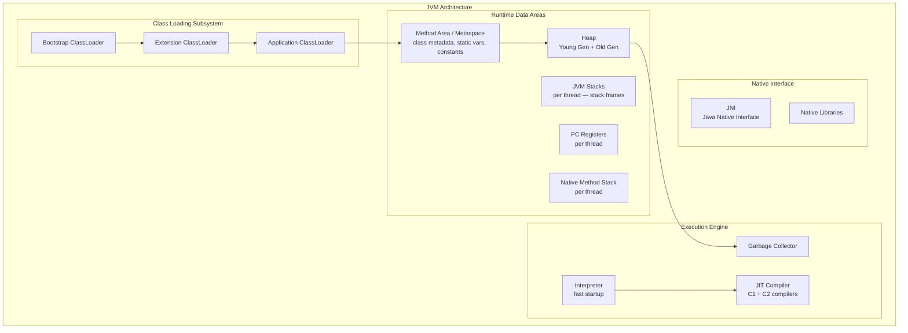
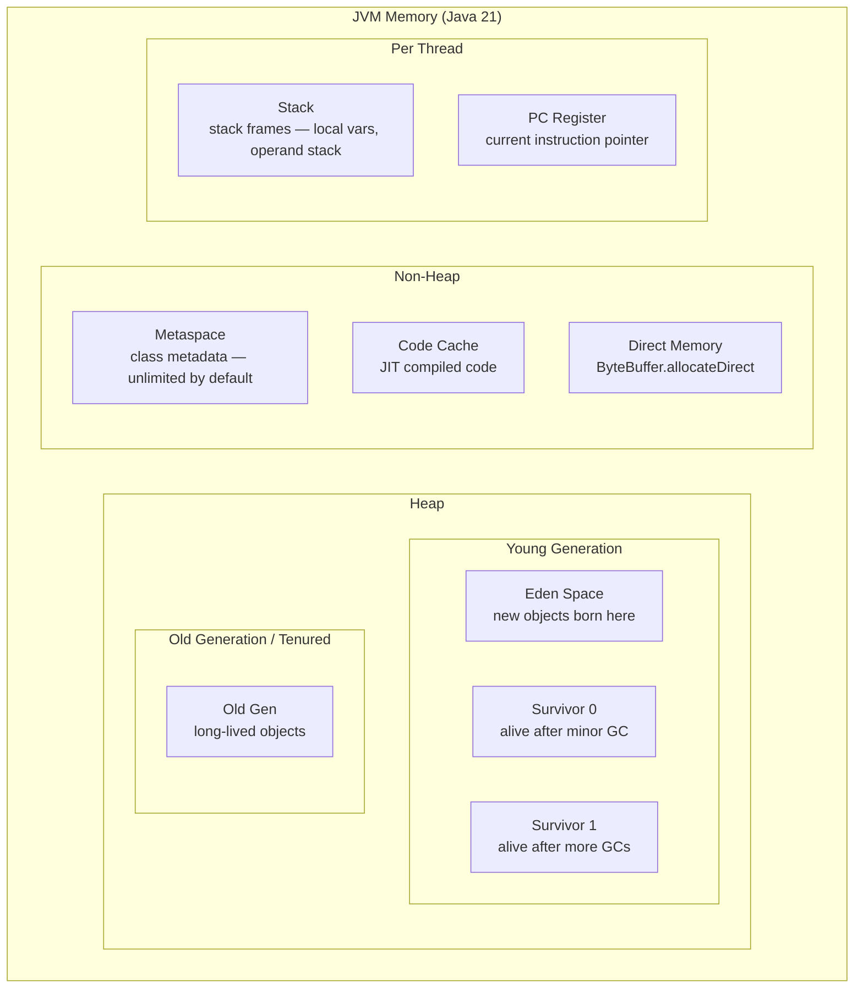

# Section 2: Advanced Java Engineering

## Chapter 5: JVM Internals

### Introduction

The Java Virtual Machine (JVM) is the engine that runs Java programs. Understanding it deeply is what separates a senior Java engineer from a junior one. When your application has memory leaks, GC pauses, or mysterious slowdowns, you need to know how the JVM works to fix them.

The JVM does three main things: loads your class files, verifies they are safe, and executes them efficiently using JIT compilation.

### JVM Architecture Overview



### Class Loading

When you run `java MyApp`, the JVM does not read all classes at once. It loads classes **lazily** — only when they are first needed.

**Class loading happens in three phases:**

**1. Loading** — Read the `.class` file (from filesystem, JAR, network) and create a `Class` object in memory.

**2. Linking** — Three steps:
- **Verification**: Check that bytecode follows JVM spec. Prevents malicious code from corrupting the JVM.
- **Preparation**: Allocate memory for static fields, set them to default values (0, null, false).
- **Resolution**: Replace symbolic references (class names, field names) with direct memory references.

**3. Initialization** — Execute the class's `<clinit>` method (static initializer blocks and static field assignments).

**Parent Delegation Model:**

```java
// When ClassLoader loads "com.example.MyClass":
// 1. Ask parent (Extension ClassLoader) first
// 2. Parent asks ITS parent (Bootstrap ClassLoader)
// 3. Bootstrap tries to load — fails (not in rt.jar)
// 4. Extension tries — fails (not in jre/lib/ext)
// 5. Application ClassLoader loads it from classpath

// This prevents malicious code from replacing java.lang.String
// by loading a fake one before the real one is found
```

**Custom ClassLoader example:**

```java
public class HotReloadClassLoader extends ClassLoader {
    private final Path classDir;

    public HotReloadClassLoader(Path classDir) {
        super(ClassLoader.getSystemClassLoader()); // parent = system
        this.classDir = classDir;
    }

    @Override
    protected Class<?> findClass(String name) throws ClassNotFoundException {
        Path classFile = classDir.resolve(name.replace('.', '/') + ".class");

        if (!Files.exists(classFile)) {
            throw new ClassNotFoundException(name);
        }

        try {
            byte[] bytes = Files.readAllBytes(classFile);
            return defineClass(name, bytes, 0, bytes.length);
        } catch (IOException e) {
            throw new ClassNotFoundException(name, e);
        }
    }
}

// Hot-reload a plugin without restarting the JVM:
HotReloadClassLoader loader = new HotReloadClassLoader(Path.of("/plugins"));
Class<?> pluginClass = loader.loadClass("com.example.plugins.MyPlugin");
Plugin plugin = (Plugin) pluginClass.getDeclaredConstructor().newInstance();
plugin.execute();

// To reload: create a NEW ClassLoader instance
// The old one (and its classes) will be GC'd when no references remain
```

### JVM Memory Layout

Understanding JVM memory is essential for diagnosing memory leaks and GC problems.



**Heap regions:**

- **Eden Space**: Where new objects are allocated. This fills up quickly. When full, a Minor GC runs.
- **Survivor Spaces (S0, S1)**: Objects that survive Minor GC go here. Objects bounce between S0 and S1. After surviving enough GCs (threshold: `MaxTenuringThreshold`, default 15), they are promoted to Old Gen.
- **Old Generation**: Long-lived objects. Collecting this requires a Major GC (more expensive). Full GC collects everything — very expensive.

**Stack Frames:**

Each method call creates a stack frame containing:
- Local variable table
- Operand stack (for computation)
- Reference to the constant pool
- Return address

```java
public int add(int a, int b) { // Frame pushed onto stack
    int result = a + b;        // result stored in local variable table
    return result;             // frame popped, result returned
}
```

**Metaspace** (replaced PermGen in Java 8):
- Stores class metadata (method bytecode, field info, class hierarchy)
- Lives in native memory — not in heap
- Grows automatically (no more `OutOfMemoryError: PermGen space`)
- Limit with `-XX:MaxMetaspaceSize=256m`

### JIT Compilation

The JVM starts by **interpreting** bytecode (fast startup, slow execution). As it runs, it identifies **hot methods** — methods called frequently — and compiles them to native machine code. This is Just-In-Time (JIT) compilation.

**Two JIT compilers:**

- **C1 (Client Compiler)**: Fast compilation, moderate optimization. Good for startup.
- **C2 (Server Compiler)**: Slow compilation, heavy optimization. Good for throughput.

**Tiered compilation** (default since Java 8):
- Level 0: Interpreter
- Level 1-3: C1 with increasing optimization
- Level 4: C2 with full optimization

A method starts at Level 0 and moves up as it gets called more. The JVM uses invocation counters to decide when to compile.

**JIT Optimizations:**
- **Inlining**: Replaces method calls with the method body. Biggest performance win.
- **Escape Analysis**: If an object doesn't leave the method (doesn't escape), allocate it on the stack instead of heap. No GC needed.
- **Loop Unrolling**: Transform `for (i = 0; i < 4; i++)` into four sequential statements.
- **Dead Code Elimination**: Remove code that has no effect.
- **Constant Folding**: Compute `2 * 3` at compile time, not runtime.

**How to see JIT decisions:**
```bash
# Print methods being compiled
java -XX:+PrintCompilation -cp myapp.jar com.example.Main

# Print inlining decisions
java -XX:+PrintInlining -cp myapp.jar com.example.Main

# Disable JIT for comparison (slow!)
java -Xint -cp myapp.jar com.example.Main
```

### Garbage Collection Deep Dive

Garbage collection is the process of finding objects that are no longer reachable and freeing their memory. Understanding GC is critical for low-latency and high-throughput applications.

#### How GC Works: Reachability Analysis

The GC starts from **GC Roots** and follows all object references. Any object not reachable from a GC Root is garbage.

**GC Roots include:**
- Local variables in active stack frames
- Static variables
- JNI references
- Active threads

```
GC Roots ──→ ThreadPool ──→ Task ──→ User ──→ Address
                                    └──→ Order ──→ OrderItem
             (not reachable) ──→ AbandonedObject  ← GARBAGE
```

#### Minor GC (Young Generation)

Young Gen is divided into Eden + two Survivor spaces. Objects are created in Eden. When Eden fills up:

1. Stop all threads (Stop-The-World pause)
2. Mark all live objects in Eden and active Survivor space
3. Copy live objects to empty Survivor space (compact — no fragmentation)
4. Clear Eden and old Survivor space
5. Increment age counter on surviving objects
6. Promote objects with age > `MaxTenuringThreshold` to Old Gen

This is called a **Copying Collector**. It is fast because:
- Only live objects are copied (most objects die young)
- Results in compact memory — no fragmentation
- No need to update old references immediately

#### G1 GC (Default since Java 9)

G1 (Garbage First) divides the heap into equal-sized **regions** (~1-32MB each). Regions can be designated as Eden, Survivor, Old, or Humongous (for large objects).

**Why G1?** It can collect the most "garbage-rich" regions first (hence the name), giving predictable pause times.

```bash
# G1 GC configuration for low-latency backend:
-XX:+UseG1GC
-XX:MaxGCPauseMillis=200        # Target max pause time (default 200ms)
-XX:G1HeapRegionSize=16m        # Region size (1m-32m, power of 2)
-XX:G1NewSizePercent=30         # Min % of heap for young gen
-XX:G1MaxNewSizePercent=60      # Max % of heap for young gen
-XX:InitiatingHeapOccupancyPercent=45  # When to start concurrent marking
```

#### ZGC (Java 15+ production-ready)

ZGC targets sub-millisecond pause times. It achieves this by doing most of its work **concurrently** with the application — GC threads run while your application threads run.

**Key technique: Load Barriers**

When your code reads an object reference, ZGC inserts a tiny check (the load barrier). If GC is moving that object, the barrier fixes the reference before returning it. This means relocating objects does not require stopping the world.

**ZGC configuration:**
```bash
-XX:+UseZGC
-XX:ZCollectionInterval=5           # GC every 5 seconds minimum
-XX:ZFragmentationLimit=25          # Compact if fragmentation > 25%
-XX:SoftMaxHeapSize=28g             # Soft limit — ZGC tries to stay under this
-Xmx32g                              # Hard limit
```

#### Shenandoah GC

Similar goal to ZGC — sub-millisecond pauses. Different approach: instead of relocating then fixing references, Shenandoah uses **forwarding pointers** and a **Brooks pointer** (an extra word in each object header) that points to the new location.

```bash
-XX:+UseShenandoahGC
-XX:ShenandoahGCHeuristics=adaptive  # Let JVM decide when to GC
```

#### Choosing the Right GC

| GC | Java Version | Pause Target | Throughput | Best For |
|---|---|---|---|---|
| Serial GC | All | High | Low | Single-core, small apps |
| Parallel GC | All | High | Highest | Batch processing |
| G1 GC | 9+ (default) | ~200ms | Good | Most applications |
| ZGC | 15+ | <1ms | Good | Low latency, large heaps |
| Shenandoah | 12+ | <1ms | Good | Low latency |

#### GC Tuning Example

```bash
# Production Spring Boot service — G1GC, low latency
java \
  -Xms4g -Xmx4g \                     # Fixed heap (same min/max avoids resize cost)
  -XX:+UseG1GC \
  -XX:MaxGCPauseMillis=100 \           # Target 100ms max pause
  -XX:G1HeapRegionSize=16m \
  -XX:G1NewSizePercent=40 \
  -XX:G1MaxNewSizePercent=60 \
  -XX:+G1UseAdaptiveIHOP \            # Adaptive concurrent marking trigger
  -XX:+AlwaysPreTouch \               # Touch all memory pages at startup
  -XX:+DisableExplicitGC \            # Ignore System.gc() calls
  -XX:+ExitOnOutOfMemoryError \       # Crash fast — don't limp along OOM
  -XX:+HeapDumpOnOutOfMemoryError \   # Dump heap for analysis
  -XX:HeapDumpPath=/var/dumps/ \
  -Xlog:gc*:file=/var/log/gc.log:time,uptime,level,tags:filecount=5,filesize=20m \
  -jar myapp.jar
```

### Memory Leak Detection

Memory leaks in Java happen when objects are referenced but never used again. The GC cannot collect them because they are still reachable.

**Common causes:**

**1. Static collections that grow unbounded:**
```java
// LEAK — this map lives forever
public class UserSession {
    private static final Map<String, Session> sessions = new HashMap<>();

    public static void put(String token, Session session) {
        sessions.put(token, session); // never removed!
    }
}
```

**2. Listeners not removed:**
```java
// LEAK — listener holds reference to button, button holds reference to listener
button.addActionListener(new ActionListener() {
    @Override
    public void actionPerformed(ActionEvent e) {
        // 'this' captures outer class reference — might prevent GC
    }
});
// Fix: remove listener when done, or use WeakReference
```

**3. ThreadLocal not cleaned:**
```java
// LEAK — thread pool threads live forever, so do their ThreadLocals
private static final ThreadLocal<HeavyObject> local = new ThreadLocal<>();

public void handleRequest() {
    local.set(new HeavyObject());
    try {
        // use it
    } finally {
        local.remove(); // ALWAYS remove in finally block
    }
}
```

**4. Caches without eviction:**
```java
// LEAK — grows forever
private final Map<String, ComputedValue> cache = new HashMap<>();

// Fix 1: Use WeakHashMap (evicted when key has no strong references)
private final Map<String, ComputedValue> cache = new WeakHashMap<>();

// Fix 2: Use Caffeine with expiry
private final Cache<String, ComputedValue> cache = Caffeine.newBuilder()
    .maximumSize(10_000)
    .expireAfterAccess(Duration.ofMinutes(10))
    .build();
```

**Detecting leaks with tools:**

```bash
# Take a heap dump
jmap -dump:format=b,file=/tmp/heap.hprof $(jps | grep MyApp | cut -d' ' -f1)

# Or trigger via JVM flag (auto-dump on OOM):
-XX:+HeapDumpOnOutOfMemoryError -XX:HeapDumpPath=/var/dumps/

# Analyze with Eclipse MAT or VisualVM
# Look for: Retained Heap, Dominator Tree, Leak Suspects Report
```

### Java Profiling

Profiling tells you WHERE your application spends time and memory.

**async-profiler (production-safe, low overhead):**
```bash
# Start profiling
java -agentpath:/path/to/libasyncProfiler.so=start,event=cpu,file=/tmp/profile.html \
     -jar myapp.jar

# Or attach to running process
./profiler.sh start -e cpu 12345
./profiler.sh stop -f /tmp/flame.html 12345
```

**JFR (Java Flight Recorder — built into JDK 11+):**
```bash
# Start JFR recording
jcmd <pid> JFR.start duration=60s filename=/tmp/recording.jfr settings=profile

# Analyze with JDK Mission Control (JMC):
jmc &
```

**Reading a Flame Graph:**
- X-axis: alphabetical, not time — width shows how often that method was on the stack
- Y-axis: call stack depth
- Wide plateaus = bottlenecks — methods consuming the most CPU

### JVM Flags Cheat Sheet

```bash
# ── Memory ────────────────────────────────────────────
-Xms4g                    # Initial heap size
-Xmx4g                    # Maximum heap size
-Xss512k                  # Thread stack size (default 512k-1m)
-XX:MetaspaceSize=256m    # Initial metaspace size
-XX:MaxMetaspaceSize=512m # Max metaspace size
-XX:MaxDirectMemorySize=1g # Max direct (off-heap) memory

# ── GC ────────────────────────────────────────────────
-XX:+UseG1GC              # G1 GC
-XX:+UseZGC               # ZGC
-XX:+UseShenandoahGC      # Shenandoah
-XX:MaxGCPauseMillis=200  # G1 pause target

# ── Logging ───────────────────────────────────────────
-Xlog:gc*:file=/var/log/gc.log:time,uptime,level,tags

# ── JIT ───────────────────────────────────────────────
-XX:+PrintCompilation     # Print compiled methods
-XX:+TieredCompilation    # Tiered compilation (default)
-XX:CompileThreshold=10000 # Invocations before JIT (default)

# ── Crash handling ─────────────────────────────────────
-XX:+ExitOnOutOfMemoryError
-XX:+HeapDumpOnOutOfMemoryError
-XX:HeapDumpPath=/var/dumps/
-XX:ErrorFile=/var/log/hs_err.log

# ── Performance ───────────────────────────────────────
-XX:+AlwaysPreTouch       # Pre-touch all heap pages at startup
-XX:+DisableExplicitGC    # Ignore System.gc()
-XX:+UseStringDeduplication # Deduplicate String objects (G1 only)
```

### Interview Questions

**Q: Explain the difference between Young Gen and Old Gen. Why do we have separate generations?**

A: Most objects die young — they are created for a single request and then become garbage. By keeping newly created objects in a small "Young Gen" region, we can collect them quickly without scanning the entire heap. Young Gen collection (Minor GC) is fast because only live objects are copied (usually a small fraction). Objects that survive many Minor GCs are promoted to Old Gen. Old Gen is collected less frequently but takes longer because it is larger.

**Q: What is Stop-The-World and why does it happen?**

A: Stop-The-World (STW) is when the JVM pauses all application threads to do GC work. It happens because if application threads modify object references while the GC is scanning them, the GC could miss live objects (causing data corruption) or think dead objects are alive. Modern GCs like ZGC and Shenandoah minimize STW pauses by doing most work concurrently, but they still need brief STW pauses for some phases.

**Q: What is the difference between `-Xms` and `-Xmx`? Should they be equal?**

A: `-Xms` is the initial heap size (JVM requests this from the OS at startup). `-Xmx` is the maximum heap size. Setting them equal avoids heap resize cost during runtime — the JVM requests all memory upfront and never resizes. This is recommended for server applications that need predictable performance. The downside is you "waste" memory if the app never reaches its maximum heap usage.

**Q: How does escape analysis help performance?**

A: Escape analysis detects when an object is only used within a single method and does not "escape" to other threads or methods. In that case, the JVM can allocate the object on the stack instead of the heap. Stack allocations are fast (just move the stack pointer), require no GC, and improve cache locality. This is why small, short-lived value objects in Java can be as fast as C++ in practice.

---

## Chapter 6: Java Memory Model and Concurrency

### The Java Memory Model

The Java Memory Model (JMM) defines how threads interact through memory. Without it, the JVM and CPU are free to reorder instructions and cache values — making multi-threaded code unpredictable.

**The core problem: visibility and ordering**

```java
// Thread 1
boolean ready = false;
int value = 0;

// Thread 2 writes:
value = 42;
ready = true;   // Compiler/CPU might reorder this BEFORE value = 42!

// Thread 1 reads:
if (ready) {
    System.out.println(value); // might print 0, not 42!
}
```

This is NOT a bug in code — it is the hardware working as designed. CPUs reorder instructions for performance. The JMM provides a contract: **if you follow the rules, the JVM guarantees visibility.**

### Happens-Before Relationship

The JMM uses **happens-before** (HB) as its correctness guarantee. If action A happens-before action B, then all effects of A are visible to B.

**Happens-before rules:**

1. **Program order rule**: Within a single thread, each action HB the next action in that thread.
2. **Monitor lock rule**: Unlocking a lock HB every subsequent lock of the same lock.
3. **Volatile variable rule**: Writing to a volatile field HB every subsequent read of that field.
4. **Thread start rule**: `Thread.start()` HB every action in the new thread.
5. **Thread termination rule**: Every action in a thread HB detection of that thread's termination.
6. **Transitivity**: If A HB B and B HB C, then A HB C.

### Volatile

`volatile` is the lightest synchronization mechanism. It guarantees visibility but NOT atomicity.

```java
// Safe: boolean flag shared between threads
private volatile boolean running = true;

// Thread 1 (producer):
public void shutdown() {
    running = false; // immediately visible to all threads
}

// Thread 2 (consumer):
public void run() {
    while (running) { // always reads fresh value
        process();
    }
}

// NOT safe for compound operations:
private volatile int counter = 0;

// Thread 1:
counter++;  // This is read-modify-write: NOT atomic!
            // Even with volatile, two threads can both read 0,
            // both increment to 1, and both write 1. Lost update!
```

### Synchronized

`synchronized` provides mutual exclusion AND memory visibility.

```java
public class SafeCounter {
    private int count = 0;
    private final Object lock = new Object(); // explicit lock object

    public void increment() {
        synchronized (lock) {
            count++; // Only one thread at a time
        }
    }

    public int get() {
        synchronized (lock) {
            return count; // Guaranteed to see latest value
        }
    }
}
```

**Common mistake: synchronizing on the wrong object:**
```java
// BAD — each call creates a new String, so locking on different objects
public void processItem(String itemId) {
    synchronized (itemId) { // WRONG — String interning makes this unreliable
        process(itemId);
    }
}

// GOOD — use a dedicated lock object per item
private final ConcurrentHashMap<String, Object> locks = new ConcurrentHashMap<>();

public void processItem(String itemId) {
    Object lock = locks.computeIfAbsent(itemId, k -> new Object());
    synchronized (lock) {
        process(itemId);
    }
}
```

### java.util.concurrent

Modern Java concurrent code should use `java.util.concurrent` (j.u.c) instead of raw `synchronized`.

**ReentrantLock:**
```java
public class OrderProcessor {
    private final ReentrantLock lock = new ReentrantLock(true); // fair lock

    public boolean tryProcess(Order order, long timeoutMs) {
        try {
            // Try to acquire lock — don't wait forever
            if (!lock.tryLock(timeoutMs, TimeUnit.MILLISECONDS)) {
                return false; // Lock not available
            }
            try {
                // critical section
                processInternal(order);
                return true;
            } finally {
                lock.unlock(); // ALWAYS unlock in finally
            }
        } catch (InterruptedException e) {
            Thread.currentThread().interrupt();
            return false;
        }
    }
}
```

**ReadWriteLock — maximize concurrency for read-heavy data:**
```java
public class PricingCache {
    private final Map<String, Price> cache = new HashMap<>();
    private final ReadWriteLock rwLock = new ReentrantReadWriteLock();
    private final Lock readLock = rwLock.readLock();
    private final Lock writeLock = rwLock.writeLock();

    public Price getPrice(String productId) {
        readLock.lock();    // Multiple readers allowed simultaneously
        try {
            return cache.get(productId);
        } finally {
            readLock.unlock();
        }
    }

    public void updatePrice(String productId, Price newPrice) {
        writeLock.lock();   // Exclusive — blocks all readers and other writers
        try {
            cache.put(productId, newPrice);
        } finally {
            writeLock.unlock();
        }
    }
}
```

**StampedLock (Java 8+ — optimistic reads):**
```java
public class PositionTracker {
    private double x, y;
    private final StampedLock lock = new StampedLock();

    public void update(double x, double y) {
        long stamp = lock.writeLock();
        try {
            this.x = x;
            this.y = y;
        } finally {
            lock.unlockWrite(stamp);
        }
    }

    public double[] position() {
        // Try optimistic read first (no locking — fastest path)
        long stamp = lock.tryOptimisticRead();
        double x = this.x;
        double y = this.y;

        // Validate: check if a write happened during our read
        if (!lock.validate(stamp)) {
            // Write happened — fall back to real read lock
            stamp = lock.readLock();
            try {
                x = this.x;
                y = this.y;
            } finally {
                lock.unlockRead(stamp);
            }
        }

        return new double[]{x, y};
    }
}
```

### Atomic Classes

Atomic classes use hardware-level CAS (Compare-And-Swap) operations — faster than locks for simple operations.

```java
// AtomicInteger — thread-safe counter without locks
private final AtomicInteger requestCount = new AtomicInteger(0);

public void recordRequest() {
    requestCount.incrementAndGet(); // atomic, no lock
}

// AtomicReference — thread-safe reference update
private final AtomicReference<Config> currentConfig = new AtomicReference<>(defaultConfig);

public void updateConfig(Config newConfig) {
    currentConfig.set(newConfig); // atomic swap
}

// CAS-based conditional update
public boolean reserveTicket(String ticketId) {
    AtomicReference<TicketStatus> statusRef = tickets.get(ticketId);
    TicketStatus expected = TicketStatus.AVAILABLE;
    TicketStatus reserved = TicketStatus.RESERVED;
    return statusRef.compareAndSet(expected, reserved); // atomic CAS
}

// LongAdder — better than AtomicLong for high-contention counters
private final LongAdder hitCount = new LongAdder();

public void recordCacheHit() {
    hitCount.increment(); // internally shards to reduce contention
}

public long getHitCount() {
    return hitCount.sum();
}
```

### Interview Questions

**Q: What is the difference between `volatile` and `synchronized`?**

A: Both establish happens-before relationships, but `synchronized` also provides mutual exclusion. `volatile` guarantees that reads always see the latest write — it ensures visibility. But it does not make compound operations atomic. `synchronized` blocks guarantee that only one thread executes the critical section at a time AND establishes memory visibility. Use `volatile` for simple boolean flags. Use `synchronized` (or `ReentrantLock`) when you need atomicity across multiple operations.

**Q: What is a deadlock and how do you prevent it?**

A: A deadlock happens when thread A holds lock 1 and waits for lock 2, while thread B holds lock 2 and waits for lock 1. Both wait forever. Prevention strategies: (1) Lock ordering — always acquire locks in the same order. (2) Lock timeout — use `tryLock(timeout)` and retry. (3) Detect and recover — use a watchdog thread that detects deadlock and interrupts threads. (4) Avoid holding multiple locks — redesign to need only one lock at a time.

**Q: What is the ABA problem in CAS operations?**

A: A thread reads value A. Before it does CAS(A → C), another thread changes the value: A → B → A. The first thread's CAS succeeds because the value is A again, but the world has changed. In financial systems, this can cause serious bugs. Solution: `AtomicStampedReference` — add a version stamp. CAS checks both value and version, so A(v1) → B(v2) → A(v3) — the version prevents the false success.

---
