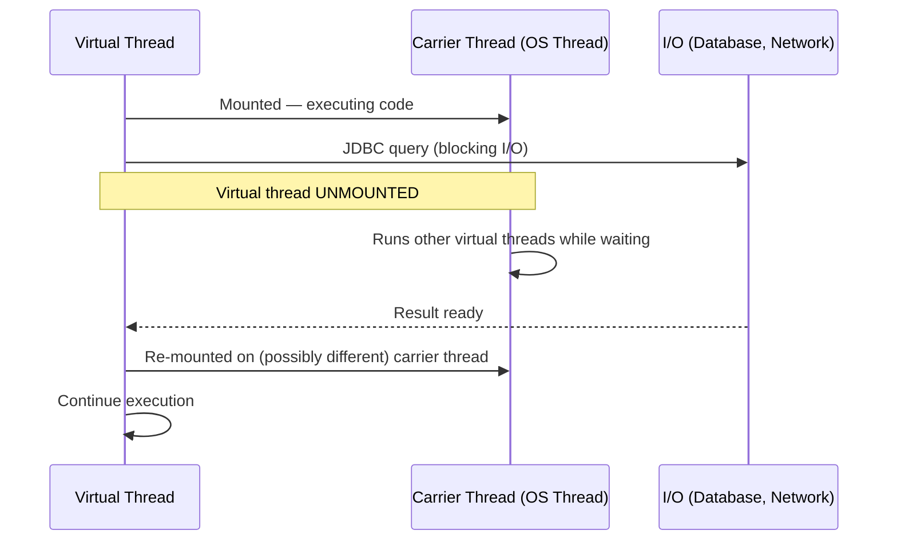

# Chapter 7: Threading, ExecutorService, and Virtual Threads

## ExecutorService and Thread Pools

Raw `Thread` objects are expensive. Creating a thread allocates a native OS thread (typically 512KB-1MB of stack), and OS thread scheduling is costly. Thread pools reuse threads — instead of creating a new thread per task, tasks are queued and executed by a fixed pool of threads.

### Thread Pool Types

```java
// ── Fixed Thread Pool ──────────────────────────────────────
// Best for: CPU-bound work where you know the parallelism level
ExecutorService cpuPool = Executors.newFixedThreadPool(
    Runtime.getRuntime().availableProcessors()
);

// ── Cached Thread Pool ─────────────────────────────────────
// Creates threads on demand, reuses idle ones, removes them after 60s
// DANGER: Can create thousands of threads under load — causes OOM
// Never use in production for unbounded workloads
ExecutorService unboundedPool = Executors.newCachedThreadPool();

// ── Scheduled Thread Pool ──────────────────────────────────
ScheduledExecutorService scheduler = Executors.newScheduledThreadPool(4);
scheduler.scheduleAtFixedRate(this::sendHealthCheck, 0, 30, TimeUnit.SECONDS);

// ── Production-grade: Custom ThreadPoolExecutor ────────────
ThreadPoolExecutor executor = new ThreadPoolExecutor(
    10,                              // corePoolSize: always-alive threads
    50,                              // maximumPoolSize: max under load
    60L, TimeUnit.SECONDS,           // keepAliveTime: idle thread lifetime
    new LinkedBlockingQueue<>(1000), // bounded queue — prevents OOM
    new ThreadFactory() {
        private final AtomicInteger counter = new AtomicInteger();
        @Override
        public Thread newThread(Runnable r) {
            Thread t = new Thread(r);
            t.setName("order-processor-" + counter.getAndIncrement());
            t.setDaemon(false); // non-daemon — JVM won't exit until done
            t.setUncaughtExceptionHandler((thread, ex) ->
                log.error("Uncaught exception in {}", thread.getName(), ex));
            return t;
        }
    },
    new ThreadPoolExecutor.CallerRunsPolicy() // backpressure: caller runs task
    // Alternatives:
    // AbortPolicy    — throw RejectedExecutionException (default)
    // DiscardPolicy  — silently discard
    // DiscardOldestPolicy — discard oldest queued task
);
```

### CompletableFuture

`CompletableFuture` is Java's way to write asynchronous, non-blocking code.

```java
@Service
public class OrderFulfillmentService {

    // Compose async operations
    public CompletableFuture<FulfillmentResult> fulfillOrder(String orderId) {
        return findOrder(orderId)
            .thenCompose(order -> validateInventory(order))       // flat-map
            .thenCompose(order -> reserveInventory(order))
            .thenCompose(order -> initiateShipping(order))
            .thenApply(shipment -> FulfillmentResult.success(shipment))  // map
            .exceptionally(ex -> {
                log.error("Fulfillment failed for order {}: {}", orderId, ex.getMessage());
                return FulfillmentResult.failure(ex.getMessage());
            });
    }

    // Run two operations in parallel, combine results
    public CompletableFuture<EnrichedOrder> enrichOrder(String orderId) {
        CompletableFuture<Order> orderFuture = findOrder(orderId);
        CompletableFuture<Customer> customerFuture = orderFuture
            .thenCompose(o -> findCustomer(o.getCustomerId()));
        CompletableFuture<List<Product>> productsFuture = orderFuture
            .thenCompose(o -> fetchProducts(o.getProductIds()));

        // Wait for both customer and products (after order is loaded)
        return orderFuture.thenCombine(
            customerFuture.thenCombine(productsFuture, EnrichedOrder.CustomerAndProducts::new),
            (order, customerAndProducts) ->
                EnrichedOrder.of(order, customerAndProducts.customer(), customerAndProducts.products())
        );
    }

    // Wait for all futures — aggregate results
    public CompletableFuture<List<Price>> getPricesForAllProducts(List<String> productIds) {
        List<CompletableFuture<Price>> futures = productIds.stream()
            .map(this::fetchPrice)
            .collect(Collectors.toList());

        return CompletableFuture.allOf(futures.toArray(new CompletableFuture[0]))
            .thenApply(v -> futures.stream()
                .map(CompletableFuture::join)
                .collect(Collectors.toList()));
    }

    // Timeout handling
    public CompletableFuture<Inventory> checkInventoryWithTimeout(String productId) {
        return inventoryService.check(productId)
            .orTimeout(500, TimeUnit.MILLISECONDS)      // fail after 500ms
            .exceptionally(ex -> {
                if (ex instanceof TimeoutException) {
                    return Inventory.unknown(productId); // fallback for timeout
                }
                throw new CompletionException(ex);
            });
    }

    // Custom executor — control which thread pool handles each stage
    public CompletableFuture<Report> generateReport(ReportRequest req) {
        return CompletableFuture
            .supplyAsync(() -> fetchData(req), ioPool)          // I/O thread pool
            .thenApplyAsync(data -> processData(data), cpuPool)  // CPU thread pool
            .thenApplyAsync(result -> formatReport(result), ioPool); // I/O for serialization
    }
}
```

### Virtual Threads (Project Loom — Java 21)

Virtual threads are a game-changer. They are lightweight threads managed by the JVM, not the OS. You can create **millions** of them without memory issues.

**Why virtual threads exist:**

Traditional platform threads are expensive:
- Each needs ~1MB of stack memory
- OS context-switching is expensive (~1-10 microseconds)
- A server with 50K concurrent requests needs 50K threads — not practical

Virtual threads solve this:
- Live in JVM heap — much smaller (a few KB each)
- JVM scheduler mounts/unmounts them on carrier threads (OS threads)
- When a virtual thread blocks (I/O, sleep), it unmounts — the carrier thread is freed to run another virtual thread



**Virtual threads in Java 21:**

```java
// Simple: create a virtual thread
Thread vt = Thread.ofVirtual().start(() -> {
    System.out.println("Running in: " + Thread.currentThread());
    // Block without issues — JVM handles it
    Thread.sleep(Duration.ofMillis(100));
});

// ExecutorService with virtual threads
ExecutorService vtExecutor = Executors.newVirtualThreadPerTaskExecutor();

// Every task gets its own virtual thread — no pooling needed
// You can have millions of them
for (int i = 0; i < 1_000_000; i++) {
    vtExecutor.submit(() -> processRequest());
}

// Spring Boot 3.2+ — enable virtual threads for Tomcat
// application.yml:
// spring.threads.virtual.enabled: true
// That's it. Spring handles the rest.
```

**Real-world example — database per-request threading:**

```java
// Old model: thread pool with 200 threads — 200 concurrent requests max
@Bean
public DataSource dataSource() {
    HikariConfig config = new HikariConfig();
    config.setMaximumPoolSize(200); // limited by thread pool
    return new HikariDataSource(config);
}

// New model: virtual threads — connection pool is the bottleneck, not threads
@Bean
public DataSource dataSource() {
    HikariConfig config = new HikariConfig();
    config.setMaximumPoolSize(20); // only 20 actual DB connections needed
    // Virtual threads wait efficiently when pool is exhausted
    return new HikariDataSource(config);
}
```

**Pinning — the main virtual thread gotcha:**

Virtual threads cannot unmount when they are "pinned." This happens with:
- `synchronized` blocks (use `ReentrantLock` instead)
- Native methods

```java
// BAD — pins the virtual thread, blocks the carrier thread
public synchronized void criticalSection() {
    Thread.sleep(Duration.ofMillis(100)); // Carrier thread blocked!
}

// GOOD — ReentrantLock works with virtual threads
private final ReentrantLock lock = new ReentrantLock();

public void criticalSection() {
    lock.lock();
    try {
        Thread.sleep(Duration.ofMillis(100)); // Virtual thread unmounts here
    } finally {
        lock.unlock();
    }
}
```

**Structured Concurrency (Java 21 preview):**

```java
// New API for managing groups of concurrent tasks
try (var scope = new StructuredTaskScope.ShutdownOnFailure()) {
    Future<Weather> weatherFuture = scope.fork(() -> fetchWeather(city));
    Future<Restaurants> restaurantsFuture = scope.fork(() -> fetchRestaurants(city));

    scope.join();           // Wait for all forks
    scope.throwIfFailed();  // Propagate any failure

    return new CityInfo(weatherFuture.resultNow(), restaurantsFuture.resultNow());
}
// If fetchWeather throws, fetchRestaurants is automatically cancelled
// Clean lifecycle management — no orphaned threads
```

### ForkJoinPool

`ForkJoinPool` is designed for recursive divide-and-conquer work. It uses **work-stealing** — idle threads steal tasks from busy threads' queues.

```java
// Parallel array sorting using ForkJoin
public class ParallelMergeSort extends RecursiveAction {
    private final int[] array;
    private final int start, end;
    private static final int THRESHOLD = 1000;

    @Override
    protected void compute() {
        if (end - start < THRESHOLD) {
            Arrays.sort(array, start, end); // base case: sequential sort
            return;
        }

        int mid = (start + end) / 2;

        ParallelMergeSort leftTask = new ParallelMergeSort(array, start, mid);
        ParallelMergeSort rightTask = new ParallelMergeSort(array, mid, end);

        invokeAll(leftTask, rightTask); // fork both, join both

        merge(array, start, mid, end);
    }
}

// Usage
ForkJoinPool pool = ForkJoinPool.commonPool();
pool.invoke(new ParallelMergeSort(largeArray, 0, largeArray.length));

// RecursiveTask — returns a value
public class SumTask extends RecursiveTask<Long> {
    private final long[] array;
    private final int start, end;

    @Override
    protected Long compute() {
        if (end - start <= 1000) {
            long sum = 0;
            for (int i = start; i < end; i++) sum += array[i];
            return sum;
        }

        int mid = (start + end) / 2;
        SumTask left = new SumTask(array, start, mid);
        SumTask right = new SumTask(array, mid, end);

        left.fork();                   // run left asynchronously
        long rightResult = right.compute(); // run right in this thread
        long leftResult = left.join(); // wait for left

        return leftResult + rightResult;
    }
}
```

### Reactive Programming with Project Reactor

Reactive programming handles streams of data asynchronously with backpressure. Spring WebFlux uses Project Reactor.

```java
// Mono: 0 or 1 items
// Flux: 0 to N items

@Service
public class ReactiveOrderService {

    // Return a stream of order updates (Server-Sent Events)
    public Flux<OrderUpdate> streamOrderUpdates(String customerId) {
        return orderUpdateRepository.findByCustomerId(customerId)
            .mergeWith(orderUpdateSink.asFlux()
                .filter(update -> customerId.equals(update.getCustomerId())))
            .map(this::enrichUpdate)
            .delayElements(Duration.ofMillis(100))      // rate limiting
            .doOnNext(update -> metricsService.record(update))
            .doOnError(ex -> log.error("Stream error", ex))
            .onErrorResume(ex -> Flux.empty());          // fallback on error
    }

    // Backpressure — tell upstream how many items you can handle
    public Flux<ProcessedOrder> processOrders(Flux<Order> orders) {
        return orders
            .onBackpressureBuffer(1000)    // buffer up to 1000 items
            .parallel(4)                   // process on 4 parallel rails
            .runOn(Schedulers.boundedElastic())
            .map(this::processOrder)
            .sequential()
            .publishOn(Schedulers.single()); // switch to single-thread for output
    }

    // Combine multiple reactive sources
    public Mono<EnrichedOrder> enrichOrder(String orderId) {
        Mono<Order> orderMono = orderRepository.findById(orderId);

        return orderMono.flatMap(order ->
            Mono.zip(
                customerRepository.findById(order.getCustomerId()),
                inventoryRepository.findByProductId(order.getProductId()),
                (customer, inventory) -> EnrichedOrder.of(order, customer, inventory)
            )
        );
    }
}
```

### Interview Questions

**Q: When should you use virtual threads vs. platform threads?**

A: Virtual threads are ideal for I/O-bound workloads — threads that spend most of their time waiting for databases, HTTP calls, or file I/O. You can create thousands of them without memory pressure. Platform threads (backed by OS threads) are still better for CPU-bound work that never blocks, because you want exactly as many threads as CPU cores to avoid context-switching overhead. For CPU-bound work, use a fixed thread pool sized to `Runtime.getRuntime().availableProcessors()`.

**Q: What is work-stealing in ForkJoinPool?**

A: Each thread in a ForkJoinPool has its own deque (double-ended queue) of tasks. When a thread finishes its tasks, instead of sitting idle, it "steals" tasks from the tail of another thread's deque. The owning thread adds/removes tasks from its head. This minimizes contention while maximizing CPU utilization. It is very effective for recursive divide-and-conquer algorithms.

**Q: What is backpressure in reactive programming?**

A: Backpressure is a mechanism to signal to the producer that the consumer cannot keep up. In reactive streams, a consumer (subscriber) tells the publisher how many items it can handle using `request(n)`. The publisher only sends `n` items. Without backpressure, a fast producer would overwhelm a slow consumer — filling memory and crashing. Reactor's `onBackpressureBuffer()`, `onBackpressureDrop()`, and `onBackpressureLatest()` provide different strategies for handling the case when the consumer is too slow.

---
