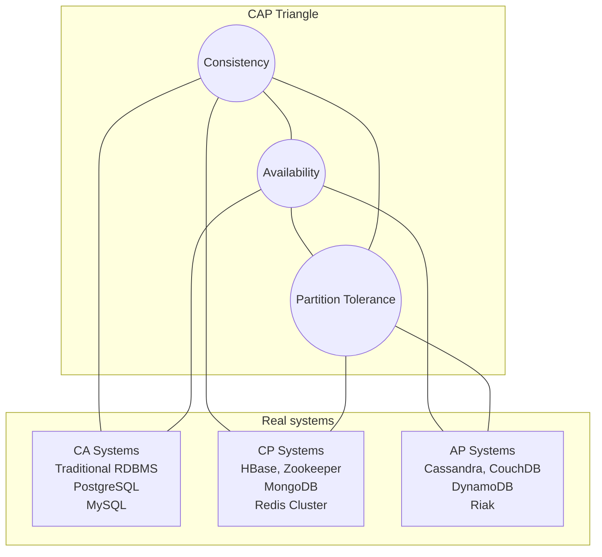
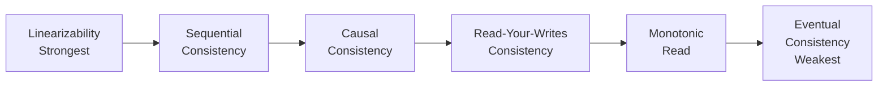
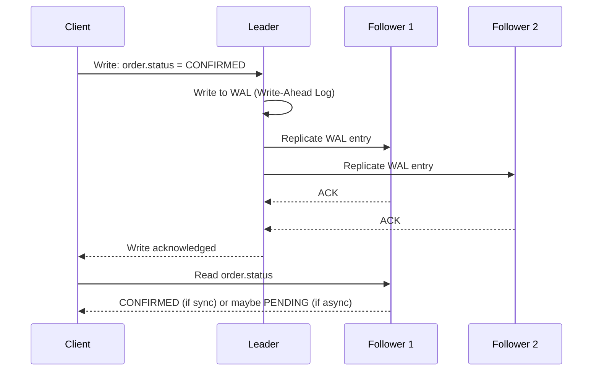
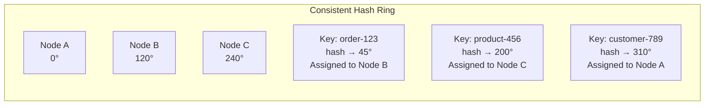
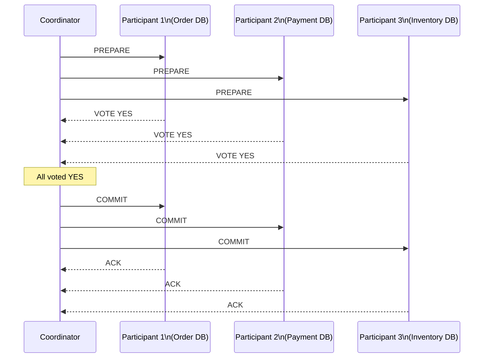
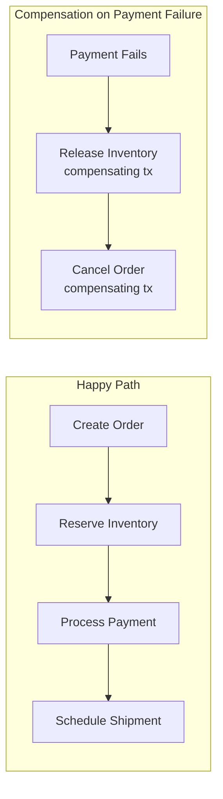

# Section 3: Distributed Systems

## Chapter 8: Foundations — CAP Theorem, Consistency Models, and Distributed Architectures

### Introduction

A distributed system is a group of computers working together that appears as a single computer to the user. Distributed systems solve problems that a single machine cannot: scale beyond a single machine's resources, survive hardware failures, and serve users globally with low latency.

But distribution introduces new problems: partial failures, network partitions, clock skew, and coordination costs. This chapter is about understanding these problems deeply — because you cannot design distributed systems without knowing what can go wrong.

### The CAP Theorem

CAP Theorem (Brewer's Theorem, 2000) states that a distributed data system can provide at most **two** of these three guarantees simultaneously:

- **C — Consistency**: Every read receives the most recent write or an error
- **A — Availability**: Every request receives a (non-error) response, without guarantee it contains the most recent write
- **P — Partition Tolerance**: The system continues to operate despite network partitions (message loss between nodes)



**The critical insight: In the presence of a network partition, you MUST choose between C and A.**

A network partition is not optional — it will happen. Networks fail. Cables get cut. Switches reboot. You cannot design around it. So the real choice is: **when a partition happens, do we return stale data (choose A) or return an error (choose C)?**

**Why CA without P is only possible without distribution:**

If your system truly cannot tolerate partitions, you must avoid distribution — put everything on one machine. Any two-machine system can experience a partition, so real distributed systems must tolerate partitions. The choice is between CP and AP.

### PACELC Theorem

CAP only describes behavior during a partition. But distributed systems also have tradeoffs during normal operation. PACELC extends CAP:

**If there is a Partition:**
- choose between **A**vailability and **C**onsistency

**Else (normal operation):**
- choose between **L**atency and **C**onsistency

```
PACELC: PA/EL, PA/EC, PC/EL, PC/EC

Examples:
- DynamoDB: PA/EL — Available during partition, Low latency normally
- Zookeeper: PC/EC — Consistent during partition, Consistent (higher latency) normally
- Cassandra: PA/EL — Available during partition, Low latency normally (tunable)
- RDBMS: PC/EC — Consistent during partition, Consistent normally
```

### Consistency Models

Consistency is not binary. There is a spectrum from strong to weak consistency, each with different performance characteristics.



#### Linearizability (Strong Consistency)

The gold standard. Every operation appears instantaneous at some point between its start and end. Once a write is acknowledged, all subsequent reads must return that value.

**Real example:**
- Time 10:00:00 — Write X=5 starts
- Time 10:00:01 — Write X=5 completes (acknowledged)
- Time 10:00:02 — Read X — **must return 5**

Systems: ZooKeeper (for its sequential nodes), etcd, Google Spanner, PostgreSQL (single node).

**Cost:** Requires coordination across replicas for every write. High latency. Low throughput.

#### Sequential Consistency

All operations appear in some sequential order that is consistent with each thread's program order. Does NOT require real-time ordering.

```
Thread 1: Write X=1, Read Y
Thread 2: Write Y=2, Read X

Linearizable valid result:  X=1, Y=2
Sequential valid result:    Y=2, X=0  (reads can be "stale" as long as order is consistent)
Sequential valid result:    X=0, Y=0  (this is fine if it reflects a consistent ordering)
```

#### Causal Consistency

Operations that are causally related appear in the correct order. Independent operations may appear in any order.

```
Thread 1: Post "Hello" (msg-1)
Thread 2: Reply "World" to msg-1 (msg-2) — causally depends on msg-1

With causal consistency:
Thread 3 must see msg-1 before msg-2
Thread 3 may never see msg-2 if msg-1 was not delivered to it

This is stronger than eventual but weaker than sequential.
```

**Implemented using:** Vector clocks, version vectors, Lamport timestamps.

#### Eventual Consistency

Given enough time with no new writes, all replicas will converge to the same value. No guarantees about how long this takes.

**Real example — Amazon DynamoDB:**
```java
// Write to DynamoDB (eventually consistent)
PutItemRequest request = PutItemRequest.builder()
    .tableName("orders")
    .item(Map.of("orderId", AttributeValue.fromS("order-123"),
                 "status", AttributeValue.fromS("CONFIRMED")))
    .build();
dynamoDbClient.putItem(request);

// Immediately read — might still see old value!
GetItemRequest getRequest = GetItemRequest.builder()
    .tableName("orders")
    .key(Map.of("orderId", AttributeValue.fromS("order-123")))
    .consistentRead(false) // eventual — fast but might be stale
    .build();
// Could return status=PENDING if replica not yet updated

// Or read consistently — guaranteed latest but costs 2x read capacity
GetItemRequest consistentGet = GetItemRequest.builder()
    .tableName("orders")
    .key(Map.of("orderId", AttributeValue.fromS("order-123")))
    .consistentRead(true) // reads from leader — latest value
    .build();
```

### Distributed System Failure Modes

Understanding failure modes is essential. A distributed system engineer must design for failure as the normal case.

#### The 8 Fallacies of Distributed Computing

1. The network is reliable
2. Latency is zero
3. Bandwidth is infinite
4. The network is secure
5. Topology does not change
6. There is one administrator
7. Transport cost is zero
8. The network is homogeneous

Every one of these is false. Systems that assume any of them will fail in production.

#### Types of Failures

**Crash failure**: Node stops completely. Detectable (no more heartbeats).

**Fail-stop**: Node crashes and stays stopped. Easier to handle than crash + restart.

**Byzantine failure**: Node behaves arbitrarily — sends wrong data, ignores messages, lies. Most dangerous. Requires Byzantine Fault Tolerant (BFT) algorithms.

**Network partition**: Nodes cannot communicate with each other but both believe they are the primary.

**Split-brain**: Two nodes each believe they are the leader. Both accept writes. Dangerous for consistency.

**Crash-recovery**: Node crashes and recovers. During recovery, it may have incomplete state.

**Gray failures**: Partial failures — slow responses, intermittent packet loss. Hardest to detect and diagnose.

#### Timeouts and Failure Detection

How does a node know if another node is dead or just slow?

```java
// Phi Accrual Failure Detector (used by Akka, Cassandra)
// Instead of a binary "alive/dead", gives a suspicion level φ
// φ rises as more heartbeats are missed
// When φ exceeds threshold, declare failure

public class PhiAccrualFailureDetector {
    private final double threshold;
    private final Deque<Long> intervals = new ArrayDeque<>();

    public double phi(long timeSinceLastHeartbeat) {
        if (intervals.isEmpty()) return 0.0;

        double mean = intervals.stream().mapToLong(l -> l).average().orElse(1000.0);
        double stdDev = calculateStdDev(intervals, mean);

        // Gaussian distribution of heartbeat intervals
        double y = (timeSinceLastHeartbeat - mean) / stdDev;
        double e = Math.exp(-y * (1.5976 + 0.070566 * y * y));

        if (timeSinceLastHeartbeat > mean) {
            return -Math.log10(e / (1 + e));
        } else {
            return -Math.log10(1 - 1 / (1 + e));
        }
    }

    public boolean isAlive(String nodeId) {
        long elapsed = System.currentTimeMillis() - lastHeartbeat.get(nodeId);
        return phi(elapsed) < threshold; // threshold typically 8-16
    }
}
```

### Replication

Replication keeps copies of data on multiple nodes for fault tolerance and read scalability.

#### Leader-Based Replication (Single-Leader)

One node is the **leader** (primary). All writes go to the leader. The leader sends changes to **followers** (replicas). Reads can go to any replica.



**Synchronous vs. Asynchronous Replication:**

- **Sync**: Leader waits for follower acknowledgement. Durable but slow.
- **Async**: Leader acknowledges immediately, replicates later. Fast but risk of data loss on leader crash.
- **Semi-sync** (common in production): Leader waits for at least 1 follower. Balances durability and performance.

**PostgreSQL streaming replication config:**
```sql
-- On primary (postgresql.conf):
wal_level = replica              -- Enable WAL streaming
max_wal_senders = 10             -- Max follower connections
synchronous_commit = on          -- Wait for follower ACK (semi-sync)
synchronous_standby_names = '1 (replica1, replica2)'  -- Wait for 1 of these

-- On replica:
-- recovery.conf (or postgresql.auto.conf in PG12+):
primary_conninfo = 'host=primary port=5432 user=replication password=secret'
hot_standby = on                 -- Allow reads on replica
```

**Leader election problem:**

When the leader fails, a new leader must be elected. This is non-trivial:
- Multiple followers might think they are the new leader (split-brain)
- Need a quorum to decide
- Use an external system like ZooKeeper or etcd for leader election

#### Multi-Leader Replication

Multiple nodes accept writes. Used for multi-datacenter and offline-capable apps.

**Conflict resolution is the core challenge.** Two leaders can accept conflicting writes:
```
Leader A (EU): user.email = "alice@eu.com"
Leader B (US): user.email = "alice@us.com"
```

How to resolve? Options:
1. **Last Write Wins (LWW)**: Timestamp determines winner. But clocks are unreliable.
2. **Merge**: Application-specific merge logic.
3. **CRDTs**: Conflict-free Replicated Data Types — mathematically guaranteed to merge without conflict.

#### Leaderless Replication (Dynamo-style)

Any replica can accept writes. Used by Cassandra, DynamoDB, Riak.

**Quorum reads and writes:**

```
n = total replicas
w = write quorum (how many must acknowledge write)
r = read quorum (how many must acknowledge read)

For strong consistency: w + r > n

Example: n=3, w=2, r=2
- Write to 2 of 3 replicas
- Read from 2 of 3 replicas
- At least 1 replica must have the latest write
```

```java
// Cassandra quorum configuration
CqlSession session = CqlSession.builder()
    .addContactPoint(new InetSocketAddress("cassandra-1", 9042))
    .withLocalDatacenter("datacenter1")
    .build();

// Write with QUORUM consistency
session.execute(
    QueryBuilder.insertInto("orders")
        .value("order_id", literal(orderId))
        .value("status", literal("CONFIRMED"))
        .build()
        .setConsistencyLevel(ConsistencyLevel.QUORUM) // n=3, w=2
);

// Read with QUORUM consistency
Row row = session.execute(
    QueryBuilder.selectFrom("orders")
        .all()
        .whereColumn("order_id").isEqualTo(literal(orderId))
        .build()
        .setConsistencyLevel(ConsistencyLevel.QUORUM) // n=3, r=2
).one();
```

**Read repair:** When a read finds stale data on some replicas, it repairs them in the background.

**Anti-entropy:** Background process that continuously compares replicas and syncs differences.

### Sharding / Partitioning

When data no longer fits on one machine, you partition it across multiple machines.

#### Range Partitioning

Assign ranges of keys to partitions.

```
Partition 1: orders with id 0–999,999
Partition 2: orders with id 1,000,000–1,999,999
Partition 3: orders with id 2,000,000+
```

**Pro:** Range queries are efficient (e.g., "all orders from Jan–Feb").
**Con:** Hot spots — if all new orders go to the latest partition, only one machine handles all writes.

#### Hash Partitioning

Apply a hash function to the key. Send to partition based on hash.

```java
// Consistent hashing — used by Cassandra, Redis Cluster
public int getPartition(String key, int numPartitions) {
    // MurmurHash3 is common in distributed systems
    int hash = MurmurHash3.hash32x86(key.getBytes());
    return Math.abs(hash) % numPartitions;
}
```

**Pro:** Uniform distribution — no hot spots.
**Con:** Range queries require scanning all partitions.

#### Consistent Hashing

Used by Cassandra, Redis Cluster, Amazon DynamoDB. Maps both keys and nodes to a ring. A key belongs to the first node clockwise on the ring. Adding/removing a node only moves adjacent keys.



**Virtual nodes (vnodes):** Each physical node gets multiple positions on the ring. This ensures uniform distribution when node capacities differ.

### Distributed Transactions and the Saga Pattern

Distributed transactions span multiple services or databases. ACID transactions cannot span distributed systems without coordination.

#### Two-Phase Commit (2PC)

**Phase 1: Prepare**
- Coordinator asks all participants: "Can you commit?"
- Each participant writes to its WAL (write-ahead log) and responds Yes or No

**Phase 2: Commit or Abort**
- If all said Yes: send Commit to all participants
- If any said No: send Abort to all participants



**2PC Problems:**
1. **Blocking**: If coordinator crashes after sending PREPARE, participants are stuck waiting (they have locks held)
2. **Single point of failure**: Coordinator failure brings the whole transaction down
3. **Performance**: Two network round trips, locks held during both phases

#### Saga Pattern

Instead of one big distributed transaction, break it into a sequence of local transactions, each with a compensating transaction to undo it on failure.



**Choreography-based Saga (events):**

```java
// Service 1: Order Service
@Service
public class OrderService {
    @EventListener
    @Transactional
    public void handleOrderPlaced(PlaceOrderCommand cmd) {
        Order order = Order.create(cmd);
        orderRepository.save(order);
        eventBus.publish(new OrderCreatedEvent(order.getId(), order.getItems()));
    }

    @EventListener
    @Transactional
    public void handlePaymentFailed(PaymentFailedEvent event) {
        Order order = orderRepository.findById(event.getOrderId()).orElseThrow();
        order.cancel("Payment failed: " + event.getReason());
        orderRepository.save(order);
        // No more events — saga ends here
    }
}

// Service 2: Inventory Service
@Service
public class InventoryService {
    @EventListener
    @Transactional
    public void handleOrderCreated(OrderCreatedEvent event) {
        try {
            inventoryRepository.reserve(event.getItems());
            eventBus.publish(new InventoryReservedEvent(event.getOrderId()));
        } catch (InsufficientInventoryException e) {
            eventBus.publish(new InventoryReservationFailedEvent(event.getOrderId(), e.getMessage()));
        }
    }
}

// Service 3: Payment Service
@Service
public class PaymentService {
    @EventListener
    @Transactional
    public void handleInventoryReserved(InventoryReservedEvent event) {
        Order order = orderRepository.findById(event.getOrderId()).orElseThrow();
        try {
            paymentGateway.charge(order.getTotal(), order.getPaymentMethod());
            eventBus.publish(new PaymentProcessedEvent(order.getId()));
        } catch (PaymentGatewayException e) {
            eventBus.publish(new PaymentFailedEvent(order.getId(), e.getMessage()));
        }
    }
}
```

**Orchestration-based Saga:**

A central orchestrator (saga coordinator) tells each service what to do next.

```java
@Component
public class OrderFulfillmentSaga {
    private final InventoryClient inventoryClient;
    private final PaymentClient paymentClient;
    private final ShippingClient shippingClient;

    @SagaEventHandler(associationProperty = "orderId")
    public void handle(OrderCreatedEvent event) {
        inventoryClient.reserve(ReserveCommand.builder()
            .orderId(event.getOrderId())
            .items(event.getItems())
            .build());
    }

    @SagaEventHandler(associationProperty = "orderId")
    public void handle(InventoryReservedEvent event) {
        paymentClient.charge(ChargeCommand.builder()
            .orderId(event.getOrderId())
            .amount(event.getOrder().getTotal())
            .build());
    }

    @SagaEventHandler(associationProperty = "orderId")
    public void handle(PaymentFailedEvent event) {
        // Compensate: release inventory
        inventoryClient.release(ReleaseCommand.builder()
            .orderId(event.getOrderId())
            .build());

        // Compensate: cancel order
        orderClient.cancel(CancelOrderCommand.builder()
            .orderId(event.getOrderId())
            .reason(event.getReason())
            .build());
    }

    @EndSaga
    @SagaEventHandler(associationProperty = "orderId")
    public void handle(ShipmentScheduledEvent event) {
        // Saga complete
    }
}
```

### Idempotency

In distributed systems, network failures cause retries. Retries cause duplicate messages. Without idempotency, you process the same order twice, charge the customer twice, or ship the package twice.

**Idempotency key pattern:**

```java
@PostMapping("/payments")
public ResponseEntity<PaymentResponse> processPayment(
        @RequestHeader("Idempotency-Key") String idempotencyKey,
        @RequestBody PaymentRequest request) {

    // Check if we already processed this request
    Optional<PaymentResponse> existing = idempotencyStore.get(idempotencyKey);
    if (existing.isPresent()) {
        return ResponseEntity.ok(existing.get()); // Return same response
    }

    // Process the payment
    PaymentResponse response = paymentService.charge(request);

    // Store the result with TTL (e.g., 24 hours)
    idempotencyStore.put(idempotencyKey, response, Duration.ofHours(24));

    return ResponseEntity.status(HttpStatus.CREATED).body(response);
}

@Service
public class IdempotencyStore {
    private final RedisTemplate<String, PaymentResponse> redis;

    public Optional<PaymentResponse> get(String key) {
        return Optional.ofNullable(redis.opsForValue().get("idempotency:" + key));
    }

    public void put(String key, PaymentResponse response, Duration ttl) {
        redis.opsForValue().set("idempotency:" + key, response, ttl);
    }
}
```

**Database-level idempotency:**

```sql
-- Use UNIQUE constraint on idempotency key
CREATE TABLE payment_requests (
    idempotency_key VARCHAR(255) UNIQUE NOT NULL,
    payment_id      VARCHAR(255),
    status          VARCHAR(50),
    response_body   JSONB,
    created_at      TIMESTAMP DEFAULT NOW()
);

-- INSERT OR IGNORE on conflict — safe for retries
INSERT INTO payment_requests (idempotency_key, payment_id, status, response_body)
VALUES (:key, :paymentId, 'COMPLETED', :response)
ON CONFLICT (idempotency_key) DO NOTHING
RETURNING *;
```

### Interview Questions

**Q: Explain the CAP theorem in simple terms. Give an example.**

A: CAP says a distributed system cannot simultaneously guarantee Consistency (reads always get the latest write), Availability (every request gets a response), and Partition Tolerance (system works despite network failures). Since network partitions inevitably happen, you must choose between C and A during a partition. Example: If your database leader and replica are partitioned, you can either (A) let the replica serve reads even though it might have stale data, or (C) refuse reads from the replica until the partition heals. Cassandra chooses A — it keeps serving requests with possibly stale data. ZooKeeper chooses C — it refuses requests when it cannot reach a quorum.

**Q: What is the difference between 2PC and Saga?**

A: 2PC is a distributed transaction protocol where all participants must agree to commit atomically. It is blocking — if the coordinator fails, all participants hold locks and wait. It works but is slow and has a single point of failure. Saga breaks a distributed transaction into a sequence of local transactions, each with a compensating transaction. It is not atomic — intermediate states are visible. But it is non-blocking, more scalable, and works well for long-running business processes. Use Saga for microservices. Use 2PC only for tightly coupled systems where you control all components.

**Q: How does consistent hashing work and why is it used?**

A: Consistent hashing maps both keys and nodes to positions on a virtual ring. A key is assigned to the first node clockwise from its position. When a node is added or removed, only the keys between the new node and its predecessor are moved — not all keys. With simple modulo hashing (`hash(key) % n`), changing n (adding/removing a node) would remap almost all keys — very expensive. Consistent hashing minimizes key movement. It is used by Cassandra, Redis Cluster, and CDN systems.

---
