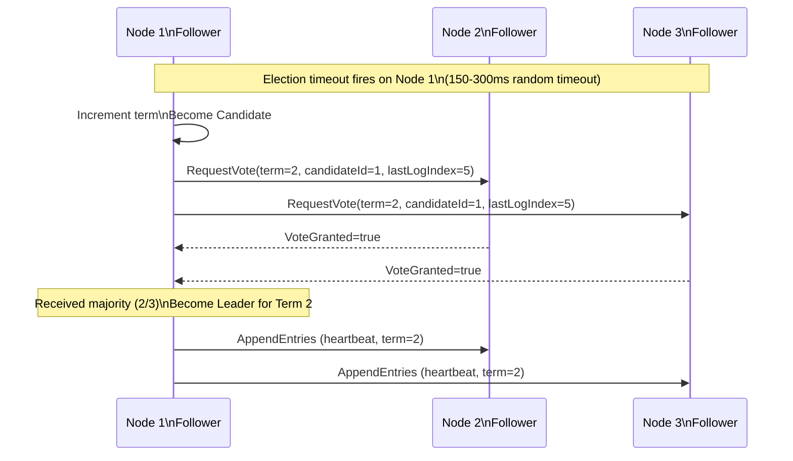
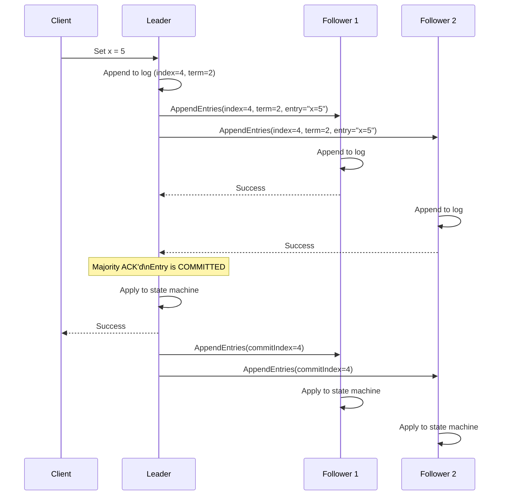
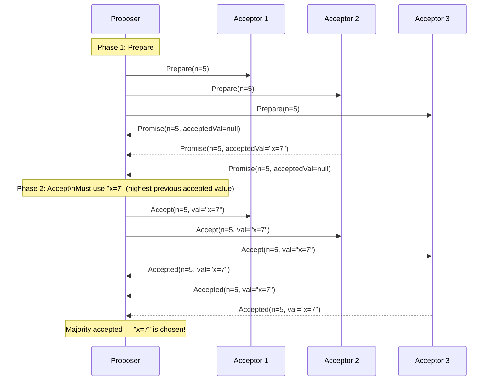
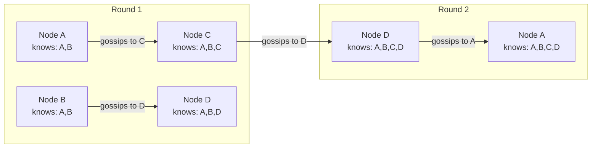

# Chapter 9: Consensus Algorithms — Raft and Paxos

## Introduction

Consensus is the problem of getting a group of computers to agree on a single value. This sounds simple but is extremely difficult in the presence of failures and network partitions. Consensus is the foundation of:

- Leader election (Kubernetes uses etcd, which uses Raft)
- Distributed locks (ZooKeeper uses ZAB, similar to Paxos)
- Replicated state machines (the basis for all strongly consistent databases)

The two most important consensus algorithms are **Paxos** and **Raft**.

## Raft — The Understandable Consensus Algorithm

Raft was designed to be easy to understand. It divides consensus into relatively independent subproblems:
1. Leader election
2. Log replication
3. Safety (only one leader, logs never lost)

### Raft Roles

Every node in a Raft cluster is in one of three states:

- **Follower**: Passive. Responds to requests from leaders and candidates.
- **Candidate**: Trying to become leader. Transitions from Follower when it suspects leader is dead.
- **Leader**: Handles all client requests. Replicates log to followers.

### Terms

Raft divides time into **terms** — logical time units. Each term starts with an election. If a candidate wins, it serves as leader for the rest of the term. If election fails (split vote), a new term starts.

Terms act as logical clocks. They help detect stale messages: if node A receives a message from term 5 but node A is in term 7, the message is outdated and ignored.

### Leader Election



**Election rules:**
1. Follower starts election if it hasn't heard from a leader for `electionTimeout` (150-300ms, randomized)
2. Candidate votes for itself, increments term, sends `RequestVote` to all others
3. Nodes vote at most once per term, on first-come basis
4. Candidate must be as up-to-date as the voter's log (safety condition)
5. Candidate wins with majority vote — becomes leader
6. New leader immediately sends heartbeats to stop other elections

**Why random timeouts?** If all followers had the same timeout, they would all start elections simultaneously and split votes forever. Random timeouts make it likely one node starts before others.

### Log Replication



**Key invariant:** An entry is committed only when stored on a majority of servers. A committed entry will never be overwritten.

**Log matching property:** If two logs have an entry with the same index and term, then they have identical entries in all positions up to that index. The leader enforces this by checking the previous entry's index and term in every `AppendEntries` request.

### Safety

Raft guarantees that if a value has been committed, it will be preserved across leader changes. This is enforced by the **election restriction**: a candidate cannot win if its log is less up-to-date than the voter's log.

"More up-to-date" means:
1. The log with the higher term for the last entry is more up-to-date
2. If last entry terms are equal, the longer log is more up-to-date

This ensures that a new leader always has all committed entries.

### Leader Failure and Recovery

When a leader fails:
1. Followers stop receiving heartbeats
2. Election timeout fires on one follower
3. New election happens
4. New leader may have some uncommitted entries from old leader — it does NOT roll them back
5. New leader replicates its log to followers, overwriting inconsistent entries

```java
// Simplified Raft implementation in Java
public class RaftNode {
    private volatile RaftState state = RaftState.FOLLOWER;
    private volatile int currentTerm = 0;
    private volatile String votedFor = null;
    private volatile String currentLeader = null;
    private final List<LogEntry> log = new ArrayList<>();
    private int commitIndex = 0;
    private int lastApplied = 0;

    // Leader state
    private Map<String, Integer> nextIndex = new HashMap<>();
    private Map<String, Integer> matchIndex = new HashMap<>();

    private final ScheduledExecutorService scheduler = Executors.newScheduledThreadPool(2);
    private ScheduledFuture<?> electionTimer;
    private ScheduledFuture<?> heartbeatTimer;

    public void start() {
        resetElectionTimer();
    }

    private void resetElectionTimer() {
        if (electionTimer != null) electionTimer.cancel(false);

        // Randomized timeout — key to avoiding split votes
        long timeout = ThreadLocalRandom.current().nextLong(150, 300);
        electionTimer = scheduler.schedule(this::startElection, timeout, TimeUnit.MILLISECONDS);
    }

    private synchronized void startElection() {
        if (state == RaftState.LEADER) return;

        currentTerm++;
        state = RaftState.CANDIDATE;
        votedFor = nodeId;
        currentLeader = null;

        log.info("Starting election for term {}", currentTerm);

        AtomicInteger votes = new AtomicInteger(1); // Vote for self
        int termForElection = currentTerm;

        for (String peer : peers) {
            executor.submit(() -> {
                VoteResponse response = sendRequestVote(peer, new VoteRequest(
                    termForElection, nodeId,
                    log.size() - 1,         // lastLogIndex
                    getLastLogTerm()         // lastLogTerm
                ));

                synchronized (RaftNode.this) {
                    if (response.term > currentTerm) {
                        // Seen higher term — step down
                        becomeFollower(response.term);
                        return;
                    }

                    if (state != RaftState.CANDIDATE || currentTerm != termForElection) {
                        return; // Term changed during election
                    }

                    if (response.voteGranted) {
                        int total = votes.incrementAndGet();
                        if (total > peers.size() / 2 + 1) { // majority
                            becomeLeader();
                        }
                    }
                }
            });
        }

        resetElectionTimer();
    }

    private synchronized void becomeLeader() {
        state = RaftState.LEADER;
        currentLeader = nodeId;
        log.info("Became leader for term {}", currentTerm);

        // Initialize leader state
        for (String peer : peers) {
            nextIndex.put(peer, log.size());
            matchIndex.put(peer, 0);
        }

        // Start sending heartbeats
        heartbeatTimer = scheduler.scheduleAtFixedRate(
            this::sendHeartbeats, 0, 50, TimeUnit.MILLISECONDS
        );
    }

    public synchronized AppendEntriesResponse handleAppendEntries(AppendEntriesRequest req) {
        // Update term if necessary
        if (req.term > currentTerm) {
            becomeFollower(req.term);
        }

        // Reply false if term < currentTerm
        if (req.term < currentTerm) {
            return new AppendEntriesResponse(currentTerm, false);
        }

        // This is a valid leader — reset election timer
        currentLeader = req.leaderId;
        resetElectionTimer();

        // Reply false if log doesn't contain entry at prevLogIndex with prevLogTerm
        if (req.prevLogIndex >= 0 &&
            (log.size() <= req.prevLogIndex || log.get(req.prevLogIndex).term != req.prevLogTerm)) {
            return new AppendEntriesResponse(currentTerm, false);
        }

        // Append entries
        int insertIndex = req.prevLogIndex + 1;
        for (int i = 0; i < req.entries.size(); i++) {
            int logIndex = insertIndex + i;
            if (logIndex < log.size()) {
                if (log.get(logIndex).term != req.entries.get(i).term) {
                    // Conflict — delete this and all subsequent entries
                    while (log.size() > logIndex) {
                        log.remove(log.size() - 1);
                    }
                    log.add(req.entries.get(i));
                }
            } else {
                log.add(req.entries.get(i));
            }
        }

        // Update commit index
        if (req.leaderCommit > commitIndex) {
            commitIndex = Math.min(req.leaderCommit, log.size() - 1);
            applyCommittedEntries();
        }

        return new AppendEntriesResponse(currentTerm, true);
    }
}
```

### Raft in Production — etcd

Kubernetes uses **etcd** (which uses Raft) for all cluster state. Understanding etcd is essential for Kubernetes operators.

```bash
# Check etcd cluster health
etcdctl --endpoints=https://etcd-1:2379,https://etcd-2:2379,https://etcd-3:2379 \
        --cacert=/etc/etcd/ca.crt \
        --cert=/etc/etcd/etcd.crt \
        --key=/etc/etcd/etcd.key \
        endpoint health

# Check leader
etcdctl endpoint status --write-out=table

# Raft log is stored in /var/lib/etcd/member/
# WAL (Write-Ahead Log) + snapshots

# etcd configuration
cat /etc/etcd/etcd.conf.yaml
```
```yaml
# etcd configuration for production cluster
name: etcd-1
data-dir: /var/lib/etcd

listen-peer-urls: https://192.168.1.1:2380
listen-client-urls: https://192.168.1.1:2379

initial-cluster: >
  etcd-1=https://192.168.1.1:2380,
  etcd-2=https://192.168.1.2:2380,
  etcd-3=https://192.168.1.3:2380
initial-cluster-state: new
initial-cluster-token: my-etcd-cluster

advertise-client-urls: https://192.168.1.1:2379
initial-advertise-peer-urls: https://192.168.1.1:2380

# TLS
client-transport-security:
  cert-file: /etc/etcd/etcd.crt
  key-file: /etc/etcd/etcd.key
  client-cert-auth: true
  trusted-ca-file: /etc/etcd/ca.crt
peer-transport-security:
  cert-file: /etc/etcd/etcd.crt
  key-file: /etc/etcd/etcd.key
  client-cert-auth: true
  trusted-ca-file: /etc/etcd/ca.crt

# Performance
heartbeat-interval: 100       # ms (leader sends heartbeat every 100ms)
election-timeout: 1000        # ms (follower starts election after 1000ms silence)
snapshot-count: 10000         # create snapshot every 10000 Raft log entries
quota-backend-bytes: 8589934592  # 8GB max backend size
```

## Paxos

Paxos was the first practical consensus algorithm (Lamport, 1989). It is harder to understand than Raft but forms the theoretical foundation. Many production systems use Paxos variants: Google Chubby, Google Spanner, Apache ZooKeeper (ZAB), Microsoft Azure Storage (using Multi-Paxos).

### Single-Decree Paxos (Synod Algorithm)

**Goal:** Get a set of nodes to agree on a single value.

**Roles:**
- **Proposer**: Proposes values
- **Acceptor**: Votes on proposals
- **Learner**: Learns the chosen value

**Two phases:**

**Phase 1a — Prepare:**
Proposer sends `Prepare(n)` where n is a unique proposal number. Must be higher than any previous proposal number it has used.

**Phase 1b — Promise:**
Acceptor responds with a `Promise` not to accept any proposal with number < n. Also returns the highest-numbered proposal it has already accepted (if any).

**Phase 2a — Accept:**
If a majority of acceptors replied, proposer sends `Accept(n, v)` where v is either:
- The value from the highest-numbered previous proposal in the responses, OR
- Any value the proposer chooses if no previous value

**Phase 2b — Accepted:**
Acceptors accept the proposal (if they haven't promised to a higher proposal). They send `Accepted(n, v)` to learners.



**Why must the proposer use the previous accepted value?**

Safety. If a value was chosen in a previous round (majority accepted it), the new proposer must continue with that value. Otherwise, two different values could both claim to be "chosen."

### Multi-Paxos

Single-decree Paxos agrees on one value. For a replicated log (sequence of values), we need Multi-Paxos — Paxos run for each log slot with optimizations:

1. Leader election: One node becomes the distinguished proposer (leader)
2. Leader skips Phase 1 for subsequent proposals — only Phase 2 needed
3. Leader can pipeline multiple proposals

This is what Google's Chubby, Spanner, and Apache ZooKeeper use in practice.

### ZooKeeper Atomic Broadcast (ZAB)

ZooKeeper uses ZAB — similar to Multi-Paxos but designed for total order broadcast.

```java
// ZooKeeper leader election example
// Used by Kafka (before KRaft) for broker leader election

CuratorFramework client = CuratorFrameworkFactory.builder()
    .connectString("zk1:2181,zk2:2181,zk3:2181")
    .retryPolicy(new ExponentialBackoffRetry(1000, 3))
    .build();
client.start();

LeaderLatch leaderLatch = new LeaderLatch(client, "/kafka/broker-leader");
leaderLatch.addListener(new LeaderLatchListener() {
    @Override
    public void isLeader() {
        log.info("This broker is now the leader");
        startLeaderActivities();
    }

    @Override
    public void notLeader() {
        log.info("Lost leadership — becoming follower");
        stopLeaderActivities();
    }
});
leaderLatch.start();

// Distributed lock with ZooKeeper
InterProcessMutex lock = new InterProcessMutex(client, "/locks/order-processor");
if (lock.acquire(10, TimeUnit.SECONDS)) {
    try {
        processOrderExclusively();
    } finally {
        lock.release();
    }
}
```

### Gossip Protocols

Gossip (epidemic) protocols spread information through a cluster without centralized coordination. Each node randomly selects peers and exchanges state. Information propagates like a virus.

**How it works:**
- Every `gossipInterval` (e.g., 1 second), each node picks `fanout` random peers
- Sends its current state digest
- Peers respond with differences
- Converges to full consistency in O(log N) rounds



**Uses:** Cassandra uses gossip for node discovery and failure detection. Consul uses it. Redis Cluster uses a gossip-like protocol.

```java
// Simplified gossip implementation
@Component
public class GossipService {
    private final ConcurrentHashMap<String, NodeState> clusterState = new ConcurrentHashMap<>();
    private final List<String> knownPeers;

    @Scheduled(fixedDelay = 1000) // every 1 second
    public void gossip() {
        // Pick random peers
        List<String> peers = selectRandomPeers(3);

        for (String peer : peers) {
            try {
                // Send our current state digest (just hashes, not full data)
                GossipDigest myDigest = buildDigest(clusterState);
                GossipAck ack = sendGossip(peer, myDigest);

                // Peer tells us what we're missing — update our state
                applyUpdates(ack.getUpdatesForUs());

                // Send peer what they're missing
                Map<String, NodeState> peerMissing = findMissing(ack.getPeerDigest());
                sendUpdates(peer, peerMissing);

            } catch (Exception e) {
                log.debug("Gossip failed to peer {}: {}", peer, e.getMessage());
                // failure is normal — gossip is resilient
            }
        }
    }

    // Update local state — CRDT merge (take max version wins)
    private void applyUpdates(Map<String, NodeState> updates) {
        updates.forEach((nodeId, state) ->
            clusterState.merge(nodeId, state, (existing, incoming) ->
                incoming.getVersion() > existing.getVersion() ? incoming : existing
            )
        );
    }
}
```

### Vector Clocks

Vector clocks track causal ordering in distributed systems. Each node maintains a vector of counters — one per node. On each event, the node increments its own counter.

```
Event ordering:
Node A: [A:1, B:0, C:0] → [A:2, B:0, C:0] → [A:3, B:2, C:1]
Node B: [A:0, B:1, C:0] → [A:2, B:2, C:0]
Node C: [A:0, B:0, C:1]

Causal order: A[1] → B[1] (if B's timestamp includes A:1 or higher)
Concurrent: A[2] and B[1] are concurrent if neither dominates the other
```

```java
public class VectorClock {
    private final Map<String, Long> clock;

    public VectorClock() {
        this.clock = new ConcurrentHashMap<>();
    }

    // Increment local node's counter
    public void tick(String nodeId) {
        clock.merge(nodeId, 1L, Long::sum);
    }

    // Merge another vector clock (take max of each component)
    public VectorClock merge(VectorClock other) {
        VectorClock merged = new VectorClock();
        Set<String> allNodes = new HashSet<>(this.clock.keySet());
        allNodes.addAll(other.clock.keySet());

        for (String node : allNodes) {
            merged.clock.put(node, Math.max(
                this.clock.getOrDefault(node, 0L),
                other.clock.getOrDefault(node, 0L)
            ));
        }
        return merged;
    }

    // Compare: does VC A happen-before VC B?
    public static boolean happensBefore(VectorClock a, VectorClock b) {
        // A ≤ B component-wise AND A ≠ B
        Set<String> allNodes = new HashSet<>(a.clock.keySet());
        allNodes.addAll(b.clock.keySet());

        boolean strictlyLess = false;
        for (String node : allNodes) {
            long aVal = a.clock.getOrDefault(node, 0L);
            long bVal = b.clock.getOrDefault(node, 0L);
            if (aVal > bVal) return false;     // A is NOT ≤ B
            if (aVal < bVal) strictlyLess = true;
        }
        return strictlyLess; // A < B in at least one component
    }

    // Are A and B concurrent? (neither happens-before the other)
    public static boolean concurrent(VectorClock a, VectorClock b) {
        return !happensBefore(a, b) && !happensBefore(b, a);
    }
}
```

### Interview Questions

**Q: Explain Raft leader election in simple terms.**

A: Every Raft node has an election timeout (randomized 150-300ms). If a follower doesn't hear from a leader within that time, it starts an election. It increments its term, votes for itself, and asks others to vote for it. To get a vote, it must be as up-to-date as the voter's log. If it gets votes from a majority of nodes, it becomes leader and starts sending heartbeats to prevent new elections. The randomized timeout makes it likely one node starts before others, avoiding split votes.

**Q: What is the split-brain problem and how does Raft prevent it?**

A: Split-brain happens when two nodes both believe they are the leader and accept writes independently, causing data divergence. Raft prevents this with the quorum rule: a leader can only commit entries that are acknowledged by a majority of nodes. If the network splits, only the partition with the majority can elect a leader and commit entries. The minority partition cannot make progress because it cannot reach a quorum. When the partition heals, minority nodes accept the majority's log.

**Q: What is the difference between Raft and Paxos?**

A: Both solve the same problem (consensus) with similar guarantees. Paxos was first (1989) but is notoriously difficult to understand and implement correctly. Raft was designed explicitly for understandability — it decomposes consensus into leader election, log replication, and safety. Paxos has better theoretical properties for some edge cases. In practice: etcd uses Raft, ZooKeeper uses ZAB (similar to Paxos), Google Spanner uses Paxos. Raft is more commonly implemented today because it is easier to get right.

---
