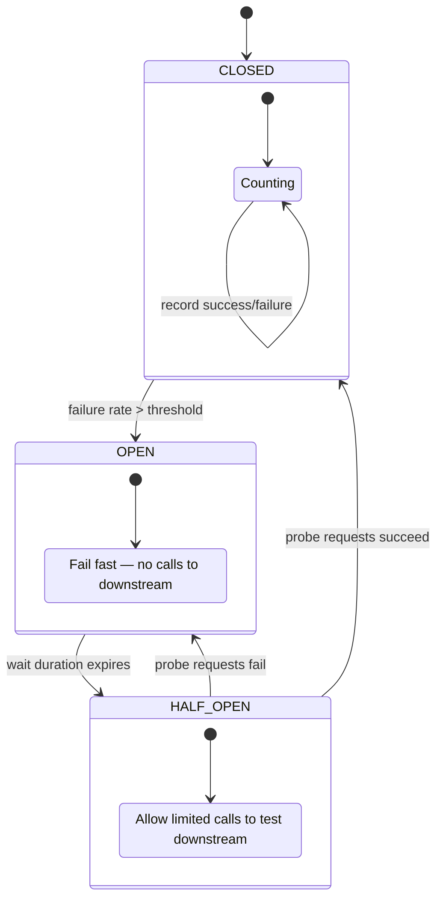
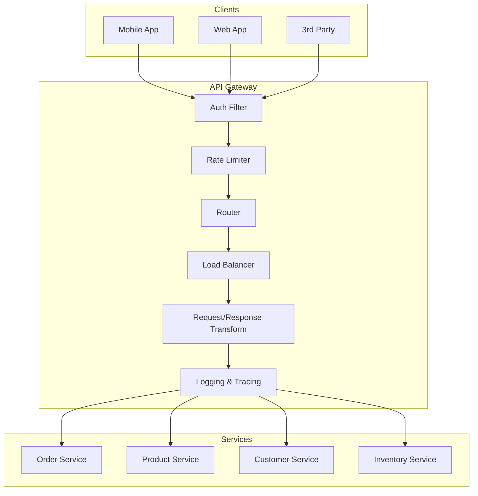
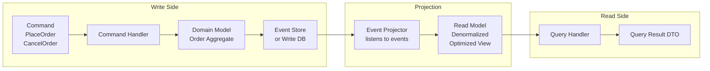

# Section 4: Microservices Architecture

## Chapter 10: Spring Boot, Spring Cloud, and Microservices Patterns

### Introduction

Microservices are an architectural style where an application is built as a collection of small, independently deployable services. Each service:
- Owns its own data
- Has a single business responsibility
- Communicates over the network
- Can be deployed independently

This sounds simple. The reality is that splitting a monolith into services moves complexity from within a single process to the network between processes. Network calls fail. Services go down. Data becomes distributed. You need patterns to deal with this complexity.

### When to Use Microservices

Microservices add complexity. They are the RIGHT choice when:
- Multiple teams need to deploy independently without coordinating
- Different services need different technology stacks
- Different services have very different scaling requirements
- The domain is large and well-understood (clear service boundaries)

Microservices are the WRONG choice when:
- You are starting a new product (you don't know the boundaries yet)
- Small team (the overhead is not worth it)
- Services are heavily coupled (you've created a "distributed monolith")

**Martin Fowler's rule:** Start with a monolith. Extract services when you have clear reasons to.

### Building a Microservice with Spring Boot 3

```java
// Build file: pom.xml
// Key dependencies for a production microservice
```
```xml
<dependencies>
    <!-- Core -->
    <dependency>
        <groupId>org.springframework.boot</groupId>
        <artifactId>spring-boot-starter-web</artifactId>
    </dependency>
    <dependency>
        <groupId>org.springframework.boot</groupId>
        <artifactId>spring-boot-starter-data-jpa</artifactId>
    </dependency>
    <dependency>
        <groupId>org.springframework.boot</groupId>
        <artifactId>spring-boot-starter-validation</artifactId>
    </dependency>
    <dependency>
        <groupId>org.springframework.boot</groupId>
        <artifactId>spring-boot-starter-actuator</artifactId>
    </dependency>

    <!-- Observability -->
    <dependency>
        <groupId>io.micrometer</groupId>
        <artifactId>micrometer-registry-prometheus</artifactId>
    </dependency>
    <dependency>
        <groupId>io.micrometer</groupId>
        <artifactId>micrometer-tracing-bridge-otel</artifactId>
    </dependency>
    <dependency>
        <groupId>io.opentelemetry.instrumentation</groupId>
        <artifactId>opentelemetry-spring-boot-starter</artifactId>
    </dependency>

    <!-- Resilience -->
    <dependency>
        <groupId>io.github.resilience4j</groupId>
        <artifactId>resilience4j-spring-boot3</artifactId>
    </dependency>

    <!-- Kafka -->
    <dependency>
        <groupId>org.springframework.kafka</groupId>
        <artifactId>spring-kafka</artifactId>
    </dependency>

    <!-- Database -->
    <dependency>
        <groupId>org.postgresql</groupId>
        <artifactId>postgresql</artifactId>
    </dependency>
    <dependency>
        <groupId>org.flywaydb</groupId>
        <artifactId>flyway-core</artifactId>
    </dependency>
</dependencies>
```

**Production-grade Order Service:**

```java
// Domain model — rich domain objects, not anemic
@Entity
@Table(name = "orders")
public class Order {
    @Id
    @GeneratedValue(strategy = GenerationType.UUID)
    private String id;

    @Column(nullable = false)
    private String customerId;

    @OneToMany(cascade = CascadeType.ALL, orphanRemoval = true)
    @JoinColumn(name = "order_id")
    private List<OrderItem> items = new ArrayList<>();

    @Embedded
    private Money total;

    @Enumerated(EnumType.STRING)
    private OrderStatus status = OrderStatus.PENDING;

    @Version
    private Long version; // Optimistic locking

    @CreatedDate
    private Instant createdAt;

    @LastModifiedDate
    private Instant updatedAt;

    // Business logic belongs in the domain object
    public static Order create(String customerId, List<OrderItem> items) {
        if (items.isEmpty()) {
            throw new InvalidOrderException("Order must have at least one item");
        }
        Order order = new Order();
        order.customerId = customerId;
        order.items = new ArrayList<>(items);
        order.total = calculateTotal(items);
        order.status = OrderStatus.PENDING;
        return order;
    }

    public void confirm() {
        if (status != OrderStatus.PENDING) {
            throw new IllegalStateException("Can only confirm PENDING orders, current: " + status);
        }
        this.status = OrderStatus.CONFIRMED;
    }

    public void cancel(String reason) {
        if (status == OrderStatus.SHIPPED || status == OrderStatus.DELIVERED) {
            throw new IllegalStateException("Cannot cancel shipped or delivered orders");
        }
        this.status = OrderStatus.CANCELLED;
    }

    private static Money calculateTotal(List<OrderItem> items) {
        return items.stream()
            .map(item -> item.getUnitPrice().multiply(item.getQuantity()))
            .reduce(Money.ZERO, Money::add);
    }
}

// Application service — orchestrates use cases
@Service
@Transactional
@RequiredArgsConstructor
public class OrderApplicationService {
    private final OrderRepository orderRepository;
    private final InventoryClient inventoryClient;
    private final EventPublisher eventPublisher;
    private final MeterRegistry meterRegistry;

    private final Counter ordersCreated;
    private final Counter ordersFailed;
    private final Timer orderProcessingTime;

    public OrderApplicationService(OrderRepository orderRepository,
                                   InventoryClient inventoryClient,
                                   EventPublisher eventPublisher,
                                   MeterRegistry meterRegistry) {
        this.orderRepository = orderRepository;
        this.inventoryClient = inventoryClient;
        this.eventPublisher = eventPublisher;
        this.meterRegistry = meterRegistry;

        this.ordersCreated = Counter.builder("orders.created")
            .description("Number of orders created")
            .register(meterRegistry);
        this.ordersFailed = Counter.builder("orders.failed")
            .description("Number of failed order creations")
            .register(meterRegistry);
        this.orderProcessingTime = Timer.builder("orders.processing.time")
            .description("Order processing time")
            .register(meterRegistry);
    }

    public Order placeOrder(PlaceOrderCommand command) {
        Timer.Sample sample = Timer.start(meterRegistry);

        try {
            // Check inventory (may fail — circuit breaker handles it)
            inventoryClient.checkAvailability(command.getItems());

            // Create domain object
            Order order = Order.create(command.getCustomerId(), command.getItems());

            // Save
            Order saved = orderRepository.save(order);

            // Publish event (outbox pattern in production)
            eventPublisher.publish(new OrderCreatedEvent(saved.getId(), saved.getCustomerId(),
                                                          saved.getTotal(), saved.getItems()));

            ordersCreated.increment();
            return saved;

        } catch (Exception e) {
            ordersFailed.increment();
            throw e;
        } finally {
            sample.stop(orderProcessingTime);
        }
    }

    @Transactional(readOnly = true)
    public Optional<Order> findOrder(String orderId) {
        return orderRepository.findById(orderId);
    }
}
```

**REST Controller:**

```java
@RestController
@RequestMapping("/api/v1/orders")
@RequiredArgsConstructor
@Slf4j
public class OrderController {
    private final OrderApplicationService orderService;

    @PostMapping
    public ResponseEntity<OrderResponse> placeOrder(
            @Valid @RequestBody PlaceOrderRequest request,
            @RequestHeader(value = "Idempotency-Key", required = false) String idempotencyKey) {

        log.info("Placing order for customer {}", request.getCustomerId());

        PlaceOrderCommand command = PlaceOrderCommand.fromRequest(request);
        Order order = orderService.placeOrder(command);

        return ResponseEntity
            .status(HttpStatus.CREATED)
            .location(URI.create("/api/v1/orders/" + order.getId()))
            .body(OrderResponse.from(order));
    }

    @GetMapping("/{orderId}")
    public ResponseEntity<OrderResponse> getOrder(@PathVariable String orderId) {
        return orderService.findOrder(orderId)
            .map(order -> ResponseEntity.ok(OrderResponse.from(order)))
            .orElseThrow(() -> new OrderNotFoundException(orderId));
    }

    @ExceptionHandler(OrderNotFoundException.class)
    public ResponseEntity<ErrorResponse> handleNotFound(OrderNotFoundException ex) {
        return ResponseEntity.status(HttpStatus.NOT_FOUND)
            .body(ErrorResponse.of("ORDER_NOT_FOUND", ex.getMessage()));
    }

    @ExceptionHandler(InventoryUnavailableException.class)
    public ResponseEntity<ErrorResponse> handleInventoryUnavailable(InventoryUnavailableException ex) {
        return ResponseEntity.status(HttpStatus.CONFLICT)
            .body(ErrorResponse.of("INVENTORY_UNAVAILABLE", ex.getMessage()));
    }
}
```

**Application configuration:**

```yaml
# application.yml — production configuration
server:
  port: 8080
  tomcat:
    threads:
      max: 200
      min-spare: 20

spring:
  application:
    name: order-service

  datasource:
    url: ${DB_URL:jdbc:postgresql://localhost:5432/orders}
    username: ${DB_USER:orders_user}
    password: ${DB_PASSWORD}
    hikari:
      maximum-pool-size: 20
      minimum-idle: 5
      connection-timeout: 30000
      idle-timeout: 600000
      max-lifetime: 1800000
      pool-name: OrderDB

  jpa:
    hibernate:
      ddl-auto: validate
    properties:
      hibernate:
        dialect: org.hibernate.dialect.PostgreSQLDialect
        format_sql: false
        jdbc.batch_size: 50
        order_inserts: true
        order_updates: true
    open-in-view: false  # Never true in production — N+1 problems

  flyway:
    enabled: true
    locations: classpath:db/migration

  kafka:
    bootstrap-servers: ${KAFKA_BROKERS:localhost:9092}
    producer:
      key-serializer: org.apache.kafka.common.serialization.StringSerializer
      value-serializer: org.springframework.kafka.support.serializer.JsonSerializer
      acks: all         # Wait for all in-sync replicas
      retries: 3
      properties:
        enable.idempotence: true
        max.in.flight.requests.per.connection: 1
    consumer:
      group-id: order-service
      auto-offset-reset: earliest
      enable-auto-commit: false   # Manual commit for exactly-once processing

  threads:
    virtual:
      enabled: true  # Java 21 virtual threads

# Resilience4j
resilience4j:
  circuitbreaker:
    instances:
      inventory-service:
        sliding-window-size: 10
        failure-rate-threshold: 50
        wait-duration-in-open-state: 30s
        permitted-number-of-calls-in-half-open-state: 3
        automatic-transition-from-open-to-half-open-enabled: true
  retry:
    instances:
      inventory-service:
        max-attempts: 3
        wait-duration: 500ms
        exponential-backoff-multiplier: 2
  timelimiter:
    instances:
      inventory-service:
        timeout-duration: 2s

# Actuator
management:
  endpoints:
    web:
      exposure:
        include: health,info,metrics,prometheus,env,loggers
  endpoint:
    health:
      show-details: when-authorized
      probes:
        enabled: true    # /actuator/health/liveness and /readiness
  metrics:
    export:
      prometheus:
        enabled: true
  tracing:
    sampling:
      probability: 0.1   # 10% sampling in production

# OpenTelemetry
otel:
  service:
    name: order-service
  exporter:
    otlp:
      endpoint: ${OTEL_EXPORTER_OTLP_ENDPOINT:http://jaeger:4318}

logging:
  pattern:
    console: "%d{HH:mm:ss.SSS} [%thread] %-5level %logger{36} [traceId=%X{traceId}] - %msg%n"
  level:
    com.example: DEBUG
    org.springframework.web: INFO
    org.hibernate.SQL: DEBUG
```

### Circuit Breaker Pattern

A circuit breaker prevents cascading failures. When a downstream service is failing, the circuit "opens" and requests fail fast instead of waiting for timeouts.



**Resilience4j Circuit Breaker:**

```java
@Service
@RequiredArgsConstructor
public class InventoryClient {
    private final RestClient restClient;
    private final CircuitBreaker circuitBreaker;
    private final Retry retry;

    @CircuitBreaker(name = "inventory-service", fallbackMethod = "checkAvailabilityFallback")
    @Retry(name = "inventory-service")
    @TimeLimiter(name = "inventory-service")
    public InventoryStatus checkAvailability(List<OrderItem> items) {
        return restClient
            .post()
            .uri("/api/v1/inventory/check")
            .body(items)
            .retrieve()
            .body(InventoryStatus.class);
    }

    // Fallback: called when circuit is open or call fails after retries
    public InventoryStatus checkAvailabilityFallback(List<OrderItem> items, Exception ex) {
        log.warn("Inventory check failed, using fallback. Reason: {}", ex.getMessage());

        // Strategy 1: Optimistic — assume available
        // Good when inventory rarely runs out and availability checks fail often
        return InventoryStatus.assumeAvailable(items);

        // Strategy 2: Pessimistic — deny the request
        // throw new InventoryUnavailableException("Inventory service unavailable");

        // Strategy 3: Cache — return last known status
        // return inventoryCache.getLastKnown(items);
    }
}

// Manual circuit breaker usage for more control
@Service
public class PaymentService {
    private final CircuitBreaker circuitBreaker;
    private final RestClient restClient;

    public PaymentResult chargePayment(PaymentRequest request) {
        return circuitBreaker.executeSupplier(() -> {
            return restClient
                .post()
                .uri("/api/v1/payments")
                .body(request)
                .retrieve()
                .body(PaymentResult.class);
        });
    }
}
```

### API Gateway Pattern

The API Gateway is the single entry point for all clients. It handles:
- Authentication/Authorization
- Rate limiting
- Request routing
- Load balancing
- SSL termination
- Request/Response transformation
- Logging and tracing



**Spring Cloud Gateway:**

```java
@SpringBootApplication
public class ApiGatewayApplication {
    public static void main(String[] args) {
        SpringApplication.run(ApiGatewayApplication.class, args);
    }
}
```

```yaml
# api-gateway application.yml
spring:
  application:
    name: api-gateway

  cloud:
    gateway:
      default-filters:
        - DedupeResponseHeader=Access-Control-Allow-Credentials Access-Control-Allow-Origin
        - name: RequestRateLimiter
          args:
            redis-rate-limiter.replenishRate: 100    # tokens per second
            redis-rate-limiter.burstCapacity: 200    # max burst
            redis-rate-limiter.requestedTokens: 1
            key-resolver: "#{@userKeyResolver}"
        - name: CircuitBreaker
          args:
            name: default
            fallbackUri: forward:/fallback

      routes:
        - id: order-service
          uri: lb://order-service          # Load balanced via service discovery
          predicates:
            - Path=/api/v1/orders/**
          filters:
            - name: AuthFilter
            - name: RequestHeaderToRequestUri
            - StripPrefix=0
            - name: Retry
              args:
                retries: 3
                statuses: BAD_GATEWAY,SERVICE_UNAVAILABLE
                methods: GET
                backoff:
                  firstBackoff: 50ms
                  maxBackoff: 500ms
                  factor: 2

        - id: product-service
          uri: lb://product-service
          predicates:
            - Path=/api/v1/products/**
          filters:
            - name: AuthFilter
            - name: AddRequestHeader
              args:
                name: X-Internal-Service
                value: api-gateway
```

```java
// Custom auth filter
@Component
public class AuthFilter implements GatewayFilter, Ordered {
    private final JwtValidator jwtValidator;

    @Override
    public Mono<Void> filter(ServerWebExchange exchange, GatewayFilterChain chain) {
        ServerHttpRequest request = exchange.getRequest();

        // Skip auth for public endpoints
        if (isPublicEndpoint(request.getPath().value())) {
            return chain.filter(exchange);
        }

        String authHeader = request.getHeaders().getFirst(HttpHeaders.AUTHORIZATION);
        if (authHeader == null || !authHeader.startsWith("Bearer ")) {
            exchange.getResponse().setStatusCode(HttpStatus.UNAUTHORIZED);
            return exchange.getResponse().setComplete();
        }

        String token = authHeader.substring(7);
        return jwtValidator.validate(token)
            .flatMap(claims -> {
                // Add user info as headers for downstream services
                ServerHttpRequest modifiedRequest = exchange.getRequest().mutate()
                    .header("X-User-Id", claims.getSubject())
                    .header("X-User-Roles", String.join(",", claims.getRoles()))
                    .build();
                return chain.filter(exchange.mutate().request(modifiedRequest).build());
            })
            .onErrorResume(JwtException.class, e -> {
                exchange.getResponse().setStatusCode(HttpStatus.UNAUTHORIZED);
                return exchange.getResponse().setComplete();
            });
    }

    @Override
    public int getOrder() {
        return -100; // High priority — run before other filters
    }
}
```

### Service Discovery

In a dynamic environment, service instances come and go. Hardcoding IPs does not work. Service discovery lets services find each other dynamically.

**Client-side discovery (Ribbon/Spring Cloud LoadBalancer):**
```yaml
# Service registers itself to a registry
# Client queries registry to find instances

spring:
  cloud:
    discovery:
      enabled: true
    loadbalancer:
      ribbon:
        enabled: false  # Use Spring Cloud LoadBalancer (not Ribbon)
```

**Kubernetes-native discovery (recommended):**
In Kubernetes, use Kubernetes Services instead of a service registry. K8s DNS resolves service names automatically.

```yaml
# Kubernetes Service — DNS: order-service.default.svc.cluster.local
apiVersion: v1
kind: Service
metadata:
  name: order-service
  namespace: default
spec:
  selector:
    app: order-service
  ports:
    - port: 8080
      targetPort: 8080
  type: ClusterIP
```

```yaml
# In application.yml — use Kubernetes DNS names directly
spring:
  cloud:
    kubernetes:
      discovery:
        enabled: true
```

### CQRS — Command Query Responsibility Segregation

Separate the model for reading from the model for writing. The write model handles commands (state changes). The read model handles queries (optimized for reading).



```java
// Command side — rich domain model
@Service
@Transactional
public class OrderCommandHandler {

    public String handle(PlaceOrderCommand command) {
        Order order = Order.create(command.getCustomerId(), command.getItems());
        orderRepository.save(order);

        // Publish event for read-side projection
        eventStore.append(new OrderCreatedEvent(
            order.getId(),
            order.getCustomerId(),
            order.getItems(),
            order.getTotal()
        ));

        return order.getId();
    }
}

// Read side — denormalized view model
@Entity
@Table(name = "order_summary_view")
public class OrderSummaryView {
    @Id
    private String orderId;
    private String customerId;
    private String customerName;   // denormalized from Customer service
    private String customerEmail;  // denormalized
    private BigDecimal totalAmount;
    private String currency;
    private String status;
    private int itemCount;
    private Instant createdAt;
    // No joins needed — all data in one flat table
}

// Projection — updates read model from events
@Component
@KafkaListener(topics = "order-events", groupId = "order-projector")
public class OrderProjection {

    @EventHandler
    @Transactional
    public void on(OrderCreatedEvent event) {
        Customer customer = customerRepository.findById(event.getCustomerId()).orElseThrow();
        OrderSummaryView view = new OrderSummaryView();
        view.setOrderId(event.getOrderId());
        view.setCustomerId(event.getCustomerId());
        view.setCustomerName(customer.getFullName());
        view.setCustomerEmail(customer.getEmail());
        view.setTotalAmount(event.getTotal().getAmount());
        view.setCurrency(event.getTotal().getCurrency());
        view.setStatus("CONFIRMED");
        view.setItemCount(event.getItems().size());
        view.setCreatedAt(event.getOccurredAt());
        orderSummaryRepository.save(view);
    }

    @EventHandler
    @Transactional
    public void on(OrderCancelledEvent event) {
        orderSummaryRepository.findById(event.getOrderId())
            .ifPresent(view -> {
                view.setStatus("CANCELLED");
                orderSummaryRepository.save(view);
            });
    }
}

// Query side — fast, no domain logic
@Service
@Transactional(readOnly = true)
public class OrderQueryHandler {

    // Simple, fast query — no joins, no domain logic
    public List<OrderSummaryView> findOrdersByCustomer(String customerId, Pageable pageable) {
        return orderSummaryRepository.findByCustomerId(customerId, pageable).getContent();
    }

    public Page<OrderSummaryView> searchOrders(OrderSearchCriteria criteria, Pageable pageable) {
        return orderSummaryRepository.findAll(buildSpecification(criteria), pageable);
    }
}
```

### Event Sourcing

Instead of storing current state, store the full history of events. The current state is always derived by replaying events.

```java
// Event store
public interface EventStore {
    void append(String aggregateId, List<DomainEvent> events, int expectedVersion);
    List<DomainEvent> getEvents(String aggregateId);
    List<DomainEvent> getEvents(String aggregateId, int fromVersion);
}

// Order aggregate with event sourcing
public class Order {
    private String id;
    private String customerId;
    private List<OrderItem> items;
    private OrderStatus status;
    private int version = 0;

    private final List<DomainEvent> uncommittedEvents = new ArrayList<>();

    // Reconstitute from event history
    public static Order reconstitute(List<DomainEvent> events) {
        Order order = new Order();
        events.forEach(order::apply);
        return order;
    }

    // Command — validate and generate events
    public void placeOrder(String customerId, List<OrderItem> items) {
        if (items.isEmpty()) throw new InvalidOrderException("Empty order");

        OrderCreatedEvent event = new OrderCreatedEvent(
            UUID.randomUUID().toString(),
            customerId,
            items,
            calculateTotal(items),
            Instant.now()
        );

        apply(event);
        uncommittedEvents.add(event);
    }

    public void confirm() {
        if (status != OrderStatus.PENDING) {
            throw new IllegalStateException("Cannot confirm " + status + " order");
        }
        OrderConfirmedEvent event = new OrderConfirmedEvent(id, Instant.now());
        apply(event);
        uncommittedEvents.add(event);
    }

    // Apply — updates state (no validation here, just state change)
    private void apply(DomainEvent event) {
        switch (event) {
            case OrderCreatedEvent e -> {
                this.id = e.orderId();
                this.customerId = e.customerId();
                this.items = e.items();
                this.status = OrderStatus.PENDING;
            }
            case OrderConfirmedEvent e -> {
                this.status = OrderStatus.CONFIRMED;
            }
            case OrderCancelledEvent e -> {
                this.status = OrderStatus.CANCELLED;
            }
            default -> throw new UnknownEventException(event.getClass());
        }
        this.version++;
    }

    public List<DomainEvent> getUncommittedEvents() {
        return Collections.unmodifiableList(uncommittedEvents);
    }

    public void clearUncommittedEvents() {
        uncommittedEvents.clear();
    }
}
```

### Interview Questions

**Q: What is the difference between CQRS and Event Sourcing?**

A: They are different patterns that are often used together. CQRS separates the model for writes (commands) from the model for reads (queries). This allows each model to be optimized independently. Event Sourcing stores every state change as an event instead of just the current state. You can use CQRS without event sourcing (separate write/read databases with current state). You can use event sourcing without CQRS (though it's unusual). When combined: events from the command side are projected to build optimized read models.

**Q: What is the Strangler Fig pattern?**

A: A strategy for incrementally migrating from a monolith to microservices. Like a strangler fig plant that grows around a tree and eventually replaces it. You run the new microservice alongside the monolith. Traffic is gradually shifted to the new service. The old code in the monolith is gradually "strangled" and removed. This allows you to migrate without a big-bang rewrite and without downtime.

**Q: How do you handle data consistency across microservices?**

A: Each service owns its data — no shared databases. For data that needs to be consistent across services, you use eventual consistency through events. When a service changes its data, it publishes an event. Other services subscribe and update their own copies. This means data can be temporarily inconsistent (milliseconds to seconds). Design your system to tolerate this lag. For operations that need stronger guarantees, use the Saga pattern with compensating transactions.

---
