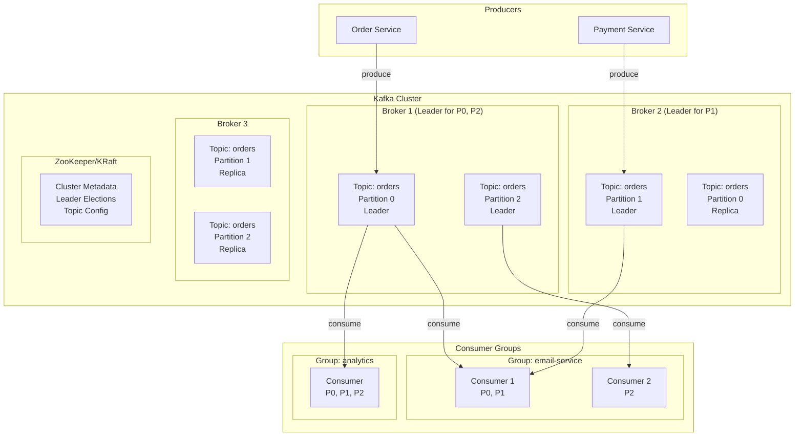
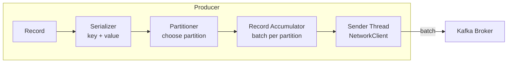
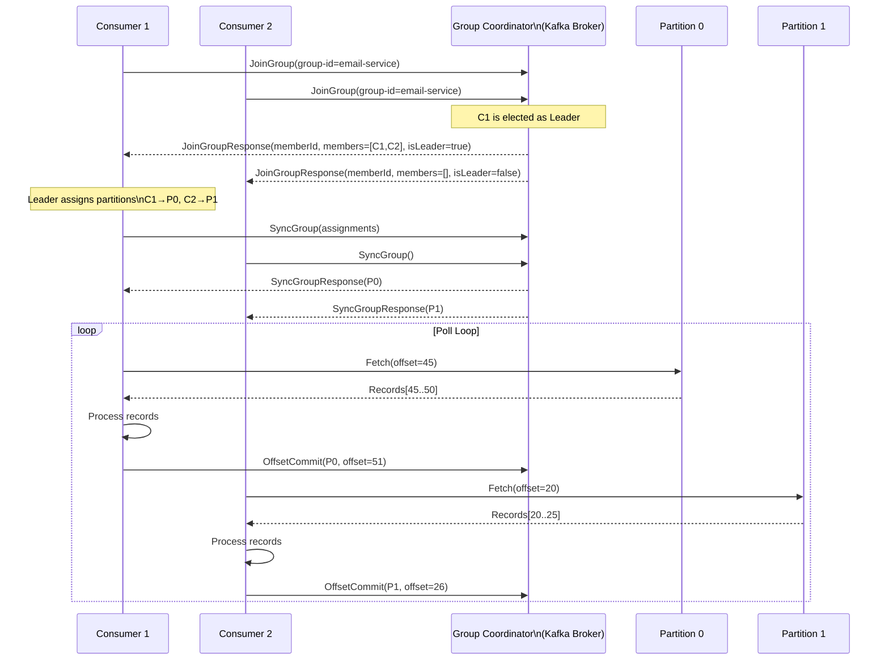
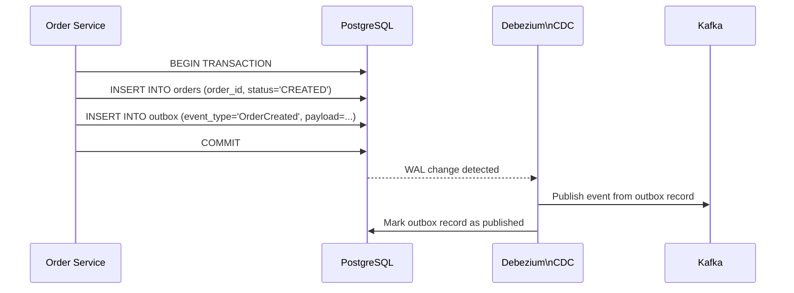

# Section 5: Message Streaming & Data Engineering

## Chapter 11: Apache Kafka — Deep Internals

### Introduction

Apache Kafka is a distributed, partitioned, replicated commit log. It is NOT a traditional message queue. It is a persistent, ordered, replayable log. This distinction is critical.

**Traditional message queue:**
- Messages are consumed and deleted
- Queue is a buffer — consume ASAP
- No history — cannot replay

**Kafka log:**
- Messages are retained for a configured duration (days, weeks, forever)
- Multiple consumer groups can read independently
- Consumer controls its offset — can replay from any point
- Acts as the source of truth for your event stream

This makes Kafka useful not just for messaging but for event sourcing, CDC (change data capture), stream processing, and as the backbone of event-driven architectures.

### Kafka Architecture



### Topics, Partitions, and Offsets

**Topic**: A named stream of records. Think of it as a database table or a folder.

**Partition**: A topic is divided into partitions. Each partition is an ordered, immutable sequence of records. Partitions enable parallelism — different consumers can read different partitions simultaneously.

**Offset**: Each record in a partition has a unique, monotonically increasing offset. The offset is permanent — it never changes.

```
Topic: orders
Partition 0:  [0: OrderCreated] [1: OrderConfirmed] [2: OrderShipped] [3: OrderDelivered]
Partition 1:  [0: OrderCreated] [1: OrderCancelled]
Partition 2:  [0: OrderCreated] [1: OrderConfirmed]
```

**Consumer offset**: Each consumer group independently tracks which offset it has consumed up to. Two different consumer groups (e.g., email-service and analytics) can both read the same partition from different offsets.

### Log Segment Internals

Under the hood, each partition is a directory on the broker's filesystem. The directory contains:

```
/var/kafka-logs/orders-0/
├── 00000000000000000000.log        # Segment file (actual records)
├── 00000000000000000000.index      # Offset index (sparse index)
├── 00000000000000000000.timeindex  # Timestamp index
├── 00000000000021475648.log        # Next segment
├── 00000000000021475648.index
└── 00000000000021475648.timeindex
```

**Log file**: Binary format, append-only. Each record contains:
- CRC checksum
- Magic byte (version)
- Timestamp
- Key length + Key bytes
- Value length + Value bytes
- Headers

**Index file**: Sparse offset-to-byte-position mapping. Allows binary search to find the byte position of a given offset without scanning the entire log.

**Reading a specific offset:**
1. Binary search in index file to find approximate byte position
2. Scan log file from that position to find exact record

**Log segment rollover:**
Kafka creates a new segment when:
- `log.segment.bytes` is reached (default 1GB)
- `log.segment.ms` has elapsed (default 7 days)

**Log retention and compaction:**
```bash
# Retention by time (default 7 days)
log.retention.hours=168

# Retention by size
log.retention.bytes=107374182400  # 100GB

# Log compaction — keep only the latest record per key
# Used for: changelogs, configuration updates, database snapshots
log.cleanup.policy=compact
log.min.cleanable.dirty.ratio=0.5
```

### Producer Internals



**Producer batch behavior:**
- Records are accumulated in a `RecordAccumulator` buffer
- Sender thread sends batches when:
  - `batch.size` bytes are accumulated (default 16KB)
  - `linger.ms` has elapsed (default 0ms — send immediately)
- `linger.ms=5` means "wait up to 5ms to fill a batch" — much better throughput

**Producer acknowledgement modes:**

```java
// acks=0 — Fire and forget (fastest, data loss possible)
props.put(ProducerConfig.ACKS_CONFIG, "0");

// acks=1 — Wait for leader acknowledgement (moderate durability)
props.put(ProducerConfig.ACKS_CONFIG, "1");

// acks=all — Wait for all in-sync replicas (strongest durability)
props.put(ProducerConfig.ACKS_CONFIG, "all");
// with min.insync.replicas=2: at least 2 replicas must acknowledge
```

**Idempotent producer (enables exactly-once at producer level):**

```java
props.put(ProducerConfig.ENABLE_IDEMPOTENCE_CONFIG, true);
// This automatically sets: acks=all, retries=Integer.MAX_VALUE, max.in.flight.requests.per.connection=5
// Producer gets a PID (Producer ID) and sequence numbers
// Broker deduplicates retried messages using (PID, partition, sequence)
```

**Spring Kafka Producer:**

```java
@Configuration
public class KafkaProducerConfig {

    @Bean
    public ProducerFactory<String, Object> producerFactory() {
        Map<String, Object> config = new HashMap<>();
        config.put(ProducerConfig.BOOTSTRAP_SERVERS_CONFIG, "${KAFKA_BROKERS}");
        config.put(ProducerConfig.KEY_SERIALIZER_CLASS_CONFIG, StringSerializer.class);
        config.put(ProducerConfig.VALUE_SERIALIZER_CLASS_CONFIG, JsonSerializer.class);

        // Reliability settings
        config.put(ProducerConfig.ACKS_CONFIG, "all");
        config.put(ProducerConfig.ENABLE_IDEMPOTENCE_CONFIG, true);
        config.put(ProducerConfig.RETRIES_CONFIG, Integer.MAX_VALUE);
        config.put(ProducerConfig.MAX_IN_FLIGHT_REQUESTS_PER_CONNECTION, 5);

        // Performance settings
        config.put(ProducerConfig.BATCH_SIZE_CONFIG, 65536);          // 64KB batches
        config.put(ProducerConfig.LINGER_MS_CONFIG, 5);               // 5ms batching delay
        config.put(ProducerConfig.BUFFER_MEMORY_CONFIG, 67108864);    // 64MB buffer
        config.put(ProducerConfig.COMPRESSION_TYPE_CONFIG, "snappy"); // Compression

        return new DefaultKafkaProducerFactory<>(config);
    }

    @Bean
    public KafkaTemplate<String, Object> kafkaTemplate() {
        KafkaTemplate<String, Object> template = new KafkaTemplate<>(producerFactory());

        // Global error handler
        template.setProducerListener(new ProducerListener<>() {
            @Override
            public void onError(ProducerRecord<String, Object> record,
                               RecordMetadata metadata,
                               Exception exception) {
                log.error("Failed to send record to topic {} partition {}: {}",
                    record.topic(), record.partition(), exception.getMessage());
                // Alert, DLQ, etc.
            }
        });

        return template;
    }
}

@Service
@RequiredArgsConstructor
public class OrderEventPublisher {
    private final KafkaTemplate<String, Object> kafkaTemplate;

    @Transactional  // Transactional outbox pattern
    public void publishOrderCreated(Order order) {
        OrderCreatedEvent event = OrderCreatedEvent.from(order);

        ProducerRecord<String, Object> record = new ProducerRecord<>(
            "order-events",           // topic
            order.getId(),            // key — ensures all events for same order go to same partition
            event                     // value
        );

        // Add headers for tracing and metadata
        record.headers().add("eventType", "OrderCreated".getBytes());
        record.headers().add("eventVersion", "1".getBytes());
        record.headers().add("traceId", currentTraceId().getBytes());

        CompletableFuture<SendResult<String, Object>> future = kafkaTemplate.send(record);
        future.whenComplete((result, ex) -> {
            if (ex == null) {
                log.debug("Published OrderCreated for order {} to partition {} at offset {}",
                    order.getId(),
                    result.getRecordMetadata().partition(),
                    result.getRecordMetadata().offset());
            } else {
                log.error("Failed to publish OrderCreated for order {}", order.getId(), ex);
                // In production: write to outbox table for retry
            }
        });
    }
}
```

### Consumer Internals



**Consumer group rebalancing:**

When a consumer joins or leaves the group, all partitions are reassigned. During rebalancing, no consumer can read messages — this is a "stop the world" event for the consumer group.

**Rebalance strategies:**
- **Range**: Default. Assigns consecutive ranges. Can cause uneven distribution.
- **RoundRobin**: Distributes partitions round-robin. More even.
- **Sticky**: Minimizes partition movement during rebalance. Best for stateful consumers.
- **Cooperative Sticky** (Kafka 2.4+): Incremental rebalance — only moved partitions are reassigned, others keep working.

```java
@Configuration
public class KafkaConsumerConfig {

    @Bean
    public ConsumerFactory<String, Object> consumerFactory() {
        Map<String, Object> config = new HashMap<>();
        config.put(ConsumerConfig.BOOTSTRAP_SERVERS_CONFIG, "${KAFKA_BROKERS}");
        config.put(ConsumerConfig.GROUP_ID_CONFIG, "order-service");
        config.put(ConsumerConfig.KEY_DESERIALIZER_CLASS_CONFIG, StringDeserializer.class);
        config.put(ConsumerConfig.VALUE_DESERIALIZER_CLASS_CONFIG, JsonDeserializer.class);
        config.put(JsonDeserializer.TRUSTED_PACKAGES, "com.example.events");

        // Offset management
        config.put(ConsumerConfig.ENABLE_AUTO_COMMIT_CONFIG, false);   // Manual commits
        config.put(ConsumerConfig.AUTO_OFFSET_RESET_CONFIG, "earliest"); // Start from beginning

        // Performance
        config.put(ConsumerConfig.MAX_POLL_RECORDS_CONFIG, 500);         // Max records per poll
        config.put(ConsumerConfig.FETCH_MIN_BYTES_CONFIG, 1024);         // Min fetch size
        config.put(ConsumerConfig.FETCH_MAX_WAIT_MS_CONFIG, 500);        // Max wait if insufficient data

        // Rebalance
        config.put(ConsumerConfig.PARTITION_ASSIGNMENT_STRATEGY_CONFIG,
            CooperativeStickyAssignor.class.getName()); // Incremental rebalance

        // Heartbeat and session timeout
        config.put(ConsumerConfig.HEARTBEAT_INTERVAL_MS_CONFIG, 3000);  // 3s heartbeat
        config.put(ConsumerConfig.SESSION_TIMEOUT_MS_CONFIG, 30000);    // 30s session timeout
        config.put(ConsumerConfig.MAX_POLL_INTERVAL_MS_CONFIG, 300000); // 5min max between polls

        return new DefaultKafkaConsumerFactory<>(config);
    }

    @Bean
    public ConcurrentKafkaListenerContainerFactory<String, Object> kafkaListenerContainerFactory() {
        ConcurrentKafkaListenerContainerFactory<String, Object> factory =
            new ConcurrentKafkaListenerContainerFactory<>();
        factory.setConsumerFactory(consumerFactory());

        // Concurrency — number of consumer threads (max = partition count)
        factory.setConcurrency(3);

        // Manual ACK mode — commit after processing
        factory.getContainerProperties().setAckMode(ContainerProperties.AckMode.MANUAL_IMMEDIATE);

        // Error handler — send to DLQ
        factory.setCommonErrorHandler(new DefaultErrorHandler(
            new DeadLetterPublishingRecoverer(kafkaTemplate,
                (record, ex) -> new TopicPartition(record.topic() + ".DLT", record.partition())),
            new FixedBackOff(1000L, 3L) // 3 retries, 1s delay
        ));

        return factory;
    }
}

// Consumer with manual offset management
@Component
@Slf4j
public class OrderEventConsumer {

    @KafkaListener(
        topics = "order-events",
        groupId = "order-processor",
        containerFactory = "kafkaListenerContainerFactory"
    )
    public void handleOrderEvent(
            ConsumerRecord<String, OrderEvent> record,
            Acknowledgment ack) {

        log.info("Processing {} from topic {} partition {} offset {}",
            record.value().getClass().getSimpleName(),
            record.topic(), record.partition(), record.offset());

        try {
            processEvent(record.value());
            ack.acknowledge(); // Commit offset after successful processing

        } catch (RetryableException e) {
            // Don't ack — will retry
            log.warn("Retryable error processing event at offset {}", record.offset(), e);
            throw e; // Let the container handle retry

        } catch (NonRetryableException e) {
            // Ack anyway — sending to DLQ
            log.error("Non-retryable error processing event at offset {}", record.offset(), e);
            ack.acknowledge(); // Don't retry — already going to DLQ via error handler
        }
    }
}
```

### Exactly-Once Semantics (EOS)

Kafka offers three delivery guarantees:
- **At most once**: Messages may be lost but never duplicated (acks=0)
- **At least once**: Messages may be duplicated but never lost (acks=all + retries)
- **Exactly once**: Each message processed exactly once (Kafka transactions)

**Kafka Transactions:**

```java
@Configuration
public class KafkaTransactionConfig {

    @Bean
    public ProducerFactory<String, Object> transactionalProducerFactory() {
        Map<String, Object> config = new HashMap<>();
        // ... other config ...
        config.put(ProducerConfig.TRANSACTIONAL_ID_CONFIG, "order-service-tx-1");
        config.put(ProducerConfig.ENABLE_IDEMPOTENCE_CONFIG, true);
        return new DefaultKafkaProducerFactory<>(config);
    }
}

@Service
@RequiredArgsConstructor
public class ExactlyOnceOrderProcessor {
    private final KafkaTemplate<String, Object> kafkaTemplate;
    private final KafkaTransactionManager<String, Object> txManager;

    // Process read-process-write: exactly once
    @Transactional("kafkaTransactionManager")
    public void processOrderEvent(ConsumerRecord<String, OrderEvent> inRecord) {
        OrderEvent event = inRecord.value();

        // Do processing
        EnrichedOrderEvent enriched = enrich(event);

        // Write to output topic — atomic with offset commit
        kafkaTemplate.send("enriched-order-events", event.getOrderId(), enriched);

        // Both the output message AND the offset commit are in one transaction
        // If anything fails, both are rolled back
    }
}
```

**Read-process-write with consume-transform-produce:**

```
Consumer reads from "orders" topic
↓ (transactional boundary)
Producer writes to "processed-orders" topic
Consumer commits offset
↓
Either BOTH succeed or BOTH fail
```

### Kafka Replication

Kafka replication provides fault tolerance. Each partition has one leader and N-1 followers.

**In-Sync Replicas (ISR):**
The ISR is the set of replicas that are "caught up" with the leader. A replica is in-sync if it has fetched all messages from the leader within `replica.lag.time.max.ms` (default 30 seconds).

**min.insync.replicas:**
The minimum number of replicas that must be in-sync for a write to succeed. With `min.insync.replicas=2` and `acks=all`, Kafka refuses writes if fewer than 2 replicas are in sync — preventing data loss.

```bash
# Create topic with replication factor 3 and min ISR 2
kafka-topics.sh --create \
  --topic order-events \
  --partitions 12 \
  --replication-factor 3 \
  --config min.insync.replicas=2 \
  --config retention.ms=604800000 \
  --config segment.bytes=1073741824 \
  --bootstrap-server kafka-1:9092

# Verify ISR
kafka-topics.sh --describe --topic order-events --bootstrap-server kafka-1:9092
```

**Unclean leader election:**

When the leader fails and no in-sync replicas are available, should Kafka:
- Wait for an ISR to come back (prefer consistency — no data loss)
- Elect an out-of-sync replica (prefer availability — possible data loss)

`unclean.leader.election.enable=false` (default): Wait. Better for financial data.
`unclean.leader.election.enable=true`: Elect a stale replica. Better for availability.

### Kafka Performance Tuning

**Producer throughput:**

```properties
# Kafka producer tuning for high throughput
batch.size=65536                    # 64KB — larger batches = better throughput
linger.ms=5                         # Wait 5ms to fill batch
compression.type=snappy             # snappy: fast with good ratio; lz4: even faster
buffer.memory=134217728             # 128MB producer buffer
max.block.ms=60000                  # Wait up to 60s for buffer space
```

**Consumer throughput:**

```properties
# Consumer tuning
fetch.min.bytes=65536               # 64KB — don't fetch tiny responses
fetch.max.wait.ms=500               # Wait up to 500ms for data
max.poll.records=1000               # Process 1000 records per poll
max.partition.fetch.bytes=1048576   # 1MB per partition per fetch
```

**Topic configuration:**

```properties
# Topic-level config
num.partitions=24                   # More partitions = more parallelism
replication.factor=3                # Fault tolerance
min.insync.replicas=2               # Durability
retention.ms=604800000              # 7 days
segment.bytes=1073741824            # 1GB segments
compression.type=producer           # Keep producer's compression
```

### The Outbox Pattern — Reliable Event Publishing

Problem: How do you atomically update a database AND publish a Kafka event? If the database commits but Kafka fails, events are lost. If Kafka succeeds but the database fails, events are published for changes that didn't happen.

**Solution: The Transactional Outbox Pattern**



```java
// 1. Write to outbox table atomically with your business data
@Service
@Transactional
public class OrderService {
    private final OrderRepository orderRepository;
    private final OutboxRepository outboxRepository;

    public Order placeOrder(PlaceOrderCommand command) {
        Order order = Order.create(command);
        orderRepository.save(order);

        // Atomic with order save — same transaction!
        OutboxEvent outboxEvent = OutboxEvent.builder()
            .aggregateType("Order")
            .aggregateId(order.getId())
            .eventType("OrderCreated")
            .payload(objectMapper.writeValueAsString(OrderCreatedEvent.from(order)))
            .build();
        outboxRepository.save(outboxEvent);

        return order;
    }
}

// 2. Debezium reads the outbox table via PostgreSQL WAL and publishes to Kafka
// No application code needed for the publishing step!
```

**Debezium connector config for outbox pattern:**

```json
{
  "name": "order-outbox-connector",
  "config": {
    "connector.class": "io.debezium.connector.postgresql.PostgresConnector",
    "database.hostname": "postgres",
    "database.port": "5432",
    "database.user": "debezium",
    "database.password": "${DB_PASSWORD}",
    "database.dbname": "orders",
    "database.server.name": "orders",
    "table.include.list": "public.outbox_events",
    "transforms": "outbox",
    "transforms.outbox.type": "io.debezium.transforms.outbox.EventRouter",
    "transforms.outbox.table.field.event.id": "id",
    "transforms.outbox.table.field.event.key": "aggregate_id",
    "transforms.outbox.table.field.event.type": "event_type",
    "transforms.outbox.table.field.event.payload": "payload",
    "transforms.outbox.route.by.field": "aggregate_type",
    "transforms.outbox.route.topic.replacement": "outbox.event.${routedByValue}",
    "slot.name": "debezium_outbox"
  }
}
```

### Interview Questions

**Q: How does Kafka guarantee ordering of messages?**

A: Kafka guarantees ordering within a partition. All messages with the same key go to the same partition (by default via hash partitioning), so all events for the same order ID are in order. Ordering across partitions is not guaranteed. To maintain global ordering, use a single partition — but you lose parallelism. The practical approach: design your system to only need ordering within a key (e.g., all events for one order, one user, one device).

**Q: What is the difference between a consumer group and a consumer?**

A: A consumer group is a logical group of consumers that collectively consume a topic. Each partition is assigned to exactly one consumer in the group — they share the work. Multiple consumer groups can each consume the same topic independently (each group maintains its own offset). A consumer is one instance within a group. If you have a topic with 12 partitions and a consumer group with 4 consumers, each consumer reads from 3 partitions.

**Q: What happens when a consumer is slow and cannot process messages fast enough?**

A: The consumer will eventually miss the `max.poll.interval.ms` deadline. Kafka will consider it dead, trigger a rebalance, and reassign its partitions to other consumers. In the meantime, messages accumulate in the partition (as long as they are within the retention period). Solutions: (1) Increase `max.poll.interval.ms`, (2) Decrease `max.poll.records` to process fewer records per poll, (3) Scale out the consumer group (add more consumers), (4) Make processing faster (async, batch processing).

**Q: Explain exactly-once semantics in Kafka.**

A: Kafka achieves exactly-once through: (1) Idempotent producer — the broker deduplicates retried messages using (producer ID, partition, sequence number). (2) Transactions — a producer can atomically publish to multiple partitions and topics. The consumer only sees committed messages when `isolation.level=read_committed`. For consume-transform-produce pipelines, you combine idempotent producer + transactions so that consuming an offset and producing output are atomic. Kafka Streams uses this automatically.

---
