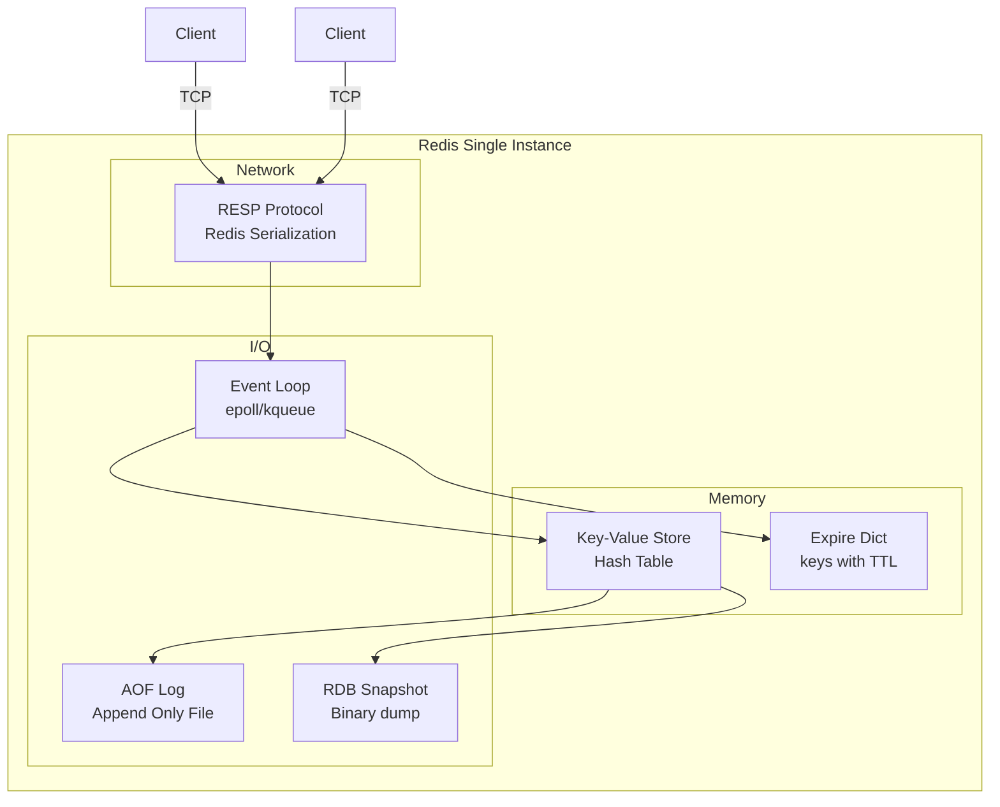

# Section 7: Caching & In-Memory Systems

## Chapter 13: Redis Internals and Distributed Caching

### Introduction

Caching is one of the most powerful performance optimizations available. A well-designed cache can reduce database load by 90% and cut response times from milliseconds to microseconds. But caching also introduces complexity: cache invalidation, consistency problems, and hot keys.

*"There are only two hard things in computer science: cache invalidation and naming things."* — Phil Karlton

### Redis Architecture

Redis is a single-threaded, in-memory data structure store. "Single-threaded" sounds limiting but is a feature: no locking, no contention, predictable performance. One Redis instance handles 100,000+ operations per second.



### Redis Data Structures

**String** — most versatile:
```bash
SET order:status:123 "CONFIRMED" EX 3600  # With 1-hour TTL
GET order:status:123
INCR page:views:homepage    # Atomic counter
GETSET user:session:abc "new-session-data"  # Get old value and set new
SETNX lock:order:123 "worker-1"  # Set only if not exists (distributed lock)
```

**Hash** — store object fields:
```bash
HSET order:123 status "CONFIRMED" total "99.99" customerId "cust-456"
HGET order:123 status
HMGET order:123 status total        # Multiple fields in one command
HGETALL order:123
HINCRBY order:123 version 1         # Atomic field increment
```

**List** — ordered collection:
```bash
LPUSH task:queue "task-1" "task-2"  # Push to left (head)
RPOP task:queue                     # Pop from right (tail) → FIFO queue
BRPOP task:queue 30                 # Blocking pop (wait up to 30s)
LRANGE task:queue 0 -1              # Get all elements
LLEN task:queue                     # Queue length
```

**Set** — unique members:
```bash
SADD user:123:tags "premium" "verified"
SISMEMBER user:123:tags "premium"   # Check membership
SMEMBERS user:123:tags              # Get all members
SINTER user:123:tags user:456:tags  # Intersection
SUNION user:123:tags user:456:tags  # Union
```

**Sorted Set (ZSet)** — ordered by score:
```bash
ZADD leaderboard 1500.0 "player-alice"
ZADD leaderboard 1200.0 "player-bob"
ZRANGE leaderboard 0 9 REV WITHSCORES  # Top 10
ZRANK leaderboard "player-alice"         # Rank (0-indexed)
ZINCRBY leaderboard 50 "player-alice"   # Increment score atomically
```

**HyperLogLog** — probabilistic cardinality estimation:
```bash
PFADD unique:visitors:2024-01-15 "user-123" "user-456" "user-789"
PFCOUNT unique:visitors:2024-01-15  # Approximate unique count (±0.81%)
# Uses only 12KB per counter regardless of data size
```

**Streams** — time-series log:
```bash
XADD order:events * type "OrderCreated" orderId "123" customerId "456"
XREAD COUNT 10 STREAMS order:events 0   # Read from beginning
XREAD BLOCK 0 COUNT 10 STREAMS order:events $  # Block until new messages
```

### Redis Persistence

Redis offers two persistence mechanisms:

**RDB (Redis Database) — point-in-time snapshots:**
```bash
# redis.conf
save 3600 1     # Save if 1+ key changed in 60min
save 300 100    # Save if 100+ keys changed in 5min
save 60 10000   # Save if 10000+ keys changed in 1min

dbfilename dump.rdb
dir /var/lib/redis
```

**AOF (Append Only File) — write-ahead log:**
```bash
appendonly yes
appendfsync everysec    # Flush to disk every second (good balance)
# appendfsync always   # Every write (slowest, safest)
# appendfsync no       # OS decides (fastest, least safe)

# AOF rewrite — compact the log when it gets large
auto-aof-rewrite-percentage 100
auto-aof-rewrite-min-size 64mb
```

**Which to use?**
- **RDB only**: Acceptable data loss (backups, cache). Fastest restart.
- **AOF only**: Maximum durability. `appendfsync always` = no data loss.
- **Both**: Best durability. AOF used for recovery, RDB for fast restart.
- **Neither**: Pure cache — acceptable to lose all data on restart.

### Redis Cluster

Redis Cluster provides horizontal scaling and high availability. Data is sharded across multiple master nodes.

```mermaid
graph TB
    subgraph "Redis Cluster (6 nodes)"
        subgraph "Shard 1 (slots 0-5460)"
            M1[Master 1]
            R1[Replica 1]
            M1 --> R1
        end
        subgraph "Shard 2 (slots 5461-10922)"
            M2[Master 2]
            R2[Replica 2]
            M2 --> R2
        end
        subgraph "Shard 3 (slots 10923-16383)"
            M3[Master 3]
            R3[Replica 3]
            M3 --> R3
        end
    end

    CLIENT[Client] -->|hash(key) % 16384| M1
    CLIENT -->|hash(key) % 16384| M2
    CLIENT -->|hash(key) % 16384| M3
```

**16384 hash slots** are distributed among masters. Key slot: `CRC16(key) mod 16384`.

**Hash tags** — force related keys to the same shard:
```
{order:123}:status   ← hash tag: "order:123" → same shard
{order:123}:items    ← hash tag: "order:123" → same shard
# Both keys go to the same slot → multi-key commands work!
```

**Redis Cluster setup:**
```bash
# redis.conf for cluster mode
cluster-enabled yes
cluster-config-file nodes.conf
cluster-node-timeout 5000
cluster-require-full-coverage no    # Cluster still works with partial failures

# Create cluster
redis-cli --cluster create \
  redis-1:6379 redis-2:6379 redis-3:6379 \
  redis-4:6379 redis-5:6379 redis-6:6379 \
  --cluster-replicas 1
```

**Spring Boot Redis Cluster:**
```yaml
spring:
  data:
    redis:
      cluster:
        nodes:
          - redis-1:6379
          - redis-2:6379
          - redis-3:6379
        max-redirects: 3
      lettuce:
        cluster:
          refresh:
            adaptive: true      # Auto-detect topology changes
            period: 30s
        pool:
          max-active: 20
          max-idle: 10
          min-idle: 5
```

### Caching Patterns in Spring Boot

**Spring Cache Abstraction:**

```java
@Configuration
@EnableCaching
public class CacheConfig {

    @Bean
    public CacheManager cacheManager(RedisConnectionFactory connectionFactory) {
        RedisCacheConfiguration defaultConfig = RedisCacheConfiguration.defaultCacheConfig()
            .entryTtl(Duration.ofMinutes(10))
            .serializeKeysWith(RedisSerializationContext.SerializationPair
                .fromSerializer(new StringRedisSerializer()))
            .serializeValuesWith(RedisSerializationContext.SerializationPair
                .fromSerializer(new GenericJackson2JsonRedisSerializer()))
            .disableCachingNullValues();

        Map<String, RedisCacheConfiguration> cacheConfigurations = Map.of(
            "products", defaultConfig.entryTtl(Duration.ofHours(1)),    // Products change rarely
            "orders", defaultConfig.entryTtl(Duration.ofMinutes(5)),     // Orders change more often
            "sessions", defaultConfig.entryTtl(Duration.ofHours(24)),    // Sessions live long
            "pricing", defaultConfig.entryTtl(Duration.ofMinutes(1))    // Pricing changes frequently
        );

        return RedisCacheManager.builder(connectionFactory)
            .cacheDefaults(defaultConfig)
            .withInitialCacheConfigurations(cacheConfigurations)
            .build();
    }
}

@Service
public class ProductService {

    @Cacheable(value = "products", key = "#productId",
               condition = "#productId != null")
    public Product findById(String productId) {
        // Called only if cache miss
        return productRepository.findById(productId).orElseThrow();
    }

    @CachePut(value = "products", key = "#product.id")
    public Product updateProduct(Product product) {
        Product saved = productRepository.save(product);
        // Updates cache after saving — cache stays consistent
        return saved;
    }

    @CacheEvict(value = "products", key = "#productId")
    public void deleteProduct(String productId) {
        productRepository.deleteById(productId);
        // Evicts from cache after deletion
    }

    @CacheEvict(value = "products", allEntries = true)
    @Scheduled(fixedRate = 3600000) // Every hour
    public void evictAllProductCache() {
        // Clear entire cache periodically for safety
    }
}
```

**Manual Redis operations for complex patterns:**

```java
@Service
@RequiredArgsConstructor
public class OrderCacheService {
    private final RedisTemplate<String, Object> redisTemplate;
    private static final Duration ORDER_TTL = Duration.ofMinutes(15);

    // Cache-aside pattern with NULL caching (prevent cache penetration)
    public Optional<Order> findOrder(String orderId) {
        String key = "order:" + orderId;
        Object cached = redisTemplate.opsForValue().get(key);

        if (cached != null) {
            if (cached instanceof NullValue) {
                return Optional.empty(); // Cached "not found"
            }
            return Optional.of((Order) cached);
        }

        // Cache miss — load from DB
        Optional<Order> order = orderRepository.findById(orderId);

        if (order.isPresent()) {
            redisTemplate.opsForValue().set(key, order.get(), ORDER_TTL);
        } else {
            // Cache the null result to prevent repeated DB hits (cache penetration)
            redisTemplate.opsForValue().set(key, NullValue.INSTANCE, Duration.ofMinutes(1));
        }

        return order;
    }

    // Atomic check-and-set
    public boolean updateOrderStatus(String orderId, OrderStatus newStatus) {
        String key = "order:" + orderId;
        // Use WATCH + MULTI/EXEC for optimistic locking
        return redisTemplate.execute(new SessionCallback<Boolean>() {
            @Override
            public Boolean execute(RedisOperations operations) {
                operations.watch(key);
                Order order = (Order) operations.opsForValue().get(key);
                if (order == null) {
                    operations.unwatch();
                    return false;
                }

                operations.multi();
                order.setStatus(newStatus);
                operations.opsForValue().set(key, order, ORDER_TTL);
                List<Object> results = operations.exec();
                return results != null; // null = transaction aborted (concurrent modification)
            }
        });
    }
}
```

### Distributed Lock with Redis

```java
@Service
@RequiredArgsConstructor
public class RedisDistributedLock {
    private final RedisTemplate<String, String> redisTemplate;

    // Redlock algorithm (simplified single-instance version)
    public boolean acquire(String lockKey, String lockValue, Duration ttl) {
        Boolean result = redisTemplate.opsForValue()
            .setIfAbsent("lock:" + lockKey, lockValue, ttl);
        return Boolean.TRUE.equals(result);
    }

    public void release(String lockKey, String lockValue) {
        // Lua script — atomic check and delete
        String script = """
            if redis.call('get', KEYS[1]) == ARGV[1] then
                return redis.call('del', KEYS[1])
            else
                return 0
            end
            """;

        redisTemplate.execute(
            new DefaultRedisScript<>(script, Long.class),
            List.of("lock:" + lockKey),
            lockValue
        );
    }
}

// Usage with try-with-resources
@Service
public class InventoryService {
    private final RedisDistributedLock lock;

    public boolean reserveInventory(String productId, int quantity) {
        String lockValue = UUID.randomUUID().toString();
        String lockKey = "inventory:" + productId;

        if (!lock.acquire(lockKey, lockValue, Duration.ofSeconds(5))) {
            throw new LockAcquisitionException("Could not acquire inventory lock for " + productId);
        }

        try {
            // Safe to access inventory exclusively
            int available = getAvailableQuantity(productId);
            if (available < quantity) return false;

            setAvailableQuantity(productId, available - quantity);
            return true;
        } finally {
            lock.release(lockKey, lockValue);
        }
    }
}
```

### Cache Invalidation Strategies

**1. Time-to-live (TTL)** — simplest, eventual consistency:
```java
redisTemplate.expire("product:123", Duration.ofMinutes(10));
// Cache auto-expires — at most 10 minutes stale
```

**2. Write-through** — update cache on write:
```java
public Product updateProduct(Product product) {
    Product saved = db.save(product);
    cache.put("product:" + product.getId(), saved); // Immediately update cache
    return saved;
}
```

**3. Write-behind** — write to cache first, async write to DB:
```
Client → Cache (fast) → DB (async in background)
Risk: If cache crashes before DB write, data lost
Use only when you can tolerate this risk
```

**4. Cache-aside** — application manages cache:
```
Read: Check cache → Miss → Load from DB → Store in cache
Write: Write to DB → Delete from cache (not update!)
Why delete? Updating is complex. Deleting forces next read to re-populate.
```

**5. Event-driven invalidation** — most accurate:
```java
// When DB changes, publish event → invalidate cache
@EventListener
public void onOrderUpdated(OrderUpdatedEvent event) {
    redisTemplate.delete("order:" + event.getOrderId());
    redisTemplate.delete("orders:customer:" + event.getCustomerId()); // Invalidate list too
}
```

### Hot Key Problem

A "hot key" is a key that gets far more traffic than others. In Redis Cluster, all traffic for a hot key goes to ONE shard, creating a bottleneck.

**Example:** Product launch — 100,000 users check the same product per second. All traffic goes to partition containing `product:launch-2024`.

**Solutions:**

```java
// 1. Local cache (L1) to absorb hot key traffic
@Service
public class ProductService {
    // Caffeine local cache — in JVM memory, super fast
    private final Cache<String, Product> localCache = Caffeine.newBuilder()
        .maximumSize(1000)
        .expireAfterWrite(Duration.ofSeconds(10)) // Short TTL — acceptable staleness
        .build();

    private final RedisTemplate<String, Product> redisTemplate;

    public Product getProduct(String productId) {
        // Check local cache first (zero network call)
        return localCache.get(productId, id -> {
            // Check Redis
            Product fromRedis = redisTemplate.opsForValue().get("product:" + id);
            if (fromRedis != null) return fromRedis;

            // Load from DB
            Product fromDb = productRepository.findById(id).orElseThrow();
            redisTemplate.opsForValue().set("product:" + id, fromDb, Duration.ofMinutes(10));
            return fromDb;
        });
    }
}

// 2. Key sharding — spread hot key across multiple keys
public Product getProductSharded(String productId) {
    // Choose one of N shards based on current time
    int shard = (int) (System.currentTimeMillis() / 1000) % 10; // 10 shards, rotate per second
    String key = "product:" + productId + ":shard:" + shard;

    Product product = redisTemplate.opsForValue().get(key);
    if (product != null) return product;

    product = productRepository.findById(productId).orElseThrow();
    // Store in all shards
    for (int i = 0; i < 10; i++) {
        redisTemplate.opsForValue().set("product:" + productId + ":shard:" + i,
                                        product, Duration.ofMinutes(10));
    }
    return product;
}
```

### Interview Questions

**Q: What is cache penetration and how do you prevent it?**

A: Cache penetration happens when queries for non-existent keys bypass the cache and hit the database every time. Example: someone queries `product:FAKE-ID-99999` repeatedly. Cache has nothing, DB has nothing, but every request hits the DB. Prevention: (1) Cache null results with a short TTL — cache the "not found" response for 1-5 minutes. (2) Bloom filter — maintain a probabilistic set of all existing IDs. Check before querying. If not in Bloom filter, return 404 immediately. (3) Input validation — reject obviously invalid IDs before querying.

**Q: What is the difference between Redis Cluster and Redis Sentinel?**

A: Redis Sentinel provides high availability for a SINGLE master with replicas. If the master fails, Sentinel promotes a replica. No data sharding — all data on one master. Redis Cluster provides both sharding (data split across masters) AND high availability (each shard has replicas). Use Sentinel when your data fits on one machine and you need HA. Use Cluster when you need to scale beyond one machine or need higher throughput.

**Q: Explain the difference between `@Cacheable`, `@CachePut`, and `@CacheEvict`.**

A: `@Cacheable`: Check cache first. If hit, return cached value. If miss, call method and cache the result. For reads. `@CachePut`: Always call the method AND update the cache with the result. For writes — keep cache warm after update. `@CacheEvict`: Call the method and delete the specified cache entry. For deletes or when you cannot easily compute the new cached value. `@Caching`: Combine multiple cache annotations on one method.

---
