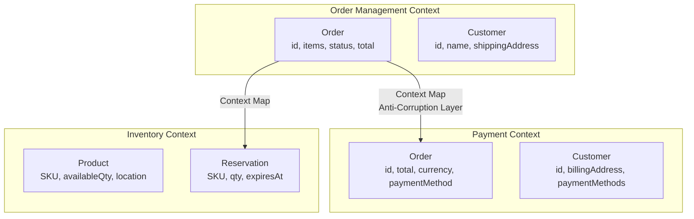
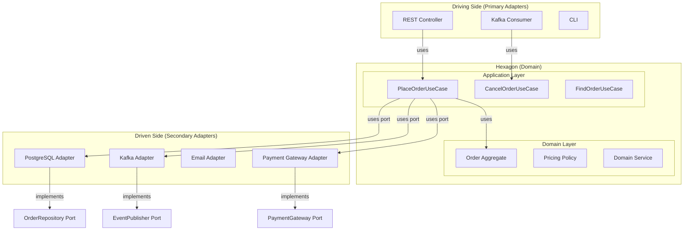

# Section 8: Software Architecture

## Chapter 14: Domain-Driven Design, Hexagonal Architecture, and System Design

### Introduction

Architecture is the set of significant decisions that are hard to change later. Good architecture enables teams to work independently, deploy safely, and understand the system. Bad architecture creates coupling — a change in one place breaks another.

This chapter covers: Domain-Driven Design (DDD), Hexagonal Architecture, and system design interview patterns.

### Domain-Driven Design (DDD)

DDD is an approach to software development that places the business domain at the center. The language developers use (in code, meetings, documentation) should match the language domain experts use.

**Core concepts:**

**Ubiquitous Language**: A shared vocabulary between developers and domain experts. If the business calls it "fulfilment" not "processing," your code should say `fulfillOrder()` not `processOrder()`.

**Bounded Context**: A boundary within which a domain model is internally consistent. Different contexts can have different models of the same concept.



Notice that "Customer" means different things in different contexts. In Order Management, you care about the shipping address. In Payment, you care about billing address and payment methods. **Never share a domain model across bounded contexts.**

**Aggregates**: A cluster of objects treated as a unit. One object is the Aggregate Root — all external references are to the root only.

```java
// Order is the Aggregate Root
// OrderItem can only be accessed through Order — never directly
public class Order {
    private String id;              // Aggregate Root ID
    private String customerId;      // Reference by ID only — no object reference to Customer
    private List<OrderItem> items;  // Inside the aggregate
    private OrderStatus status;

    // Business operations — enforce invariants
    public void addItem(String productId, Money price, int quantity) {
        if (status != OrderStatus.DRAFT) {
            throw new IllegalStateException("Cannot add items to a " + status + " order");
        }
        // Enforce aggregate invariant: max 10 items
        if (items.size() >= 10) {
            throw new MaxItemsExceededException("Order cannot have more than 10 items");
        }
        items.add(new OrderItem(productId, price, quantity));
    }

    public void confirm(PaymentResult payment) {
        if (payment.isSuccessful()) {
            this.status = OrderStatus.CONFIRMED;
        } else {
            this.status = OrderStatus.PAYMENT_FAILED;
        }
    }

    // WRONG — should not be a method on Order:
    // public void sendConfirmationEmail() { ... } ← not part of the order domain
    // public void chargePaymentCard() { ... } ← belongs to Payment context
}

// OrderItem is INSIDE the aggregate — no ID, no direct repository
@Embeddable
public class OrderItem {
    private String productId;  // Reference to Product by ID only
    private Money unitPrice;
    private int quantity;

    // No public setters — immutable within aggregate
    // Change through Order.updateItem() which enforces invariants
}
```

**Domain Services**: Logic that doesn't naturally belong to any entity or value object.

```java
// Pricing is a domain service — it coordinates multiple entities
public class PricingDomainService {
    public Money calculateOrderTotal(Order order, PricingPolicy policy, Customer customer) {
        Money baseTotal = order.getItems().stream()
            .map(item -> item.getUnitPrice().multiply(item.getQuantity()))
            .reduce(Money.ZERO, Money::add);

        // Apply tiered discounts — complex logic spanning multiple domain objects
        return policy.applyDiscounts(baseTotal, customer.getTier(), order.getItems().size());
    }
}
```

**Domain Events**: Something that happened in the domain that other parts of the system care about.

```java
// Domain events are immutable facts about the past
public record OrderConfirmedEvent(
    String orderId,
    String customerId,
    Money total,
    List<OrderItem> items,
    Instant occurredAt
) implements DomainEvent {
    public OrderConfirmedEvent(Order order) {
        this(order.getId(), order.getCustomerId(), order.getTotal(),
             order.getItems(), Instant.now());
    }
}

// Events are raised by aggregates and published by repositories or application services
public class Order {
    private final List<DomainEvent> uncommittedEvents = new ArrayList<>();

    public void confirm(PaymentResult payment) {
        // ... business logic ...
        this.status = OrderStatus.CONFIRMED;
        uncommittedEvents.add(new OrderConfirmedEvent(this));
    }
}
```

### Hexagonal Architecture (Ports and Adapters)

Hexagonal Architecture separates your core business logic from the technology around it. The core (domain + application) has NO knowledge of databases, HTTP, Kafka, or Spring.



**Implementation example:**

```java
// ── Domain Layer — NO framework dependencies ─────────────────────────────────
public class Order {
    // Pure Java — no Spring, JPA, or Kafka annotations
}

// ── Ports — interfaces defining what the application needs ──────────────────
// Primary port (driving) — what the application exposes
public interface PlaceOrderUseCase {
    Order placeOrder(PlaceOrderCommand command);
}

// Secondary port (driven) — what the application needs
public interface OrderRepository {
    Order save(Order order);
    Optional<Order> findById(String id);
}

public interface EventPublisher {
    void publish(DomainEvent event);
}

public interface PaymentGateway {
    PaymentResult charge(Money amount, PaymentMethod method);
}

// ── Application Layer — implements use cases, orchestrates domain ────────────
@Service  // Spring annotation here is OK — this is the adapter
public class PlaceOrderService implements PlaceOrderUseCase {
    private final OrderRepository orderRepository;    // Port — no adapter detail
    private final EventPublisher eventPublisher;       // Port
    private final PaymentGateway paymentGateway;      // Port
    private final PricingDomainService pricingService; // Domain service — no framework

    @Override
    @Transactional
    public Order placeOrder(PlaceOrderCommand command) {
        // Pure business logic — no HTTP, no Kafka, no DB details
        Order order = Order.create(command.getCustomerId(), command.getItems());
        Money total = pricingService.calculateTotal(order, command.getPricingPolicy());
        order.setTotal(total);

        PaymentResult payment = paymentGateway.charge(total, command.getPaymentMethod());
        order.confirm(payment);

        Order saved = orderRepository.save(order);
        order.getUncommittedEvents().forEach(eventPublisher::publish);

        return saved;
    }
}

// ── Adapters — implement ports with specific technology ──────────────────────
// Driving adapter: REST controller
@RestController
@RequestMapping("/api/v1/orders")
@RequiredArgsConstructor
public class OrderRestAdapter {
    private final PlaceOrderUseCase placeOrderUseCase; // Uses the port

    @PostMapping
    public ResponseEntity<OrderResponse> placeOrder(@RequestBody PlaceOrderRequest request) {
        PlaceOrderCommand command = OrderMapper.toCommand(request);
        Order order = placeOrderUseCase.placeOrder(command);
        return ResponseEntity.status(HttpStatus.CREATED).body(OrderMapper.toResponse(order));
    }
}

// Driven adapter: JPA repository
@Repository  // Spring annotation — adapter layer
@RequiredArgsConstructor
public class JpaOrderRepository implements OrderRepository { // Implements port
    private final SpringDataOrderRepository jpaRepo; // Spring Data
    private final OrderMapper mapper;

    @Override
    public Order save(Order order) {
        OrderEntity entity = mapper.toEntity(order);
        OrderEntity saved = jpaRepo.save(entity);
        return mapper.toDomain(saved);
    }

    @Override
    public Optional<Order> findById(String id) {
        return jpaRepo.findById(id).map(mapper::toDomain);
    }
}

// Driven adapter: Kafka event publisher
@Component
@RequiredArgsConstructor
public class KafkaEventPublisher implements EventPublisher { // Implements port
    private final KafkaTemplate<String, Object> kafkaTemplate;

    @Override
    public void publish(DomainEvent event) {
        String topic = resolveTopicForEvent(event.getClass());
        kafkaTemplate.send(topic, event.getAggregateId(), event);
    }
}
```

### System Design Interview Patterns

**The STAR approach for system design:**
1. **Scope**: Clarify requirements (functional + non-functional)
2. **Think**: Identify bottlenecks and trade-offs
3. **Architect**: Draw the high-level design
4. **Refine**: Deep-dive into critical components

**Design a URL Shortener (bit.ly):**

```
Requirements:
- Shorten long URLs to short codes
- Redirect short URLs to original
- 100M URLs/day written, 10B redirections/day
- Low latency redirects (<10ms)
- Analytics (click counts)

Estimation:
- Write: 100M/day = 1,200/sec
- Read: 10B/day = 115,000/sec (96x read-heavy)
- Storage: 100M × 500 bytes × 365 days × 5 years = ~90TB

Design:
1. Short code generation: base62(random 7 chars) = 62^7 = 3.5T URLs
   Or: hash(long_url) → take first 7 chars of MD5 (handle collisions)

2. Database: PostgreSQL for URL storage
   - Table: short_code (PK), long_url, created_at, user_id, expires_at
   - Index on short_code (already PK)
   - Partitioned by created_at (monthly partitions)

3. Caching: Redis for hot URLs
   - 80% of traffic to 20% of URLs (Pareto principle)
   - Cache top 20% in Redis = much less DB load
   - TTL: 24 hours, LRU eviction

4. Redirect service:
   GET /abc123 → Redis lookup → 301 Redirect
   If cache miss → DB lookup → cache result → 301 Redirect

5. Analytics:
   - Write click events to Kafka (async — don't slow redirects)
   - Flink consumes and aggregates
   - ClickHouse for analytics queries

6. Global distribution:
   - CDN for most popular URLs (edge caching)
   - Multi-region deployment (US, EU, Asia)
   - Active-active with eventual consistency on click counts
```

**Design Netflix:**
```
Requirements:
- Stream video to millions of concurrent users
- Upload videos (content team)
- Recommendations

Key insights:
- 99.99% of traffic is READS (streaming) — not writes
- Video files are huge (1-50GB each) — not suitable for regular DB

Architecture:
1. Video storage: AWS S3 → CDN (CloudFront)
2. Encoding: Upload raw → Transcoding service → Multiple qualities (360p, 1080p, 4K)
   → Store all qualities in S3
3. Metadata: PostgreSQL for movie info, Cassandra for user data (watch history)
4. Recommendations: Spark ML for batch, custom model for real-time
5. CDN strategy:
   - Store popular content at edge nodes globally
   - "Open Connect" — Netflix's own CDN embedded in ISPs
   - Pre-fetch predicted content
6. Adaptive bitrate: Client switches quality based on bandwidth
   - Start at low quality, increase as bandwidth allows
```

### Architecture Trade-offs Table

| Architecture | Coupling | Scalability | Complexity | Team Size | Best For |
|---|---|---|---|---|---|
| Monolith | High | Limited | Low | 1-5 teams | MVP, small products |
| Modular Monolith | Medium | Limited | Medium | 2-8 teams | Growing products |
| Microservices | Low | High | High | 5+ teams | Large products with scale needs |
| Event-Driven | Very Low | Very High | Very High | Large orgs | Async workflows, high throughput |

### Interview Questions

**Q: How would you design Twitter's newsfeed?**

A: Two approaches: **Pull** — when user opens feed, query database for tweets from followed users, merge, sort, paginate. Simple but slow. **Push (fan-out on write)** — when a user tweets, push the tweet ID to all followers' feed caches. Fast reads, but expensive for users with millions of followers (celebrity problem). **Hybrid** — use push for most users. For celebrities with millions of followers, use pull. Combine in the read path: fan-out result (for normal users you follow) + pull tweets from celebrities you follow, merge in memory. Twitter actually uses this hybrid approach.

**Q: What is the difference between DDD tactical and strategic patterns?**

A: Strategic patterns define the big picture: Bounded Contexts (where the model applies), Context Maps (how contexts relate to each other), Ubiquitous Language (shared vocabulary). Tactical patterns are about implementation inside a bounded context: Entities (identity-based objects), Value Objects (equality-based, immutable), Aggregates (consistency boundary), Domain Services (business logic across entities), Domain Events (what happened), Repositories (aggregate persistence), Factories (aggregate creation).

---
