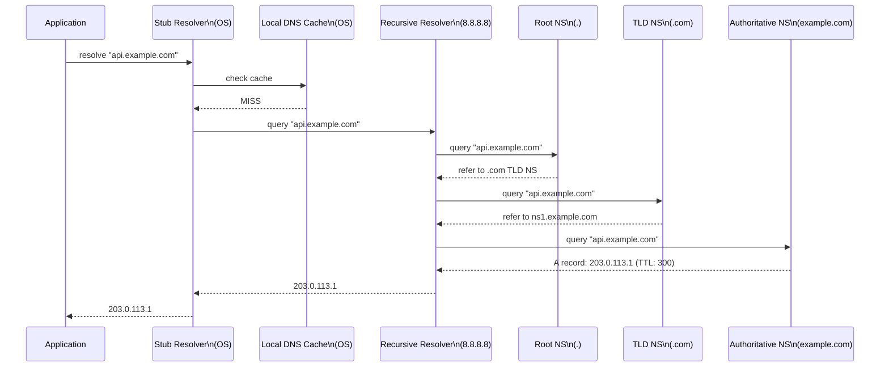
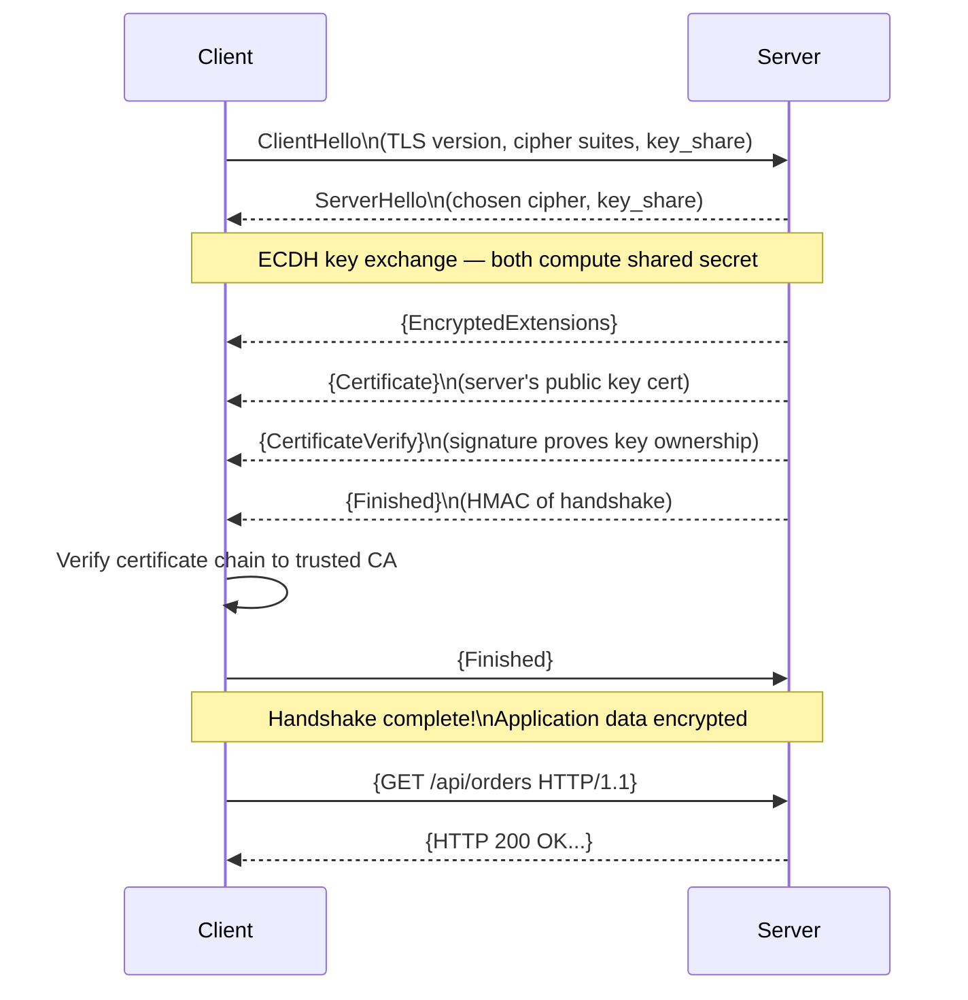

# Section 9: Networking & Infrastructure

## Chapter 15: DNS, TLS, Load Balancing, and Service Mesh

### DNS — How Names Become IPs

When your service calls `payment-service.internal`, something happens before the first byte is sent.



**DNS record types:**

| Record | Purpose | Example |
|---|---|---|
| A | IPv4 address | api.example.com → 203.0.113.1 |
| AAAA | IPv6 address | api.example.com → 2001:db8::1 |
| CNAME | Alias to another name | www → api.example.com |
| MX | Mail server | example.com → mail.example.com |
| TXT | Text (SPF, DKIM, verification) | "v=spf1 include:..." |
| SRV | Service location (port + priority) | _kafka._tcp → broker1:9092 |
| NS | Name server | example.com → ns1.example.com |
| SOA | Start of Authority | Zone metadata |

**Kubernetes DNS (CoreDNS):**

In Kubernetes, every service gets a DNS name:
```
<service>.<namespace>.svc.cluster.local
payment-service.production.svc.cluster.local → 10.96.45.23

# Short forms work within the same namespace:
payment-service                              → works in same namespace
payment-service.production                  → works from any namespace
```

**DNS TTL and caching issues:**

Low TTL (< 60s) = more DNS queries, faster propagation of changes.
High TTL (> 3600s) = fewer queries, slower updates.

In Java, DNS results are cached by the JVM:
```java
// JVM caches successful DNS results for 30 seconds by default
// Control with:
// networkaddress.cache.ttl=30 (seconds, -1 = cache forever, 0 = no cache)
// networkaddress.cache.negative.ttl=10 (how long to cache failures)

// In Spring Boot application.properties:
// sun.net.inetaddr.ttl=30
```

### TLS/SSL — Securing Communication

TLS (Transport Layer Security) provides:
- **Encryption**: Data cannot be read by eavesdroppers
- **Authentication**: Verify the server is who it claims to be
- **Integrity**: Data was not tampered with in transit

**TLS 1.3 Handshake:**



**TLS 1.3 improvements over TLS 1.2:**
- 1-RTT handshake (vs 2-RTT) — faster connection setup
- 0-RTT resumption (for reconnecting clients)
- Only strong cipher suites (removed RC4, DES, 3DES, MD5)
- Forward secrecy always on

**Certificate chain:**

```
Client verifies:
Your Certificate (leaf)
    └── Signed by: Intermediate CA
            └── Signed by: Root CA (in client's trust store)

Trust stores:
- OS trust store (system CAs)
- JVM trust store ($JAVA_HOME/lib/security/cacerts)
- Custom trust store (for private CAs in internal systems)
```

**Spring Boot TLS configuration:**

```yaml
server:
  ssl:
    enabled: true
    key-store: classpath:certs/server.p12
    key-store-type: PKCS12
    key-store-password: ${KEYSTORE_PASSWORD}
    # TLS protocol versions
    enabled-protocols: TLSv1.3,TLSv1.2
    # Cipher suites (TLS 1.3 ciphers are always enabled)
    ciphers:
      - TLS_AES_128_GCM_SHA256        # TLS 1.3
      - TLS_AES_256_GCM_SHA384        # TLS 1.3
      - TLS_ECDHE_RSA_WITH_AES_256_GCM_SHA384  # TLS 1.2
      - TLS_ECDHE_RSA_WITH_AES_128_GCM_SHA256  # TLS 1.2
```

### HTTP/2 and HTTP/3

**HTTP/1.1 problems:**
- Head-of-line blocking: one request blocks the next
- One request per TCP connection (without pipelining)
- Header repetition: same headers sent every request

**HTTP/2 solutions:**
- **Multiplexing**: Multiple requests over one TCP connection, interleaved
- **Header compression (HPACK)**: Compress repeated headers
- **Server push**: Server can proactively send resources
- **Stream priorities**: Client can prioritize requests

```java
// Spring Boot HTTP/2 configuration
server:
  http2:
    enabled: true
  ssl:
    enabled: true  # HTTP/2 requires TLS (in practice)
```

**HTTP/3 and QUIC:**

HTTP/3 uses QUIC instead of TCP. QUIC is:
- UDP-based (faster connection establishment)
- Built-in TLS 1.3 (0-RTT connection)
- Independent streams: packet loss in one stream doesn't block others
- Connection migration: mobile users switching from WiFi to 4G stay connected

```
HTTP/1.1 over TCP:     [TCP handshake][TLS handshake][First request]  = 3 RTT minimum
HTTP/2 over TLS 1.3:   [TCP+TLS combined][First request]              = 2 RTT
HTTP/3 over QUIC:      [QUIC+TLS][First request]                      = 1 RTT (0 for resumption)
```

### Load Balancing

Load balancing distributes traffic across multiple server instances.

**Load balancing algorithms:**

```java
// Round Robin — simple, equal distribution
public class RoundRobinLoadBalancer implements LoadBalancer {
    private final AtomicInteger counter = new AtomicInteger(0);

    @Override
    public Server select(List<Server> servers) {
        int index = counter.getAndIncrement() % servers.size();
        return servers.get(index);
    }
}

// Least Connections — route to server with fewest active connections
public class LeastConnectionsLoadBalancer implements LoadBalancer {
    @Override
    public Server select(List<Server> servers) {
        return servers.stream()
            .min(Comparator.comparingInt(Server::getActiveConnections))
            .orElseThrow();
    }
}

// Weighted Round Robin — servers have different capacities
public class WeightedRoundRobinLoadBalancer implements LoadBalancer {
    // Implemented with smooth weighted round-robin algorithm
    // nginx uses Interleaved Weighted Round Robin
}

// Consistent Hash — same key always goes to same server (useful for caching)
public class ConsistentHashLoadBalancer implements LoadBalancer {
    @Override
    public Server select(List<Server> servers, String key) {
        int hash = Math.abs(MurmurHash3.hash32(key.getBytes()));
        return servers.get(hash % servers.size());
    }
}
```

**Layer 4 vs Layer 7 load balancing:**

- **L4 (TCP)**: Routes based on IP + port. Fast, but no HTTP awareness. AWS NLB, HAProxy (TCP mode).
- **L7 (HTTP)**: Routes based on HTTP headers, URL, cookies. Can do sticky sessions, A/B testing. AWS ALB, NGINX, HAProxy (HTTP mode).

**NGINX load balancer config:**

```nginx
# /etc/nginx/nginx.conf

upstream order_service {
    least_conn;                    # Least connections algorithm

    server order-1.internal:8080 weight=3;  # Gets 3x traffic (more powerful)
    server order-2.internal:8080 weight=1;
    server order-3.internal:8080 weight=1;

    keepalive 32;                  # Reuse connections to upstream
}

server {
    listen 443 ssl http2;
    server_name api.example.com;

    ssl_certificate     /etc/ssl/certs/api.crt;
    ssl_certificate_key /etc/ssl/private/api.key;
    ssl_protocols       TLSv1.3 TLSv1.2;
    ssl_prefer_server_ciphers on;

    # Rate limiting
    limit_req_zone $binary_remote_addr zone=api_limit:10m rate=100r/s;
    limit_req zone=api_limit burst=200 nodelay;

    location /api/v1/orders {
        proxy_pass http://order_service;
        proxy_http_version 1.1;
        proxy_set_header Connection "";      # Enable keepalive
        proxy_set_header Host $host;
        proxy_set_header X-Real-IP $remote_addr;
        proxy_set_header X-Forwarded-For $proxy_add_x_forwarded_for;
        proxy_set_header X-Request-ID $request_id;  # Tracing

        # Timeouts
        proxy_connect_timeout 5s;
        proxy_send_timeout 30s;
        proxy_read_timeout 30s;

        # Health checking
        proxy_next_upstream error timeout http_500 http_502 http_503;
        proxy_next_upstream_tries 2;
    }

    # Health check endpoint — bypass rate limiting
    location /health {
        access_log off;
        proxy_pass http://order_service/actuator/health;
    }
}
```

### Service Mesh with Istio

A service mesh handles service-to-service communication at the infrastructure level. Every pod gets a sidecar proxy (Envoy). All traffic goes through the sidecar.

**What Istio provides:**
- mTLS between all services (automatic, no code changes)
- Traffic management (routing, retries, circuit breaking)
- Observability (metrics, traces, logs from the network level)
- Authorization policies

```yaml
# Traffic management — canary deployment
apiVersion: networking.istio.io/v1beta1
kind: VirtualService
metadata:
  name: order-service
spec:
  hosts:
    - order-service
  http:
    - match:
        - headers:
            x-canary-user:
              exact: "true"   # Specific header → canary
      route:
        - destination:
            host: order-service
            subset: canary
    - route:
        - destination:
            host: order-service
            subset: stable
          weight: 95
        - destination:
            host: order-service
            subset: canary
          weight: 5           # 5% of traffic to canary
---
apiVersion: networking.istio.io/v1beta1
kind: DestinationRule
metadata:
  name: order-service
spec:
  host: order-service
  trafficPolicy:
    connectionPool:
      http:
        http2MaxRequests: 1000
        h2UpgradePolicy: UPGRADE    # Use HTTP/2
    outlierDetection:
      consecutive5xxErrors: 5       # Remove after 5 consecutive errors
      interval: 10s
      baseEjectionTime: 30s
      maxEjectionPercent: 50        # Never eject more than 50%
    retries:
      attempts: 3
      perTryTimeout: 3s
      retryOn: 5xx,reset,connect-failure
  subsets:
    - name: stable
      labels:
        version: stable
    - name: canary
      labels:
        version: canary
```

### Interview Questions

**Q: What happens when you type "google.com" in your browser and press Enter?**

A: Full journey: (1) DNS resolution: browser cache → OS cache → local DNS → recursive resolver → root NS → .com NS → google.com NS → IP address returned. (2) TCP connection: 3-way handshake (SYN → SYN-ACK → ACK) to the IP. (3) TLS handshake: negotiate cipher suite, exchange certificates, establish session keys. (4) HTTP request: browser sends `GET / HTTP/2 Host: google.com`. (5) Load balancer receives request, routes to a web server. (6) Web server returns HTML. (7) Browser parses HTML, makes additional requests for CSS, JS, images. (8) Page renders.

**Q: What is the difference between HTTP/1.1, HTTP/2, and HTTP/3?**

A: HTTP/1.1: one request per TCP connection (or pipeline with head-of-line blocking). Simple but slow under load. HTTP/2: multiplexed streams over one TCP connection — many requests simultaneously without blocking. Header compression with HPACK. Still has TCP-level head-of-line blocking (one lost packet blocks all streams). HTTP/3: uses QUIC over UDP instead of TCP. Each stream is independent — a lost packet only blocks that stream. Built-in TLS 1.3. Faster connection setup (0-RTT for returning clients). Better for mobile users (connection migration).

**Q: How does mTLS work and how does Istio implement it?**

A: In regular TLS, only the server presents a certificate — the client verifies the server. In mTLS, BOTH present certificates — mutual authentication. Istio automatically provisions certificates for every pod using its own Certificate Authority (Citadel). The Envoy sidecar intercepts all traffic and performs TLS termination. Your application code doesn't know about TLS — it communicates on plain HTTP/gRPC with its sidecar, and the sidecar handles encryption. With `PeerAuthentication: STRICT`, Istio rejects any connection that isn't mTLS — even from inside the cluster.

---
