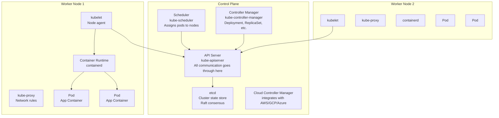
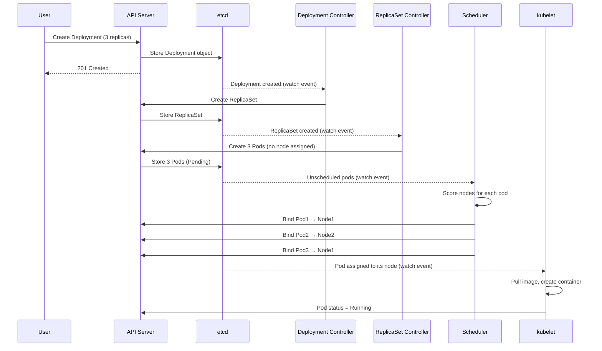

# Section 10: Cloud & Kubernetes

## Chapter 18: Kubernetes Architecture and Production Operations

### Introduction

Kubernetes (K8s) is the production standard for running containerized applications. It handles:
- Scheduling containers on nodes
- Restarting failed containers
- Scaling applications up and down
- Service discovery and load balancing
- Rolling updates and rollbacks
- Secret and configuration management

But Kubernetes is complex. Running it in production requires deep understanding of its internals.

### Kubernetes Architecture



**Control Plane components:**

**API Server (`kube-apiserver`)**:
- The only entry point for all cluster communication
- Validates and processes API requests
- Writes state to etcd
- Sends events to controllers and kubelets via watch mechanism
- Stateless — can run multiple replicas

**etcd**:
- Distributed key-value store using Raft consensus
- Stores ALL cluster state: pods, services, secrets, configmaps
- Only the API server communicates with etcd directly
- Production: run 3 or 5 etcd nodes (requires odd number for quorum)

**Scheduler (`kube-scheduler`)**:
- Watches for unscheduled pods
- Selects the best node based on:
  - Resource requests/limits (CPU, memory)
  - Node selectors, affinity, taints/tolerations
  - Spread constraints
  - Custom scheduler plugins

**Controller Manager**:
- Collection of controllers running in one process
- Deployment controller: manages ReplicaSets
- ReplicaSet controller: ensures correct number of pod replicas
- Node controller: manages node lifecycle
- Job controller: manages batch jobs
- StatefulSet controller: manages stateful applications

**Node components:**

**kubelet**:
- Runs on every node
- Watches API server for pods assigned to its node
- Creates/deletes containers via container runtime
- Reports node and pod status back to API server
- Runs pod probes (liveness, readiness, startup)

**kube-proxy**:
- Maintains network rules (iptables/IPVS) for Service routing
- Every pod can reach every Service via its ClusterIP

### Pod Scheduling Deep Dive

When you create a Deployment, here is the exact sequence:



### Pod Scheduling: Affinity, Taints, and Tolerations

**Node Affinity — prefer/require specific nodes:**

```yaml
apiVersion: apps/v1
kind: Deployment
metadata:
  name: order-service
spec:
  template:
    spec:
      affinity:
        nodeAffinity:
          # HARD requirement — pod won't schedule without this
          requiredDuringSchedulingIgnoredDuringExecution:
            nodeSelectorTerms:
              - matchExpressions:
                  - key: kubernetes.io/arch
                    operator: In
                    values: [amd64]
          # SOFT preference — try to schedule here
          preferredDuringSchedulingIgnoredDuringExecution:
            - weight: 100
              preference:
                matchExpressions:
                  - key: node-type
                    operator: In
                    values: [high-memory]

        # Anti-affinity — spread pods across nodes
        podAntiAffinity:
          preferredDuringSchedulingIgnoredDuringExecution:
            - weight: 100
              podAffinityTerm:
                labelSelector:
                  matchLabels:
                    app: order-service
                topologyKey: kubernetes.io/hostname  # Different nodes
```

**Taints and Tolerations — reserve nodes for specific workloads:**

```bash
# Taint a node — only pods with matching toleration can schedule here
kubectl taint nodes node1 dedicated=payment-service:NoSchedule

# Taint types:
# NoSchedule     — don't schedule new pods without toleration
# PreferNoSchedule — prefer not to schedule (soft)
# NoExecute      — evict existing pods too (for maintenance)
```

```yaml
# Pod tolerates the taint
spec:
  tolerations:
    - key: "dedicated"
      operator: "Equal"
      value: "payment-service"
      effect: "NoSchedule"
```

**Topology Spread Constraints — even distribution:**

```yaml
spec:
  topologySpreadConstraints:
    - maxSkew: 1               # Max difference in pod count across zones
      topologyKey: topology.kubernetes.io/zone
      whenUnsatisfiable: DoNotSchedule
      labelSelector:
        matchLabels:
          app: order-service
    - maxSkew: 1
      topologyKey: kubernetes.io/hostname
      whenUnsatisfiable: ScheduleAnyway  # Soft constraint for nodes
      labelSelector:
        matchLabels:
          app: order-service
```

### Production Deployment Manifest

```yaml
apiVersion: apps/v1
kind: Deployment
metadata:
  name: order-service
  namespace: production
  labels:
    app: order-service
    version: "1.2.3"
    team: platform
  annotations:
    deployment.kubernetes.io/revision: "5"
spec:
  replicas: 3
  selector:
    matchLabels:
      app: order-service
  strategy:
    type: RollingUpdate
    rollingUpdate:
      maxSurge: 1        # Allow 1 extra pod during update
      maxUnavailable: 0  # Never reduce below desired replicas
  template:
    metadata:
      labels:
        app: order-service
        version: "1.2.3"
      annotations:
        prometheus.io/scrape: "true"
        prometheus.io/port: "8080"
        prometheus.io/path: "/actuator/prometheus"
    spec:
      serviceAccountName: order-service
      securityContext:
        runAsNonRoot: true
        runAsUser: 1000
        fsGroup: 1000

      # Init container — wait for dependencies
      initContainers:
        - name: wait-for-db
          image: busybox:1.35
          command: ['sh', '-c',
            'until nc -z postgres-service 5432; do echo "Waiting for DB..."; sleep 2; done']

      containers:
        - name: order-service
          image: registry.example.com/order-service:1.2.3
          imagePullPolicy: IfNotPresent
          ports:
            - name: http
              containerPort: 8080
              protocol: TCP

          env:
            - name: SPRING_PROFILES_ACTIVE
              value: "production"
            - name: DB_URL
              valueFrom:
                secretKeyRef:
                  name: order-service-db-secret
                  key: jdbc-url
            - name: DB_PASSWORD
              valueFrom:
                secretKeyRef:
                  name: order-service-db-secret
                  key: password
            - name: KAFKA_BROKERS
              valueFrom:
                configMapKeyRef:
                  name: kafka-config
                  key: brokers
            # Downward API — inject pod metadata
            - name: POD_NAME
              valueFrom:
                fieldRef:
                  fieldPath: metadata.name
            - name: POD_NAMESPACE
              valueFrom:
                fieldRef:
                  fieldPath: metadata.namespace
            - name: POD_IP
              valueFrom:
                fieldRef:
                  fieldPath: status.podIP
            # JVM settings
            - name: JAVA_OPTS
              value: >-
                -Xms512m
                -Xmx512m
                -XX:+UseG1GC
                -XX:MaxGCPauseMillis=100
                -XX:+ExitOnOutOfMemoryError
                -XX:+HeapDumpOnOutOfMemoryError
                -XX:HeapDumpPath=/tmp/dumps/

          resources:
            requests:
              cpu: "250m"
              memory: "512Mi"
            limits:
              cpu: "1000m"
              memory: "1Gi"

          # Health probes
          startupProbe:
            httpGet:
              path: /actuator/health/liveness
              port: 8080
            failureThreshold: 30    # Allow 60 seconds for startup
            periodSeconds: 2

          livenessProbe:
            httpGet:
              path: /actuator/health/liveness
              port: 8080
            initialDelaySeconds: 0
            periodSeconds: 10
            failureThreshold: 3
            timeoutSeconds: 3

          readinessProbe:
            httpGet:
              path: /actuator/health/readiness
              port: 8080
            initialDelaySeconds: 0
            periodSeconds: 5
            failureThreshold: 3
            timeoutSeconds: 3

          volumeMounts:
            - name: config
              mountPath: /app/config
              readOnly: true
            - name: tmp-dumps
              mountPath: /tmp/dumps

          lifecycle:
            preStop:
              exec:
                # Wait for existing requests to complete before shutdown
                command: ["/bin/sh", "-c", "sleep 10"]

          securityContext:
            allowPrivilegeEscalation: false
            readOnlyRootFilesystem: true
            capabilities:
              drop: [ALL]

      volumes:
        - name: config
          configMap:
            name: order-service-config
        - name: tmp-dumps
          emptyDir:
            sizeLimit: 2Gi

      # Pod disruption budget
      terminationGracePeriodSeconds: 60

      affinity:
        podAntiAffinity:
          preferredDuringSchedulingIgnoredDuringExecution:
            - weight: 100
              podAffinityTerm:
                labelSelector:
                  matchLabels:
                    app: order-service
                topologyKey: kubernetes.io/hostname

      topologySpreadConstraints:
        - maxSkew: 1
          topologyKey: topology.kubernetes.io/zone
          whenUnsatisfiable: DoNotSchedule
          labelSelector:
            matchLabels:
              app: order-service
```

### Services and Networking

**Service types:**

```yaml
# ClusterIP — internal only (default)
# Use for: inter-service communication
apiVersion: v1
kind: Service
metadata:
  name: order-service
spec:
  selector:
    app: order-service
  ports:
    - port: 80
      targetPort: 8080
  type: ClusterIP
---
# NodePort — expose on every node's IP
# Use for: development, on-premise without load balancer
apiVersion: v1
kind: Service
metadata:
  name: order-service-nodeport
spec:
  selector:
    app: order-service
  ports:
    - port: 80
      targetPort: 8080
      nodePort: 30080  # Range: 30000-32767
  type: NodePort
---
# LoadBalancer — creates cloud load balancer
# Use for: production external traffic
apiVersion: v1
kind: Service
metadata:
  name: order-service-lb
  annotations:
    # AWS NLB annotations
    service.beta.kubernetes.io/aws-load-balancer-type: nlb
    service.beta.kubernetes.io/aws-load-balancer-cross-zone-load-balancing-enabled: "true"
spec:
  selector:
    app: order-service
  ports:
    - port: 443
      targetPort: 8080
  type: LoadBalancer
```

**How kube-proxy routes traffic:**

```
Client request → Service ClusterIP (10.96.0.1:80)
↓
kube-proxy (iptables/IPVS rules)
↓
Select a backend pod (round-robin)
↓
Pod IP:8080
```

With IPVS mode (recommended for large clusters), kube-proxy creates kernel-level load balancing rules — much faster than iptables for thousands of services.

### Ingress

Ingress manages external access to services. It provides HTTP routing, SSL termination, and virtual hosting.

```yaml
apiVersion: networking.k8s.io/v1
kind: Ingress
metadata:
  name: api-ingress
  namespace: production
  annotations:
    nginx.ingress.kubernetes.io/rewrite-target: /
    nginx.ingress.kubernetes.io/rate-limit: "100"
    nginx.ingress.kubernetes.io/ssl-redirect: "true"
    nginx.ingress.kubernetes.io/proxy-body-size: "10m"
    cert-manager.io/cluster-issuer: "letsencrypt-prod"
spec:
  ingressClassName: nginx
  tls:
    - hosts:
        - api.example.com
      secretName: api-tls
  rules:
    - host: api.example.com
      http:
        paths:
          - path: /api/v1/orders
            pathType: Prefix
            backend:
              service:
                name: order-service
                port:
                  number: 80
          - path: /api/v1/products
            pathType: Prefix
            backend:
              service:
                name: product-service
                port:
                  number: 80
```

### Horizontal Pod Autoscaler (HPA)

```yaml
apiVersion: autoscaling/v2
kind: HorizontalPodAutoscaler
metadata:
  name: order-service-hpa
spec:
  scaleTargetRef:
    apiVersion: apps/v1
    kind: Deployment
    name: order-service
  minReplicas: 3
  maxReplicas: 20
  metrics:
    # CPU-based scaling
    - type: Resource
      resource:
        name: cpu
        target:
          type: Utilization
          averageUtilization: 70   # Scale up when CPU > 70%
    # Memory-based scaling
    - type: Resource
      resource:
        name: memory
        target:
          type: Utilization
          averageUtilization: 80
    # Custom metric — Kafka consumer lag
    - type: External
      external:
        metric:
          name: kafka_consumer_lag
          selector:
            matchLabels:
              topic: order-events
              group: order-processor
        target:
          type: AverageValue
          averageValue: "1000"  # Scale up if lag > 1000 per pod

  behavior:
    scaleUp:
      stabilizationWindowSeconds: 30
      policies:
        - type: Pods
          value: 4        # Scale up max 4 pods at a time
          periodSeconds: 60
    scaleDown:
      stabilizationWindowSeconds: 300  # Wait 5 min before scaling down
      policies:
        - type: Percent
          value: 10       # Scale down max 10% at a time
          periodSeconds: 60
```

### StatefulSets — Running Stateful Applications

```yaml
# Kafka on Kubernetes using StatefulSet
apiVersion: apps/v1
kind: StatefulSet
metadata:
  name: kafka
spec:
  serviceName: kafka-headless
  replicas: 3
  selector:
    matchLabels:
      app: kafka
  template:
    metadata:
      labels:
        app: kafka
    spec:
      containers:
        - name: kafka
          image: confluentinc/cp-kafka:7.6.0
          ports:
            - containerPort: 9092
          env:
            - name: KAFKA_BROKER_ID
              valueFrom:
                fieldRef:
                  fieldPath: metadata.annotations['kubernetes.io/pod-ordinal']
            - name: KAFKA_ZOOKEEPER_CONNECT
              value: "zookeeper:2181"
            - name: KAFKA_LOG_DIRS
              value: /var/kafka-logs
          volumeMounts:
            - name: kafka-data
              mountPath: /var/kafka-logs
  volumeClaimTemplates:
    - metadata:
        name: kafka-data
      spec:
        accessModes: [ReadWriteOnce]
        storageClassName: fast-ssd
        resources:
          requests:
            storage: 100Gi
```

**StatefulSet properties:**
- Pods have stable network identity: `kafka-0`, `kafka-1`, `kafka-2`
- Pods have stable storage: Each pod gets its own PersistentVolumeClaim
- Ordered startup: `kafka-0` starts before `kafka-1` before `kafka-2`
- Ordered shutdown: Reverse order

### Resource Management

**Resource requests vs. limits:**

```yaml
resources:
  requests:             # What the scheduler uses to find a node
    cpu: "250m"         # 250 millicores = 0.25 CPU
    memory: "512Mi"
  limits:               # Hard caps — pod gets OOMKilled if memory exceeded
    cpu: "1000m"        # CPU is throttled, not killed
    memory: "1Gi"
```

**Quality of Service (QoS) classes:**
- **Guaranteed**: requests == limits for all containers. Highest priority.
- **Burstable**: requests < limits. Can use extra resources if available.
- **BestEffort**: No requests or limits. Evicted first under pressure.

**LimitRange — set defaults per namespace:**

```yaml
apiVersion: v1
kind: LimitRange
metadata:
  name: default-limits
  namespace: production
spec:
  limits:
    - type: Container
      default:         # Applied if no limits specified
        cpu: "500m"
        memory: "512Mi"
      defaultRequest:  # Applied if no requests specified
        cpu: "100m"
        memory: "128Mi"
      max:             # Maximum allowed
        cpu: "4"
        memory: "8Gi"
      min:             # Minimum required
        cpu: "50m"
        memory: "64Mi"
```

**ResourceQuota — cap per namespace:**

```yaml
apiVersion: v1
kind: ResourceQuota
metadata:
  name: production-quota
  namespace: production
spec:
  hard:
    requests.cpu: "100"           # Total CPU requests in namespace
    requests.memory: "200Gi"
    limits.cpu: "200"
    limits.memory: "400Gi"
    count/pods: "500"
    count/services: "100"
    count/deployments.apps: "50"
    persistentvolumeclaims: "50"
    requests.storage: "2Ti"
```

### Pod Disruption Budget

Prevent too many pods from being unavailable during voluntary disruptions (node drains, updates).

```yaml
apiVersion: policy/v1
kind: PodDisruptionBudget
metadata:
  name: order-service-pdb
spec:
  selector:
    matchLabels:
      app: order-service
  minAvailable: 2    # Always keep at least 2 pods available
  # OR
  maxUnavailable: 1  # Allow at most 1 pod unavailable at a time
```

### GitOps with ArgoCD

ArgoCD implements GitOps: Kubernetes desired state is stored in Git. ArgoCD continuously reconciles the cluster state with Git.

```yaml
# ArgoCD Application
apiVersion: argoproj.io/v1alpha1
kind: Application
metadata:
  name: order-service
  namespace: argocd
spec:
  project: production

  source:
    repoURL: https://github.com/example/k8s-manifests.git
    targetRevision: main
    path: apps/order-service/production
    # Or Helm chart
    # helm:
    #   releaseName: order-service
    #   values: |
    #     replicaCount: 3
    #     image.tag: "1.2.3"

  destination:
    server: https://kubernetes.default.svc
    namespace: production

  syncPolicy:
    automated:
      prune: true          # Delete resources removed from Git
      selfHeal: true       # Revert manual changes to cluster
    syncOptions:
      - CreateNamespace=true
      - PrunePropagationPolicy=foreground
    retry:
      limit: 5
      backoff:
        duration: 5s
        factor: 2
        maxDuration: 3m
```

### Troubleshooting Kubernetes

```bash
# ── Pod troubleshooting ─────────────────────────────────────
# Why is a pod not running?
kubectl describe pod order-service-abc123 -n production

# Check events (last 60 minutes)
kubectl get events --sort-by=.lastTimestamp -n production

# View logs (last 100 lines)
kubectl logs order-service-abc123 -n production --tail=100

# View previous container logs (before restart)
kubectl logs order-service-abc123 -n production --previous

# Shell into running pod
kubectl exec -it order-service-abc123 -n production -- /bin/sh

# ── Node troubleshooting ─────────────────────────────────────
# Node status
kubectl get nodes
kubectl describe node worker-1

# Check node resource usage
kubectl top nodes
kubectl top pods -n production

# ── Network troubleshooting ──────────────────────────────────
# Test pod-to-pod connectivity
kubectl run nettest --image=nicolaka/netshoot -it --rm -- \
  curl -v http://order-service.production.svc.cluster.local/actuator/health

# Check DNS resolution
kubectl run dnstest --image=busybox -it --rm -- \
  nslookup order-service.production.svc.cluster.local

# ── Scheduling troubleshooting ───────────────────────────────
# Why won't a pod schedule?
kubectl describe pod pending-pod | grep -A10 Events

# Check node capacity
kubectl describe nodes | grep -A5 "Allocated resources"

# ── etcd health ──────────────────────────────────────────────
kubectl exec -it etcd-master -n kube-system -- \
  etcdctl endpoint health \
  --endpoints=https://127.0.0.1:2379 \
  --cacert=/etc/kubernetes/pki/etcd/ca.crt \
  --cert=/etc/kubernetes/pki/etcd/healthcheck-client.crt \
  --key=/etc/kubernetes/pki/etcd/healthcheck-client.key
```

### Interview Questions

**Q: Explain the difference between a Deployment and a StatefulSet.**

A: A Deployment is for stateless applications. Pods are interchangeable — they have random names, no stable identity, and share the same volumes. A StatefulSet is for stateful applications (databases, queues). Pods have stable, ordered names (e.g., `kafka-0`, `kafka-1`), stable network identity, and each pod gets its own persistent volume that survives pod restarts. StatefulSet pods start and stop in order. Use Deployment for web services, use StatefulSet for databases, Kafka, ZooKeeper.

**Q: What happens when a node goes down in Kubernetes?**

A: (1) The node controller in kube-controller-manager stops receiving heartbeats from the kubelet. (2) After `node-monitor-grace-period` (default 40s), the node is marked `NotReady`. (3) After `pod-eviction-timeout` (default 5 minutes), pods on the node are evicted and rescheduled to other nodes. If you use `--pod-eviction-timeout=0s` (unreachable nodes), eviction is immediate. PodDisruptionBudgets are respected during eviction. StatefulSet pods are NOT automatically rescheduled to avoid split-brain — you must manually delete the pod.

**Q: What is the difference between liveness and readiness probes?**

A: **Liveness probe**: "Is this container alive?" If it fails, Kubernetes kills the container and restarts it (based on restartPolicy). Use for detecting deadlocks or corrupt state. **Readiness probe**: "Is this container ready to serve traffic?" If it fails, the pod is removed from Service endpoints — no traffic is sent to it. The pod is NOT restarted. Use for detecting when the app is still starting or temporarily overloaded. **Startup probe**: "Is the container started?" Disables liveness and readiness probes until this passes. Use for slow-starting applications to prevent premature restarts.

---
