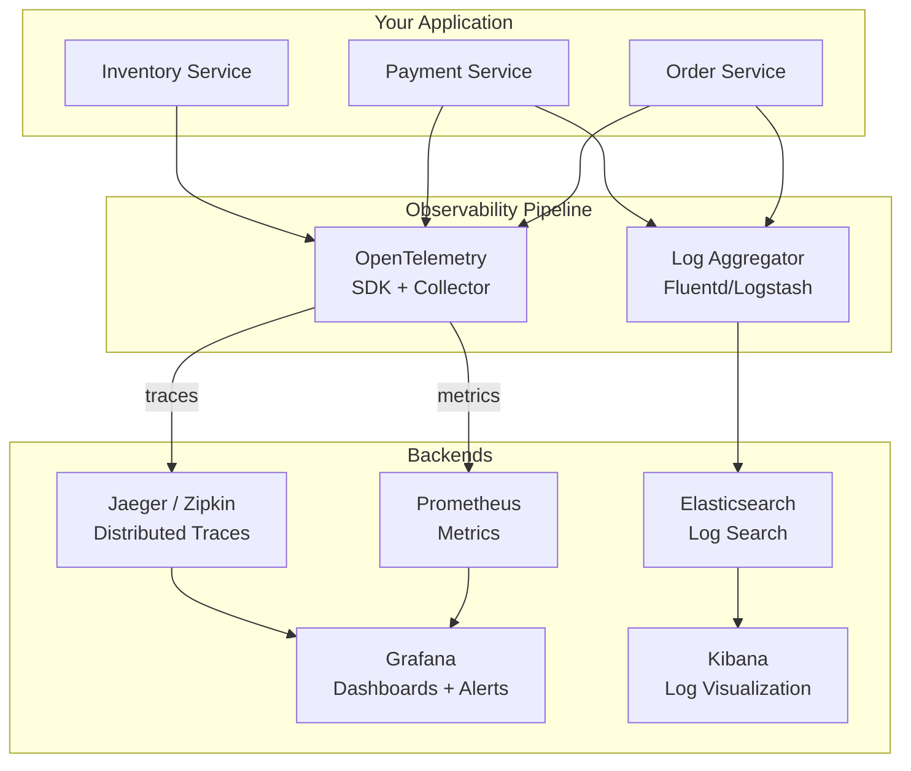
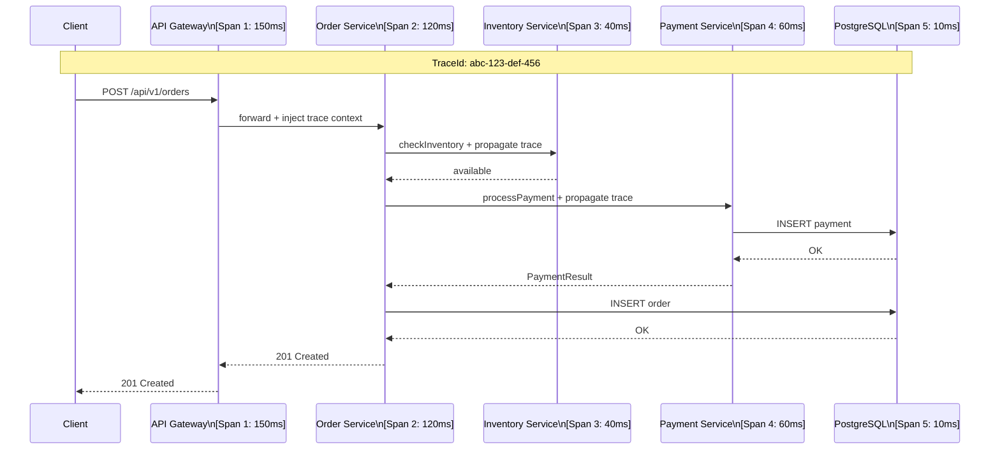

# Section 11: Observability & SRE

## Chapter 19: Observability — Logs, Metrics, and Traces

### The Three Pillars of Observability

Observability is the ability to understand the internal state of a system by examining its external outputs. A system is observable if you can answer: "Why is my service behaving this way?" without deploying new code.

The three pillars:
1. **Logs**: Discrete events that happened (structured text)
2. **Metrics**: Numeric measurements over time (aggregated)
3. **Traces**: End-to-end request journeys across services



### Structured Logging

Logs should be structured (JSON) in production. Human-readable in development.

```java
// application.yml
logging:
  pattern:
    console: "%d{HH:mm:ss.SSS} [%thread] %-5level [%X{traceId},%X{spanId}] %logger{36} - %msg%n"
  level:
    root: INFO
    com.example: DEBUG

// For production: use JSON logging
// pom.xml:
// <dependency>
//   <groupId>ch.qos.logback</groupId>
//   <artifactId>logback-classic</artifactId>
// </dependency>
// <dependency>
//   <groupId>net.logstash.logback</groupId>
//   <artifactId>logstash-logback-encoder</artifactId>
//   <version>7.4</version>
// </dependency>
```

**logback-spring.xml for production:**

```xml
<configuration>
    <springProfile name="production">
        <appender name="STDOUT" class="ch.qos.logback.core.ConsoleAppender">
            <encoder class="net.logstash.logback.encoder.LogstashEncoder">
                <includeMdcKeyNames>traceId,spanId,userId,orderId</includeMdcKeyNames>
                <customFields>{"service":"order-service","environment":"production"}</customFields>
            </encoder>
        </appender>
        <root level="INFO">
            <appender-ref ref="STDOUT"/>
        </root>
    </springProfile>

    <springProfile name="default">
        <appender name="STDOUT" class="ch.qos.logback.core.ConsoleAppender">
            <encoder>
                <pattern>%d{HH:mm:ss.SSS} [%thread] %-5level [%X{traceId}] %logger{36} - %msg%n</pattern>
            </encoder>
        </appender>
        <root level="DEBUG">
            <appender-ref ref="STDOUT"/>
        </root>
    </springProfile>
</configuration>
```

**Logging best practices in code:**

```java
@Service
@Slf4j
public class OrderService {

    public Order placeOrder(PlaceOrderCommand command) {
        // Good: include request context in logs
        log.info("Placing order: customerId={}, itemCount={}, totalAmount={}",
            command.getCustomerId(), command.getItems().size(),
            command.getExpectedTotal());

        // Use MDC for contextual fields that appear in all subsequent logs
        MDC.put("orderId", newOrderId);
        MDC.put("customerId", command.getCustomerId());

        try {
            Order order = processOrder(command);

            // Good: structured success log with outcome
            log.info("Order placed successfully: orderId={}, status={}, total={}",
                order.getId(), order.getStatus(), order.getTotal());

            return order;

        } catch (PaymentException e) {
            // Good: ERROR level for business-critical failures
            log.error("Payment failed for order: customerId={}, reason={}",
                command.getCustomerId(), e.getMessage(), e);
            throw e;

        } catch (InventoryException e) {
            // WARN: inventory issues may be transient
            log.warn("Inventory unavailable: itemId={}, requestedQty={}",
                e.getItemId(), e.getRequestedQuantity());
            throw e;

        } finally {
            MDC.clear(); // Always clear MDC
        }
    }

    // BAD patterns to avoid:
    void badLoggingExamples() {
        // DON'T: log sensitive data
        log.info("Processing payment with card: {}", creditCard.getNumber()); // NEVER

        // DON'T: use string concatenation (slow — always evaluated)
        log.debug("Processing " + items.size() + " items"); // BAD
        log.debug("Processing {} items", items.size()); // GOOD — lazy evaluation

        // DON'T: catch and rethrow with only log (lose stack trace)
        try { doSomething(); } catch (Exception e) {
            log.error("Error: " + e.getMessage()); // Missing stack trace
            throw new RuntimeException(e); // Missing context
        }

        // DO:
        try { doSomething(); } catch (Exception e) {
            log.error("Failed to process order {}: {}", orderId, e.getMessage(), e);
            throw new OrderProcessingException("Failed to process order: " + orderId, e);
        }
    }
}
```

### Metrics with Micrometer and Prometheus

**Prometheus data model:**
- Every metric is a time series: `metric_name{label1="val1", label2="val2"} value timestamp`
- Four metric types: Counter, Gauge, Histogram, Summary

```java
@Configuration
public class MetricsConfig {

    @Bean
    MeterRegistryCustomizer<MeterRegistry> metricsCommonTags(
            @Value("${spring.application.name}") String appName) {
        return registry -> registry
            .config()
            .commonTags(
                "application", appName,
                "environment", System.getenv("ENVIRONMENT"),
                "version", BuildProperties.getVersion()
            );
    }
}

@Service
@RequiredArgsConstructor
public class OrderMetrics {
    private final MeterRegistry registry;

    // Counter: things that only go up
    // Use for: requests, errors, events
    public void recordOrderPlaced(Order order) {
        Counter.builder("orders.placed")
            .tag("status", order.getStatus().name())
            .tag("currency", order.getTotal().getCurrency())
            .description("Total number of orders placed")
            .register(registry)
            .increment();
    }

    // Gauge: current snapshot value
    // Use for: queue size, active connections, inventory
    @PostConstruct
    public void registerInventoryGauge() {
        Gauge.builder("inventory.items.available", inventoryService, InventoryService::getTotalAvailable)
            .tag("warehouse", "main")
            .description("Number of items available in inventory")
            .register(registry);
    }

    // Timer / Histogram: measure latency and throughput
    // Use for: request duration, processing time
    public void recordOrderProcessingTime(Order order, Duration duration) {
        Timer.builder("orders.processing.duration")
            .tag("payment_method", order.getPaymentMethod().getType())
            .tag("currency", order.getTotal().getCurrency())
            .description("Time to process an order from placement to confirmation")
            .publishPercentiles(0.5, 0.95, 0.99)  // p50, p95, p99
            .publishPercentileHistogram()
            .sla(Duration.ofMillis(100), Duration.ofMillis(500), Duration.ofSeconds(1))
            .register(registry)
            .record(duration);
    }

    // Use @Timed for automatic method timing
    @Timed(value = "order.service.place", percentiles = {0.5, 0.95, 0.99})
    public Order placeOrder(PlaceOrderCommand command) {
        // automatically timed
    }
}
```

**Prometheus scrape config:**

```yaml
# prometheus.yml
global:
  scrape_interval: 15s
  evaluation_interval: 15s

alerting:
  alertmanagers:
    - static_configs:
        - targets: [alertmanager:9093]

rule_files:
  - /etc/prometheus/rules/*.yml

scrape_configs:
  # Kubernetes pod discovery
  - job_name: kubernetes-pods
    kubernetes_sd_configs:
      - role: pod
    relabel_configs:
      # Only scrape pods with annotation: prometheus.io/scrape: "true"
      - source_labels: [__meta_kubernetes_pod_annotation_prometheus_io_scrape]
        action: keep
        regex: true
      # Use custom port from annotation
      - source_labels: [__meta_kubernetes_pod_annotation_prometheus_io_port]
        action: replace
        regex: (.+)
        target_label: __address__
        replacement: $1
      # Add pod metadata as labels
      - source_labels: [__meta_kubernetes_namespace]
        target_label: namespace
      - source_labels: [__meta_kubernetes_pod_name]
        target_label: pod
      - source_labels: [__meta_kubernetes_pod_label_app]
        target_label: application
```

**Prometheus alerting rules:**

```yaml
# rules/order-service.yml
groups:
  - name: order-service
    interval: 30s
    rules:

      # Error rate too high
      - alert: OrderServiceHighErrorRate
        expr: |
          (
            rate(http_server_requests_seconds_count{
              application="order-service",
              status=~"5.."
            }[5m])
            /
            rate(http_server_requests_seconds_count{
              application="order-service"
            }[5m])
          ) > 0.05
        for: 2m
        labels:
          severity: warning
          team: platform
        annotations:
          summary: "Order service error rate > 5%"
          description: >
            Order service is returning {{ $value | humanizePercentage }} errors
            over the last 5 minutes.
            Check logs at https://kibana/app/logs?query=application:order-service

      # p99 latency too high
      - alert: OrderServiceHighLatency
        expr: |
          histogram_quantile(0.99,
            rate(http_server_requests_seconds_bucket{
              application="order-service",
              uri="/api/v1/orders"
            }[5m])
          ) > 2.0
        for: 5m
        labels:
          severity: warning
        annotations:
          summary: "Order service p99 latency > 2 seconds"
          description: "p99 latency is {{ $value | humanizeDuration }}"

      # Service down
      - alert: OrderServiceDown
        expr: up{application="order-service"} == 0
        for: 1m
        labels:
          severity: critical
          pagerduty: "true"
        annotations:
          summary: "Order service is DOWN"
          description: "Order service has been down for 1 minute"

      # High Kafka consumer lag
      - alert: KafkaConsumerLagHigh
        expr: |
          kafka_consumer_group_lag{
            group="order-processor",
            topic="order-events"
          } > 10000
        for: 5m
        labels:
          severity: warning
        annotations:
          summary: "Kafka consumer lag too high"
          description: "Consumer group order-processor has {{ $value }} messages lag"
```

### Distributed Tracing with OpenTelemetry

Distributed tracing follows a single request as it flows through multiple services. Essential for debugging latency and failures in microservices.



**Spring Boot OpenTelemetry configuration:**

```yaml
# application.yml
management:
  tracing:
    sampling:
      probability: 0.1  # 10% sampling (adjust based on traffic)

otel:
  service:
    name: order-service
  exporter:
    otlp:
      endpoint: http://jaeger:4318
      protocol: http/protobuf
  propagators: tracecontext,baggage
  traces:
    exporter: otlp
  metrics:
    exporter: prometheus
```

```java
@Service
@RequiredArgsConstructor
public class OrderService {
    private final Tracer tracer;  // OpenTelemetry Tracer
    private final InventoryClient inventoryClient;

    public Order placeOrder(PlaceOrderCommand command) {
        // Create a span for business context
        Span span = tracer.spanBuilder("place-order")
            .setAttribute("customer.id", command.getCustomerId())
            .setAttribute("order.item.count", command.getItems().size())
            .startSpan();

        try (Scope scope = span.makeCurrent()) {
            // All operations within this scope are linked to the span

            // Sub-spans are automatically created by OpenTelemetry instrumentation:
            // - JDBC queries (via JDBC instrumentation)
            // - HTTP calls (via RestClient instrumentation)
            // - Kafka produces (via Kafka instrumentation)

            // Add events to the span for key moments
            span.addEvent("inventory-check-started");
            inventoryClient.check(command.getItems());
            span.addEvent("inventory-check-completed");

            Order order = processOrder(command);
            span.setAttribute("order.id", order.getId());
            span.setStatus(StatusCode.OK);

            return order;

        } catch (Exception e) {
            span.recordException(e);
            span.setStatus(StatusCode.ERROR, e.getMessage());
            throw e;
        } finally {
            span.end();
        }
    }
}

// Context propagation — passing trace context across services
@Component
public class TracingRestClientInterceptor implements ClientHttpRequestInterceptor {

    @Override
    public ClientHttpResponse intercept(HttpRequest request, byte[] body,
                                       ClientHttpRequestExecution execution) throws IOException {
        // OpenTelemetry automatically injects trace context into HTTP headers:
        // traceparent: 00-{traceId}-{spanId}-01
        // tracebaggage: key=value
        // This is handled automatically by spring-boot-starter-actuator + micrometer-tracing
        return execution.execute(request, body);
    }
}
```

**Kafka trace propagation:**

```java
// Producer: inject trace context into Kafka headers
@Component
public class TracingKafkaProducerInterceptor<K, V> implements ProducerInterceptor<K, V> {
    @Override
    public ProducerRecord<K, V> onSend(ProducerRecord<K, V> record) {
        // OpenTelemetry Kafka instrumentation handles this automatically
        // when you use the opentelemetry-kafka-clients library
        return record;
    }
}

// Consumer: extract trace context from Kafka headers
@Component
public class TracingKafkaConsumerInterceptor<K, V> implements ConsumerInterceptor<K, V> {
    @Override
    public ConsumerRecords<K, V> onConsume(ConsumerRecords<K, V> records) {
        // Extract trace context and create a new span linked to the producer span
        // This shows the end-to-end flow in Jaeger: Producer → Kafka → Consumer
        return records;
    }
}
```

### SLI, SLO, and SLA

**SLI (Service Level Indicator)**: A quantitative measure of service behavior.
**SLO (Service Level Objective)**: A target value for an SLI.
**SLA (Service Level Agreement)**: A contract with consequences for violating SLOs.

**Designing SLIs and SLOs:**

```
Good SLIs:
- Request success rate: % of requests that return 2xx/3xx
- Request latency: % of requests < X ms
- Freshness: % of time data is within Y seconds of source
- Durability: probability of not losing data

Bad SLIs:
- CPU usage (not user-facing)
- Number of errors (use error rate, not count)
```

**Error Budget:**

```
SLO: 99.9% uptime
Error budget: 100% - 99.9% = 0.1% allowed downtime
= 0.001 × 365 × 24 × 60 = 525.6 minutes/year
= 43.8 minutes/month

If you burn through the error budget quickly → slow down feature deployments
If you have budget left → deploy more aggressively
```

**Prometheus SLO recording rules:**

```yaml
groups:
  - name: slo-recording-rules
    rules:
      # 5-minute success rate
      - record: order_service:success_rate:5m
        expr: |
          (
            rate(http_server_requests_seconds_count{
              application="order-service", status!~"5.."
            }[5m])
            /
            rate(http_server_requests_seconds_count{
              application="order-service"
            }[5m])
          )

      # 30-day error budget burn rate (multi-window, multi-burn-rate alerting)
      - record: order_service:error_budget_burn_rate:1h
        expr: |
          1 - order_service:success_rate:1h

      # SLO breach alert (fast burn — 2% in 1 hour = 26% monthly budget burned)
      - alert: OrderServiceSLOBreach_FastBurn
        expr: |
          order_service:error_budget_burn_rate:1h > (14.4 * 0.001)
          AND
          order_service:error_budget_burn_rate:5m > (14.4 * 0.001)
        labels:
          severity: critical
        annotations:
          summary: "Order service burning error budget 14.4x faster than expected"
```

### Chaos Engineering

Chaos engineering is the practice of intentionally introducing failures to find weaknesses before they cause incidents.

**Chaos Engineering principles:**
1. Define steady state (normal behavior)
2. Hypothesize that steady state holds during chaos
3. Introduce chaos (kill pods, inject latency, corrupt network)
4. Prove or disprove the hypothesis

```yaml
# Chaos Mesh experiment — kill random pod
apiVersion: chaos-mesh.org/v1alpha1
kind: PodChaos
metadata:
  name: order-service-pod-failure
  namespace: production
spec:
  action: pod-failure
  mode: random-max-percent    # Kill at most X% of matching pods
  value: "33"                 # Kill at most 33%
  duration: "5m"
  selector:
    namespaces:
      - production
    labelSelectors:
      app: order-service
  scheduler:
    cron: "@every 1h"         # Repeat hourly
---
# Network delay injection
apiVersion: chaos-mesh.org/v1alpha1
kind: NetworkChaos
metadata:
  name: payment-service-latency
spec:
  action: delay
  mode: all
  selector:
    namespaces: [production]
    labelSelectors:
      app: payment-service
  delay:
    latency: "500ms"
    correlation: "25"         # 25% correlation with previous delay
    jitter: "100ms"
  direction: to               # Affect outgoing traffic from payment-service
  duration: "10m"
```

**Resilience testing in CI/CD:**

```java
@SpringBootTest
class OrderServiceResilienceTest {

    @Autowired
    private OrderService orderService;

    @Autowired
    private WireMockServer wireMockServer;

    @Test
    void shouldFallbackWhenInventoryServiceIsDown() {
        // Simulate inventory service being down
        wireMockServer.stubFor(post(urlEqualTo("/api/v1/inventory/check"))
            .willReturn(serverError()));

        // Order placement should still succeed (with fallback behavior)
        PlaceOrderCommand command = buildValidOrderCommand();
        assertThatCode(() -> orderService.placeOrder(command)).doesNotThrowAnyException();
    }

    @Test
    void shouldHandleSlowInventoryService() {
        // Inject 3-second delay (our timeout is 2 seconds)
        wireMockServer.stubFor(post(urlEqualTo("/api/v1/inventory/check"))
            .willReturn(aResponse()
                .withFixedDelay(3000)
                .withBody("{}")));

        // Should timeout and use fallback within 2 seconds
        PlaceOrderCommand command = buildValidOrderCommand();
        long start = System.currentTimeMillis();
        orderService.placeOrder(command);
        long elapsed = System.currentTimeMillis() - start;

        assertThat(elapsed).isLessThan(2500); // Must not wait 3 seconds
    }
}
```

### Incident Response

When something goes wrong, a clear incident response process saves time and reduces blast radius.

**Incident severity levels:**

| Level | Description | Response Time | Example |
|---|---|---|---|
| SEV-1 | Complete outage, revenue impact | 5 minutes | Payment service down |
| SEV-2 | Major functionality broken | 15 minutes | Orders failing for 50% users |
| SEV-3 | Minor functionality broken | 1 hour | Slow order confirmation |
| SEV-4 | Low impact / cosmetic | Next business day | Wrong timestamp in logs |

**Incident runbook — SEV-1 Order Service Down:**

```markdown
## SEV-1: Order Service Not Responding

### Detection
Alert: OrderServiceDown fires in PagerDuty

### Immediate Actions (first 5 minutes)
1. Acknowledge in PagerDuty
2. Join #incident-response Slack channel
3. Check: kubectl get pods -n production -l app=order-service
4. Check: kubectl describe pods -n production -l app=order-service
5. Check recent deployments: kubectl rollout history deploy/order-service -n production

### Diagnosis
- If CrashLoopBackOff: kubectl logs <pod> --previous → look for startup error
- If Pending: kubectl describe pod → check events for scheduling issues
- If OOMKilled: increase memory limits and restart
- If recent deployment: kubectl rollout undo deploy/order-service

### Recovery
- Rollback: kubectl rollout undo deploy/order-service -n production
- Scale up: kubectl scale deploy order-service --replicas=10 -n production
- Restart all pods: kubectl rollout restart deploy/order-service -n production

### Communication
- Update status page every 10 minutes
- Notify #customer-success if impact > 15 minutes

### Post-Incident
- Schedule post-mortem within 48 hours
- Write blameless post-mortem (cause, impact, response, action items)
```

### Interview Questions

**Q: What is the difference between logs, metrics, and traces? When do you use each?**

A: Logs are discrete events — something happened at a specific time. Use them to understand WHAT happened. Good for debugging specific errors or understanding event sequences. Metrics are numerical values over time, aggregated. Use them to understand trends and trigger alerts. Good for "error rate increased from 0.1% to 5%." Traces follow a single request end-to-end through multiple services. Use them to understand WHERE time is spent. Good for "this order took 3 seconds — which service caused it?" In practice: metrics alert you to a problem, traces help you find it, logs help you understand it.

**Q: What is the difference between an SLO and an SLA?**

A: An SLO (Service Level Objective) is your internal target — what you aim to achieve. Example: "99.9% of requests complete in under 500ms." An SLA (Service Level Agreement) is a formal contract with customers, with consequences if violated (refunds, penalties). SLOs should be stricter than SLAs — you want to know about problems before customers do. Error budgets: the 0.1% downtime allowed by a 99.9% SLO is the "error budget." Burning through it too fast should slow down deployments.

**Q: How do you implement a distributed circuit breaker pattern?**

A: At the service level, use Resilience4j with CircuitBreaker configured per downstream dependency. The circuit has three states: CLOSED (normal), OPEN (failing fast), HALF_OPEN (testing recovery). Configure based on: failure rate threshold (e.g., 50%), sliding window size (e.g., last 10 calls), wait duration in open state (e.g., 30 seconds), permitted calls in half-open state (e.g., 3). Always implement a fallback — either return cached data, return a default value, or throw a user-friendly exception. For distributed tracing, include the circuit state in your spans so you can see in Jaeger when the circuit was open.

---
