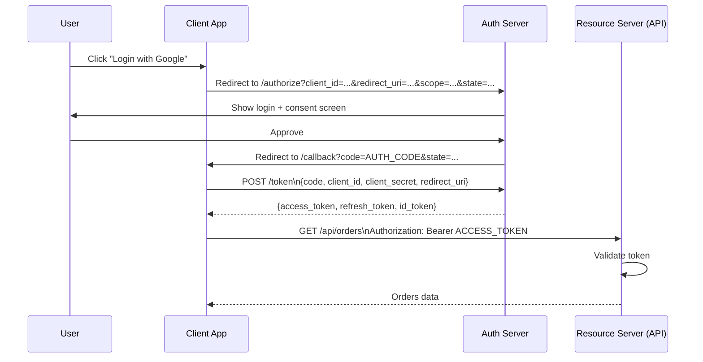
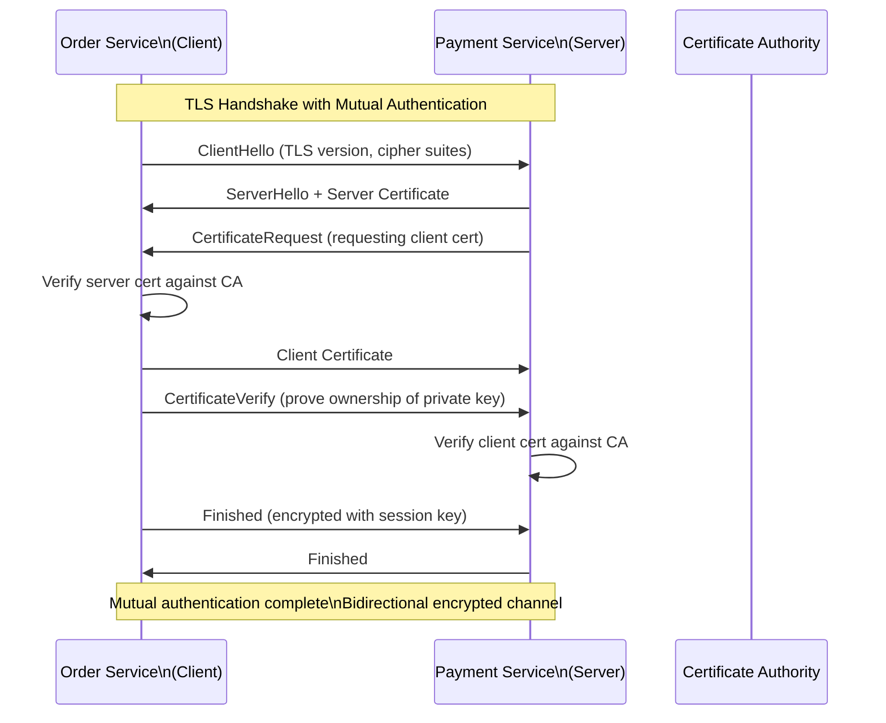

# Section 12: Security Engineering

## Chapter 20: Authentication, Authorization, and Secure Systems

### Introduction

Security is not a feature you add at the end. It must be designed from the beginning. Most security breaches happen because of predictable mistakes: weak authentication, missing authorization checks, unencrypted secrets, and unvalidated input.

This chapter covers: JWT, OAuth2, mTLS, RBAC, secrets management, OWASP top 10, and zero trust architecture.

### JWT — JSON Web Tokens

JWT is a compact, self-contained way to transmit information between parties as a JSON object, digitally signed.

**JWT structure:**
```
eyJhbGciOiJSUzI1NiIsInR5cCI6IkpXVCJ9   ← Header (Base64)
.
eyJzdWIiOiJ1c2VyLTEyMyIsImlzcyI6...    ← Payload (Base64)
.
SflKxwRJSMeKKF2QT4fwpMeJf36POk6...    ← Signature (Base64)
```

**Header:** Algorithm and token type
```json
{ "alg": "RS256", "typ": "JWT" }
```

**Payload (claims):**
```json
{
  "sub": "user-123",           // subject
  "iss": "auth.example.com",   // issuer
  "aud": "api.example.com",    // audience
  "exp": 1716000000,           // expiry (Unix timestamp)
  "iat": 1715990000,           // issued at
  "jti": "uuid-abc-123",       // JWT ID (for revocation)
  "roles": ["CUSTOMER", "PREMIUM"],
  "email": "alice@example.com"
}
```

**RS256 vs HS256:**
- **HS256** (HMAC-SHA256): Same secret signs and verifies. All services need the secret.
- **RS256** (RSA-SHA256): Private key signs (only auth service has it). Public key verifies (all services can have it). **Preferred for microservices.**

**Spring Security JWT validation:**

```java
@Configuration
@EnableWebSecurity
@EnableMethodSecurity
public class SecurityConfig {

    @Bean
    public SecurityFilterChain filterChain(HttpSecurity http) throws Exception {
        return http
            .csrf(csrf -> csrf.disable())  // Stateless API — no CSRF needed
            .sessionManagement(session ->
                session.sessionCreationPolicy(SessionCreationPolicy.STATELESS))
            .authorizeHttpRequests(auth -> auth
                .requestMatchers("/actuator/health/**").permitAll()
                .requestMatchers("/api/v1/public/**").permitAll()
                .requestMatchers(HttpMethod.POST, "/api/v1/orders").hasRole("CUSTOMER")
                .requestMatchers("/api/v1/admin/**").hasRole("ADMIN")
                .anyRequest().authenticated()
            )
            .oauth2ResourceServer(oauth2 -> oauth2
                .jwt(jwt -> jwt
                    .decoder(jwtDecoder())
                    .jwtAuthenticationConverter(jwtAuthenticationConverter())
                )
            )
            .build();
    }

    @Bean
    public JwtDecoder jwtDecoder() {
        // Public key from JWKS endpoint — rotate without restart
        return NimbusJwtDecoder.withJwkSetUri("https://auth.example.com/.well-known/jwks.json")
            .cache(Duration.ofHours(1))
            .build();
    }

    @Bean
    public JwtAuthenticationConverter jwtAuthenticationConverter() {
        JwtGrantedAuthoritiesConverter authoritiesConverter = new JwtGrantedAuthoritiesConverter();
        authoritiesConverter.setAuthorityPrefix("ROLE_");
        authoritiesConverter.setAuthoritiesClaimName("roles");

        JwtAuthenticationConverter converter = new JwtAuthenticationConverter();
        converter.setJwtGrantedAuthoritiesConverter(authoritiesConverter);
        return converter;
    }
}

// Method-level security
@RestController
@RequestMapping("/api/v1/orders")
public class OrderController {

    @PostMapping
    @PreAuthorize("hasRole('CUSTOMER')")
    public ResponseEntity<OrderResponse> placeOrder(@RequestBody PlaceOrderRequest request,
                                                     Authentication auth) {
        String userId = auth.getName(); // JWT 'sub' claim
        return ResponseEntity.ok(orderService.placeOrder(userId, request));
    }

    @GetMapping("/{orderId}")
    @PreAuthorize("@orderAccessPolicy.canRead(authentication, #orderId)")
    public ResponseEntity<OrderResponse> getOrder(@PathVariable String orderId) {
        return ResponseEntity.ok(orderService.findOrder(orderId));
    }

    @DeleteMapping("/{orderId}")
    @PreAuthorize("hasRole('ADMIN') or @orderAccessPolicy.isOwner(authentication, #orderId)")
    public ResponseEntity<Void> cancelOrder(@PathVariable String orderId) {
        orderService.cancelOrder(orderId);
        return ResponseEntity.noContent().build();
    }
}

// Custom security expression
@Component("orderAccessPolicy")
public class OrderAccessPolicy {

    public boolean canRead(Authentication auth, String orderId) {
        if (auth.getAuthorities().stream().anyMatch(a -> a.getAuthority().equals("ROLE_ADMIN"))) {
            return true;
        }
        // Regular users can only read their own orders
        Order order = orderRepository.findById(orderId).orElse(null);
        return order != null && order.getCustomerId().equals(auth.getName());
    }

    public boolean isOwner(Authentication auth, String orderId) {
        Order order = orderRepository.findById(orderId).orElse(null);
        return order != null && order.getCustomerId().equals(auth.getName());
    }
}
```

**JWT token refresh pattern:**

```java
// Short-lived access tokens + long-lived refresh tokens
// Access token: 15 minutes (used for API calls)
// Refresh token: 30 days (used to get new access token)

@Service
public class AuthService {

    public TokenPair login(LoginRequest request) {
        User user = userRepository.findByEmail(request.getEmail())
            .orElseThrow(() -> new BadCredentialsException("Invalid credentials"));

        if (!passwordEncoder.matches(request.getPassword(), user.getPasswordHash())) {
            throw new BadCredentialsException("Invalid credentials");
        }

        return generateTokenPair(user);
    }

    public TokenPair refresh(String refreshToken) {
        // Validate refresh token
        RefreshToken storedToken = refreshTokenRepository.findByToken(refreshToken)
            .orElseThrow(() -> new InvalidTokenException("Refresh token not found"));

        if (storedToken.isExpired()) {
            refreshTokenRepository.delete(storedToken);
            throw new InvalidTokenException("Refresh token expired — please login again");
        }

        User user = storedToken.getUser();
        // Rotate refresh token (single use)
        refreshTokenRepository.delete(storedToken);

        return generateTokenPair(user);
    }

    private TokenPair generateTokenPair(User user) {
        String accessToken = jwtBuilder.buildAccessToken(user);
        String refreshToken = UUID.randomUUID().toString();

        RefreshToken rt = RefreshToken.builder()
            .token(refreshToken)
            .user(user)
            .expiresAt(Instant.now().plus(Duration.ofDays(30)))
            .build();
        refreshTokenRepository.save(rt);

        return new TokenPair(accessToken, refreshToken);
    }
}
```

### OAuth2 — Authorization Framework

OAuth2 is an authorization framework. Users grant third-party apps access to their resources without giving them their password.

**Key roles:**
- **Resource Owner**: The user (owns the data)
- **Client**: The application requesting access
- **Authorization Server**: Issues tokens (e.g., Keycloak, Auth0, Google)
- **Resource Server**: The API with the protected resources

**Authorization Code Flow (most secure):**



**Spring Authorization Server (your own OAuth2 server):**

```java
@SpringBootApplication
public class AuthorizationServerApplication {
    public static void main(String[] args) {
        SpringApplication.run(AuthorizationServerApplication.class, args);
    }
}

@Configuration
public class AuthorizationServerConfig {

    @Bean
    @Order(1)
    public SecurityFilterChain authorizationServerFilterChain(HttpSecurity http) throws Exception {
        OAuth2AuthorizationServerConfiguration.applyDefaultSecurity(http);
        http.getConfigurer(OAuth2AuthorizationServerConfigurer.class)
            .oidc(Customizer.withDefaults()); // OpenID Connect support

        return http
            .exceptionHandling(ex -> ex
                .defaultAuthenticationEntryPointFor(
                    new LoginUrlAuthenticationEntryPoint("/login"),
                    new MediaTypeRequestMatcher(MediaType.TEXT_HTML)
                )
            )
            .oauth2ResourceServer(oauth2 -> oauth2.jwt(Customizer.withDefaults()))
            .build();
    }

    @Bean
    public RegisteredClientRepository registeredClientRepository() {
        RegisteredClient orderServiceClient = RegisteredClient.withId(UUID.randomUUID().toString())
            .clientId("order-service")
            .clientSecret("{bcrypt}" + passwordEncoder.encode("secret"))
            .clientAuthenticationMethod(ClientAuthenticationMethod.CLIENT_SECRET_BASIC)
            .authorizationGrantType(AuthorizationGrantType.AUTHORIZATION_CODE)
            .authorizationGrantType(AuthorizationGrantType.REFRESH_TOKEN)
            .authorizationGrantType(AuthorizationGrantType.CLIENT_CREDENTIALS)
            .redirectUri("https://order-service.example.com/callback")
            .scope(OidcScopes.OPENID)
            .scope("orders:read")
            .scope("orders:write")
            .tokenSettings(TokenSettings.builder()
                .accessTokenTimeToLive(Duration.ofMinutes(15))
                .refreshTokenTimeToLive(Duration.ofDays(30))
                .reuseRefreshTokens(false) // Rotate refresh tokens
                .build())
            .build();

        return new InMemoryRegisteredClientRepository(orderServiceClient);
    }

    @Bean
    public JWKSource<SecurityContext> jwkSource() {
        RSAKey rsaKey = generateRsaKey();
        JWKSet jwkSet = new JWKSet(rsaKey);
        return (jwkSelector, securityContext) -> jwkSelector.select(jwkSet);
    }
}
```

### mTLS — Mutual TLS

mTLS means BOTH client and server present certificates. Used for service-to-service authentication in zero-trust environments.



**mTLS in Spring Boot:**

```yaml
# order-service application.yml
server:
  ssl:
    enabled: true
    key-store: classpath:certs/order-service.p12
    key-store-password: ${KEYSTORE_PASSWORD}
    key-store-type: PKCS12
    trust-store: classpath:certs/ca-truststore.p12
    trust-store-password: ${TRUSTSTORE_PASSWORD}
    client-auth: need  # Require client certificate

# payment-service-client config (caller)
spring:
  ssl:
    bundle:
      jks:
        payment-service:
          keystore:
            location: classpath:certs/order-service.p12
            password: ${KEYSTORE_PASSWORD}
            type: PKCS12
          truststore:
            location: classpath:certs/ca-truststore.p12
            password: ${TRUSTSTORE_PASSWORD}
```

```java
@Configuration
public class PaymentClientConfig {

    @Bean
    public RestClient paymentServiceClient(SslBundles sslBundles) {
        SslBundle bundle = sslBundles.getBundle("payment-service");

        return RestClient.builder()
            .baseUrl("https://payment-service:8443")
            .requestFactory(new HttpComponentsClientHttpRequestFactory(
                HttpClients.custom()
                    .setSSLContext(bundle.createSslContext())
                    .build()
            ))
            .build();
    }
}
```

**mTLS with Istio service mesh (recommended for production):**

With Istio, you do NOT need to manage certificates in your application. Istio's sidecar proxy (Envoy) handles all TLS termination and mTLS automatically.

```yaml
# Enable strict mTLS for all services in a namespace
apiVersion: security.istio.io/v1
kind: PeerAuthentication
metadata:
  name: default
  namespace: production
spec:
  mtls:
    mode: STRICT  # All traffic must use mTLS
---
# Allow only order-service to call payment-service
apiVersion: security.istio.io/v1
kind: AuthorizationPolicy
metadata:
  name: payment-service-policy
  namespace: production
spec:
  selector:
    matchLabels:
      app: payment-service
  action: ALLOW
  rules:
    - from:
        - source:
            principals:
              - "cluster.local/ns/production/sa/order-service"
      to:
        - operation:
            methods: ["POST"]
            paths: ["/api/v1/payments"]
```

### RBAC — Role-Based Access Control

```java
// Define roles and permissions
@Entity
@Table(name = "roles")
public class Role {
    @Id
    private String name; // ADMIN, CUSTOMER, WAREHOUSE_MANAGER, etc.

    @ManyToMany
    @JoinTable(name = "role_permissions",
               joinColumns = @JoinColumn(name = "role_name"),
               inverseJoinColumns = @JoinColumn(name = "permission_name"))
    private Set<Permission> permissions;
}

@Entity
@Table(name = "permissions")
public class Permission {
    @Id
    private String name; // orders:read, orders:write, orders:cancel, inventory:manage

    private String description;
    private String resource;
    private String action;
}

// Spring Security method-level RBAC
@Service
public class OrderService {

    @PreAuthorize("hasPermission(null, 'orders', 'read')")
    public List<Order> findAllOrders() { ... }

    @PreAuthorize("hasPermission(#orderId, 'orders', 'cancel') or hasRole('ADMIN')")
    public void cancelOrder(String orderId) { ... }

    @PreAuthorize("hasPermission(null, 'orders', 'write')")
    public Order placeOrder(PlaceOrderCommand cmd) { ... }
}

// Custom PermissionEvaluator
@Component
public class OrderPermissionEvaluator implements PermissionEvaluator {

    @Override
    public boolean hasPermission(Authentication auth, Object targetId,
                                 Object targetType, Object permission) {
        if (auth == null || !auth.isAuthenticated()) return false;

        String userId = auth.getName();
        String resource = (String) targetType;
        String action = (String) permission;

        // Check permission in database
        if (!roleService.hasPermission(getUserRoles(auth), resource, action)) {
            return false;
        }

        // For object-level authorization — check ownership
        if (targetId != null && "orders".equals(resource)) {
            String orderId = (String) targetId;
            return orderRepository.existsByIdAndCustomerId(orderId, userId)
                || hasRole(auth, "ADMIN");
        }

        return true;
    }
}
```

### OWASP Top 10 — Java/Spring Specifics

**A01: Broken Access Control**
```java
// BAD — user can access any order by guessing IDs
@GetMapping("/orders/{orderId}")
public Order getOrder(@PathVariable String orderId) {
    return orderRepository.findById(orderId).orElseThrow(); // NO authorization check!
}

// GOOD — verify ownership
@GetMapping("/orders/{orderId}")
@PreAuthorize("@orderAccessPolicy.canRead(authentication, #orderId)")
public Order getOrder(@PathVariable String orderId, Authentication auth) {
    return orderRepository.findByIdAndCustomerId(orderId, auth.getName())
        .orElseThrow(() -> new OrderNotFoundException(orderId));
}
```

**A02: Cryptographic Failures**
```java
// BAD — MD5 is broken, never use for passwords
String hash = DigestUtils.md5Hex(password); // NEVER

// BAD — SHA-256 without salt is vulnerable to rainbow tables
String hash = DigestUtils.sha256Hex(password); // STILL BAD

// GOOD — bcrypt, scrypt, or argon2
@Bean
public PasswordEncoder passwordEncoder() {
    return new BCryptPasswordEncoder(12); // Cost factor 12 (adjust for your CPU)
    // Or: Argon2PasswordEncoder.defaultsForSpringSecurity_v5_8()
}

// GOOD — encrypt sensitive data at rest
@Entity
public class Customer {
    @Convert(converter = EncryptedStringConverter.class)
    private String ssn;  // Encrypted in DB, decrypted in application
}
```

**A03: Injection (SQL, LDAP, Command)**
```java
// BAD — SQL injection vulnerable
String query = "SELECT * FROM orders WHERE customer_id = '" + customerId + "'";
// Attacker sends: customer_id = "'; DROP TABLE orders; --"

// GOOD — parameterized queries (Spring Data JPA does this automatically)
@Query("SELECT o FROM Order o WHERE o.customerId = :customerId")
List<Order> findByCustomerId(@Param("customerId") String customerId);

// Or native SQL with named parameters
@Query(value = "SELECT * FROM orders WHERE customer_id = :customerId", nativeQuery = true)
List<Order> findByCustomerIdNative(@Param("customerId") String customerId);

// GOOD — never build queries with string concatenation
// NEVER: entityManager.createQuery("... " + userInput)
// ALWAYS: use @Query, Criteria API, or QueryDSL
```

**A07: Identification and Authentication Failures**
```java
// Production authentication checklist:
// 1. Rate limit login attempts
// 2. Lock accounts after N failed attempts
// 3. Use secure password hashing (bcrypt 12+)
// 4. Enforce MFA for privileged accounts
// 5. Short-lived JWT access tokens (15 min)
// 6. Rotate refresh tokens on use
// 7. Invalidate tokens on logout (store in Redis)
// 8. Require re-authentication for sensitive operations

@Service
public class LoginAttemptService {
    private final Cache<String, Integer> attemptsCache = Caffeine.newBuilder()
        .expireAfterWrite(15, TimeUnit.MINUTES)
        .build();

    public void loginFailed(String username) {
        int attempts = attemptsCache.asMap().merge(username, 1, Integer::sum);
        if (attempts >= 5) {
            accountLockoutService.lockAccount(username);
            // Also block by IP if needed
        }
    }

    public boolean isBlocked(String username) {
        Integer attempts = attemptsCache.getIfPresent(username);
        return attempts != null && attempts >= 5;
    }
}
```

**A09: Security Logging and Monitoring Failures**
```java
// Log all security events in a structured, tamper-evident way
@Component
public class SecurityAuditLogger {

    @EventListener
    public void onAuthenticationSuccess(AuthenticationSuccessEvent event) {
        log.info("AUTH_SUCCESS: user={} ip={} userAgent={}",
            event.getAuthentication().getName(),
            getCurrentRequestIp(),
            getCurrentRequestUserAgent());
    }

    @EventListener
    public void onAuthenticationFailure(AbstractAuthenticationFailureEvent event) {
        log.warn("AUTH_FAILURE: user={} reason={} ip={}",
            event.getAuthentication().getName(),
            event.getException().getMessage(),
            getCurrentRequestIp());
    }

    @EventListener
    public void onAccessDenied(AuthorizationDeniedEvent event) {
        log.warn("ACCESS_DENIED: user={} resource={} action={}",
            event.getAuthentication().getName(),
            event.getAuthorizationDecision().toString(),
            event.getObject());
    }
}
```

### Secrets Management

Never store secrets in code, config files, or environment variables in plain text.

**Kubernetes Secrets:**
```yaml
# Don't do this in production — Kubernetes secrets are base64, not encrypted
apiVersion: v1
kind: Secret
metadata:
  name: db-secret
type: Opaque
data:
  password: c3VwZXJzZWNyZXQ=  # base64("supersecret") — NOT encrypted!
```

**Better: AWS Secrets Manager + External Secrets Operator:**

```yaml
# ExternalSecret — fetches from AWS Secrets Manager at runtime
apiVersion: external-secrets.io/v1beta1
kind: ExternalSecret
metadata:
  name: order-service-db-secret
spec:
  refreshInterval: 1h
  secretStoreRef:
    name: aws-secretsmanager
    kind: ClusterSecretStore
  target:
    name: order-service-db-secret
    creationPolicy: Owner
  data:
    - secretKey: password          # k8s secret key
      remoteRef:
        key: production/order-service/db  # AWS Secrets Manager key
        property: password
    - secretKey: jdbc-url
      remoteRef:
        key: production/order-service/db
        property: jdbc-url
```

**HashiCorp Vault integration:**

```java
// Spring Vault configuration
@Configuration
@EnableVaultRepositories
public class VaultConfig {

    @Bean
    public VaultTemplate vaultTemplate(VaultEndpoint endpoint, ClientAuthentication auth) {
        return new VaultTemplate(VaultEndpointProvider.of(endpoint), auth);
    }
}

// Fetch secrets at runtime — not at startup
@Service
public class SecretService {
    private final VaultTemplate vaultTemplate;

    public String getDatabasePassword() {
        VaultResponse response = vaultTemplate.read("secret/data/order-service/db");
        Map<String, Object> data = (Map<String, Object>) response.getData().get("data");
        return (String) data.get("password");
    }
}
```

### Interview Questions

**Q: What is the difference between authentication and authorization?**

A: Authentication is "Who are you?" — verifying identity. Example: JWT validation, password check. Authorization is "What can you do?" — verifying permissions. Example: "Can this user delete this order?" In Spring Security: `@Authentication` handles authentication, `@PreAuthorize` handles authorization. Both are needed. Many security bugs come from doing authentication but skipping authorization (verifying the token is valid but not checking if the user owns the resource).

**Q: Why should JWT access tokens be short-lived?**

A: JWTs are stateless — once issued, you cannot revoke them without maintaining a blocklist. If an access token is stolen, the attacker has access until the token expires. A 15-minute lifetime limits the damage window. The refresh token (longer-lived) is used only to get new access tokens and is checked against the server on each use — allowing revocation. Pattern: access token = 15 min, refresh token = 30 days, rotated on each use.

**Q: What is CSRF and when does it apply to REST APIs?**

A: CSRF (Cross-Site Request Forgery) is when a malicious website tricks your browser into making requests to another site using your existing session cookies. It only applies to session-based (cookie) authentication. Stateless REST APIs using Bearer tokens (JWT in Authorization header) are NOT vulnerable to CSRF — the browser cannot automatically include Authorization headers in cross-site requests. So: `csrf.disable()` is correct for stateless JWT APIs. Never disable CSRF for session-based web apps.

---
