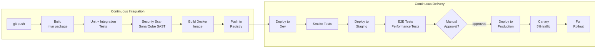

# Section 13: Platform Engineering & DevOps

## Chapter 21: CI/CD, GitOps, and Internal Developer Platforms

### Introduction

Platform engineering is about reducing cognitive load for application developers. Instead of every team managing their own Kubernetes, CI/CD pipelines, and observability, a platform team builds "golden paths" — easy, opinionated ways to do things correctly.

The goal: developers should be able to deploy a new service to production with one command, with all the right security, monitoring, and reliability features built in.

### CI/CD Pipeline Design

A good CI/CD pipeline is:
- **Fast**: Developers get feedback in minutes, not hours
- **Reliable**: Flaky tests destroy trust in the pipeline
- **Safe**: Cannot deploy broken code to production
- **Observable**: Clear visibility into what is happening



**GitHub Actions CI Pipeline:**

```yaml
# .github/workflows/ci.yml
name: CI Pipeline

on:
  push:
    branches: [main, develop]
  pull_request:
    branches: [main]

env:
  REGISTRY: ghcr.io
  IMAGE_NAME: ${{ github.repository }}
  JAVA_VERSION: '21'

jobs:
  # ── Build and Test ──────────────────────────────────────────────────────────
  build-test:
    name: Build and Test
    runs-on: ubuntu-latest

    services:
      postgres:
        image: postgres:16
        env:
          POSTGRES_DB: testdb
          POSTGRES_USER: test
          POSTGRES_PASSWORD: test
        options: >-
          --health-cmd pg_isready
          --health-interval 10s
          --health-timeout 5s
          --health-retries 5
        ports:
          - 5432:5432

      kafka:
        image: confluentinc/cp-kafka:7.6.0
        ports:
          - 9092:9092
        env:
          KAFKA_ZOOKEEPER_CONNECT: localhost:2181
          KAFKA_ADVERTISED_LISTENERS: PLAINTEXT://localhost:9092

    steps:
      - name: Checkout
        uses: actions/checkout@v4

      - name: Set up Java
        uses: actions/setup-java@v4
        with:
          java-version: ${{ env.JAVA_VERSION }}
          distribution: temurin
          cache: maven

      - name: Cache Maven packages
        uses: actions/cache@v4
        with:
          path: ~/.m2
          key: ${{ runner.os }}-m2-${{ hashFiles('**/pom.xml') }}

      - name: Build with Maven
        run: mvn clean compile --no-transfer-progress

      - name: Run unit tests
        run: mvn test -Dtest="**/*Test" --no-transfer-progress

      - name: Run integration tests
        run: mvn test -Dtest="**/*IT" -Dspring.profiles.active=test --no-transfer-progress
        env:
          SPRING_DATASOURCE_URL: jdbc:postgresql://localhost:5432/testdb
          SPRING_DATASOURCE_USERNAME: test
          SPRING_DATASOURCE_PASSWORD: test
          SPRING_KAFKA_BOOTSTRAP_SERVERS: localhost:9092

      - name: Upload test results
        uses: actions/upload-artifact@v4
        if: always()
        with:
          name: test-results
          path: target/surefire-reports/

      - name: Upload coverage to Codecov
        uses: codecov/codecov-action@v4
        with:
          files: target/site/jacoco/jacoco.xml

  # ── Security Scanning ───────────────────────────────────────────────────────
  security-scan:
    name: Security Scan
    runs-on: ubuntu-latest
    needs: build-test

    steps:
      - uses: actions/checkout@v4

      - name: Run SonarQube Analysis
        env:
          GITHUB_TOKEN: ${{ secrets.GITHUB_TOKEN }}
          SONAR_TOKEN: ${{ secrets.SONAR_TOKEN }}
        run: |
          mvn sonar:sonar \
            -Dsonar.projectKey=order-service \
            -Dsonar.host.url=https://sonar.example.com \
            -Dsonar.login=$SONAR_TOKEN

      - name: OWASP Dependency Check
        run: mvn dependency-check:check -DfailBuildOnCVSS=7
        # Fails build if any dependency has CVSS score >= 7

      - name: Trivy vulnerability scan (dependencies)
        uses: aquasecurity/trivy-action@master
        with:
          scan-type: fs
          scan-ref: .
          severity: HIGH,CRITICAL
          exit-code: 1

  # ── Build Docker Image ──────────────────────────────────────────────────────
  build-image:
    name: Build Docker Image
    runs-on: ubuntu-latest
    needs: [build-test, security-scan]
    if: github.ref == 'refs/heads/main'

    outputs:
      image-digest: ${{ steps.build.outputs.digest }}

    steps:
      - uses: actions/checkout@v4

      - name: Log in to GitHub Container Registry
        uses: docker/login-action@v3
        with:
          registry: ${{ env.REGISTRY }}
          username: ${{ github.actor }}
          password: ${{ secrets.GITHUB_TOKEN }}

      - name: Extract metadata
        id: meta
        uses: docker/metadata-action@v5
        with:
          images: ${{ env.REGISTRY }}/${{ env.IMAGE_NAME }}
          tags: |
            type=sha,prefix=sha-
            type=ref,event=branch
            type=semver,pattern={{version}}

      - name: Build and push
        id: build
        uses: docker/build-push-action@v5
        with:
          context: .
          push: true
          tags: ${{ steps.meta.outputs.tags }}
          labels: ${{ steps.meta.outputs.labels }}
          cache-from: type=gha
          cache-to: type=gha,mode=max
          provenance: true   # SLSA provenance attestation
          sbom: true         # Software Bill of Materials

      - name: Scan image for vulnerabilities
        uses: aquasecurity/trivy-action@master
        with:
          image-ref: ${{ env.REGISTRY }}/${{ env.IMAGE_NAME }}@${{ steps.build.outputs.digest }}
          severity: CRITICAL
          exit-code: 1

  # ── Deploy to Dev ───────────────────────────────────────────────────────────
  deploy-dev:
    name: Deploy to Dev
    runs-on: ubuntu-latest
    needs: build-image
    environment: development

    steps:
      - name: Update Helm values
        run: |
          # Update the image tag in the GitOps repo
          git clone https://x-access-token:${{ secrets.GITOPS_TOKEN }}@github.com/example/k8s-manifests.git
          cd k8s-manifests
          yq -i '.image.tag = "${{ github.sha }}"' apps/order-service/dev/values.yaml
          git config user.email "ci@example.com"
          git config user.name "CI Bot"
          git add -A
          git commit -m "chore: update order-service to ${{ github.sha }} in dev"
          git push
          # ArgoCD picks up the change and deploys automatically
```

**Production Dockerfile (multi-stage):**

```dockerfile
# syntax=docker/dockerfile:1.7

# ── Stage 1: Build ─────────────────────────────────────────────────────────
FROM eclipse-temurin:21-jdk-alpine AS build

WORKDIR /app

# Copy dependency files first (for cache layer optimization)
COPY pom.xml .
COPY .mvn .mvn
COPY mvnw .

# Download dependencies (cached unless pom.xml changes)
RUN ./mvnw dependency:go-offline -q

# Copy source and build
COPY src ./src
RUN ./mvnw package -DskipTests -q

# Extract layers for better caching
RUN java -Djarmode=layertools -jar target/*.jar extract --destination /app/extracted

# ── Stage 2: Runtime ───────────────────────────────────────────────────────
FROM eclipse-temurin:21-jre-alpine AS runtime

# Security: run as non-root
RUN addgroup -S appgroup && adduser -S appuser -G appgroup
USER appuser

WORKDIR /app

# Copy layers in cache-friendly order (least-to-most frequently changed)
COPY --from=build /app/extracted/dependencies/ ./
COPY --from=build /app/extracted/spring-boot-loader/ ./
COPY --from=build /app/extracted/snapshot-dependencies/ ./
COPY --from=build /app/extracted/application/ ./

# Health check
HEALTHCHECK --interval=10s --timeout=3s --start-period=30s --retries=3 \
    CMD wget -qO- http://localhost:8080/actuator/health/liveness || exit 1

EXPOSE 8080

ENTRYPOINT ["java", \
    "-XX:+UseG1GC", \
    "-XX:MaxGCPauseMillis=100", \
    "-XX:+ExitOnOutOfMemoryError", \
    "-XX:+HeapDumpOnOutOfMemoryError", \
    "-XX:HeapDumpPath=/tmp/", \
    "-Djava.security.egd=file:/dev/./urandom", \
    "org.springframework.boot.loader.launch.JarLauncher"]
```

### Helm — Kubernetes Package Manager

Helm is the standard way to template Kubernetes manifests and manage releases.

**Helm chart structure:**

```
order-service/
├── Chart.yaml              # Chart metadata
├── values.yaml             # Default values
├── values-dev.yaml         # Dev overrides
├── values-prod.yaml        # Production overrides
└── templates/
    ├── _helpers.tpl         # Template helpers
    ├── deployment.yaml
    ├── service.yaml
    ├── ingress.yaml
    ├── hpa.yaml
    ├── pdb.yaml
    ├── configmap.yaml
    ├── serviceaccount.yaml
    └── NOTES.txt
```

```yaml
# Chart.yaml
apiVersion: v2
name: order-service
description: Order Service Helm Chart
type: application
version: 0.1.0
appVersion: "1.0.0"
dependencies:
  - name: postgresql
    version: "~15.0"
    repository: https://charts.bitnami.com/bitnami
    condition: postgresql.enabled
```

```yaml
# values.yaml
replicaCount: 3

image:
  repository: ghcr.io/example/order-service
  pullPolicy: IfNotPresent
  tag: ""  # Overridden by CI

imagePullSecrets: []
nameOverride: ""
fullnameOverride: ""

serviceAccount:
  create: true
  annotations: {}

service:
  type: ClusterIP
  port: 80
  targetPort: 8080

ingress:
  enabled: true
  className: nginx
  annotations:
    cert-manager.io/cluster-issuer: letsencrypt-prod
  hosts:
    - host: api.example.com
      paths:
        - path: /api/v1/orders
          pathType: Prefix
  tls:
    - secretName: api-tls
      hosts:
        - api.example.com

resources:
  requests:
    cpu: 250m
    memory: 512Mi
  limits:
    cpu: 1000m
    memory: 1Gi

autoscaling:
  enabled: true
  minReplicas: 3
  maxReplicas: 20
  targetCPUUtilizationPercentage: 70
  targetMemoryUtilizationPercentage: 80

postgresql:
  enabled: false  # Use external managed DB in production

env:
  SPRING_PROFILES_ACTIVE: production

secrets:
  dbUrl: ""         # Set in values-prod.yaml or via external secret
  dbPassword: ""

monitoring:
  enabled: true
  serviceMonitor:
    enabled: true
    interval: 30s
```

```yaml
# templates/deployment.yaml
apiVersion: apps/v1
kind: Deployment
metadata:
  name: {{ include "order-service.fullname" . }}
  labels:
    {{- include "order-service.labels" . | nindent 4 }}
spec:
  {{- if not .Values.autoscaling.enabled }}
  replicas: {{ .Values.replicaCount }}
  {{- end }}
  selector:
    matchLabels:
      {{- include "order-service.selectorLabels" . | nindent 6 }}
  template:
    metadata:
      annotations:
        checksum/config: {{ include (print $.Template.BasePath "/configmap.yaml") . | sha256sum }}
      labels:
        {{- include "order-service.selectorLabels" . | nindent 8 }}
        version: {{ .Values.image.tag | default .Chart.AppVersion }}
    spec:
      serviceAccountName: {{ include "order-service.serviceAccountName" . }}
      containers:
        - name: {{ .Chart.Name }}
          image: "{{ .Values.image.repository }}:{{ .Values.image.tag | default .Chart.AppVersion }}"
          imagePullPolicy: {{ .Values.image.pullPolicy }}
          ports:
            - name: http
              containerPort: 8080
          env:
            {{- range $key, $val := .Values.env }}
            - name: {{ $key }}
              value: {{ $val | quote }}
            {{- end }}
          resources:
            {{- toYaml .Values.resources | nindent 12 }}
          livenessProbe:
            httpGet:
              path: /actuator/health/liveness
              port: http
            periodSeconds: 10
          readinessProbe:
            httpGet:
              path: /actuator/health/readiness
              port: http
            periodSeconds: 5
```

### Blue-Green and Canary Deployments

**Blue-Green Deployment:**

Two identical production environments. Only one is live at a time. Switch traffic instantly by updating the load balancer.

```bash
# Blue is currently live (100% traffic)
# Deploy new version to Green
kubectl apply -f deployment-green.yaml

# Run smoke tests on green (not in production traffic)
kubectl run smoketest --image=curlimages/curl --rm -it -- \
  curl http://order-service-green/actuator/health

# Switch traffic from Blue to Green
kubectl patch service order-service \
  -p '{"spec": {"selector": {"version": "green"}}}'

# Monitor for 15 minutes
# If issues: instant rollback
kubectl patch service order-service \
  -p '{"spec": {"selector": {"version": "blue"}}}'

# If healthy: decommission Blue
kubectl delete deployment order-service-blue
```

**Canary Deployment with Argo Rollouts:**

```yaml
apiVersion: argoproj.io/v1alpha1
kind: Rollout
metadata:
  name: order-service
spec:
  replicas: 10
  selector:
    matchLabels:
      app: order-service
  template:
    metadata:
      labels:
        app: order-service
    spec:
      containers:
        - name: order-service
          image: order-service:1.2.3
  strategy:
    canary:
      canaryService: order-service-canary
      stableService: order-service-stable
      trafficRouting:
        nginx:
          stableIngress: order-service-ingress
      steps:
        - setWeight: 5           # 5% of traffic to canary
        - pause: {duration: 5m}  # Wait 5 minutes
        - analysis:
            templates:
              - templateName: error-rate-check
        - setWeight: 25          # 25% traffic
        - pause: {duration: 10m}
        - analysis:
            templates:
              - templateName: latency-check
        - setWeight: 50          # 50% traffic
        - pause: {duration: 15m}
        - setWeight: 100         # Full rollout

      # Auto-rollback if analysis fails
      analysis:
        successfulRunHistoryLimit: 3
        unsuccessfulRunHistoryLimit: 3
---
# Analysis template
apiVersion: argoproj.io/v1alpha1
kind: AnalysisTemplate
metadata:
  name: error-rate-check
spec:
  metrics:
    - name: error-rate
      interval: 2m
      successCondition: result[0] < 0.01  # < 1% error rate
      failureLimit: 3
      provider:
        prometheus:
          address: http://prometheus:9090
          query: |
            rate(http_server_requests_seconds_count{
              application="order-service",
              status=~"5..",
              version="{{args.canary-hash}}"
            }[5m])
            /
            rate(http_server_requests_seconds_count{
              application="order-service",
              version="{{args.canary-hash}}"
            }[5m])
```

### Infrastructure as Code with Terraform

```hcl
# terraform/main.tf — AWS EKS cluster

terraform {
  required_version = ">= 1.7.0"
  required_providers {
    aws = {
      source  = "hashicorp/aws"
      version = "~> 5.40"
    }
    kubernetes = {
      source  = "hashicorp/kubernetes"
      version = "~> 2.27"
    }
    helm = {
      source  = "hashicorp/helm"
      version = "~> 2.12"
    }
  }

  backend "s3" {
    bucket         = "my-terraform-state"
    key            = "eks/production/terraform.tfstate"
    region         = "us-east-1"
    encrypt        = true
    dynamodb_table = "terraform-state-lock"
  }
}

provider "aws" {
  region = var.aws_region
}

# EKS Cluster
module "eks" {
  source  = "terraform-aws-modules/eks/aws"
  version = "~> 20.0"

  cluster_name    = "${var.environment}-eks-cluster"
  cluster_version = "1.29"

  cluster_endpoint_public_access  = false
  cluster_endpoint_private_access = true

  vpc_id     = module.vpc.vpc_id
  subnet_ids = module.vpc.private_subnets

  # Managed node groups
  eks_managed_node_groups = {
    # General workloads
    general = {
      instance_types = ["m5.xlarge"]
      min_size       = 3
      max_size       = 20
      desired_size   = 5

      labels = {
        node-type = "general"
      }

      taints = []
    }

    # High-memory nodes for caching
    high-memory = {
      instance_types = ["r5.2xlarge"]
      min_size       = 2
      max_size       = 10
      desired_size   = 3

      labels = {
        node-type = "high-memory"
      }

      taints = [{
        key    = "dedicated"
        value  = "high-memory"
        effect = "NO_SCHEDULE"
      }]
    }
  }

  # Add-ons
  cluster_addons = {
    coredns = {
      addon_version = "v1.11.1-eksbuild.4"
    }
    kube-proxy = {
      addon_version = "v1.29.0-eksbuild.1"
    }
    vpc-cni = {
      addon_version            = "v1.16.3-eksbuild.2"
      service_account_role_arn = module.vpc_cni_irsa_role.iam_role_arn
    }
    aws-ebs-csi-driver = {
      addon_version            = "v1.28.0-eksbuild.1"
      service_account_role_arn = module.ebs_csi_irsa_role.iam_role_arn
    }
  }

  # Enable IRSA (IAM Roles for Service Accounts)
  enable_irsa = true

  tags = local.common_tags
}

# RDS PostgreSQL
module "rds" {
  source  = "terraform-aws-modules/rds/aws"
  version = "~> 6.5"

  identifier = "${var.environment}-orders-db"

  engine               = "postgres"
  engine_version       = "16.1"
  instance_class       = "db.r6g.xlarge"
  allocated_storage    = 100
  max_allocated_storage = 1000  # Auto-scaling storage

  db_name  = "orders"
  username = "orders_admin"
  port     = 5432

  # Multi-AZ for production
  multi_az               = true
  create_db_subnet_group = true
  subnet_ids             = module.vpc.database_subnets

  # Performance Insights
  performance_insights_enabled          = true
  performance_insights_retention_period = 7

  # Enhanced monitoring
  monitoring_interval    = 60
  monitoring_role_name   = "rds-monitoring-role"
  create_monitoring_role = true

  # Backup
  backup_retention_period = 30
  backup_window           = "03:00-06:00"
  maintenance_window      = "Mon:00:00-Mon:03:00"

  # Encryption
  storage_encrypted = true
  kms_key_id        = aws_kms_key.rds.arn

  # Deletion protection
  deletion_protection = true

  tags = local.common_tags
}

# Outputs
output "cluster_endpoint" {
  value = module.eks.cluster_endpoint
}

output "rds_endpoint" {
  value = module.rds.db_instance_endpoint
}
```

### Interview Questions

**Q: What is the difference between Blue-Green and Canary deployments?**

A: Blue-Green: Two identical environments (Blue = current, Green = new). Traffic switches instantly when Green is verified — zero downtime, instant rollback. But requires double infrastructure cost. Canary: New version receives a small percentage of traffic (e.g., 5%) while the old version handles the rest. Gradually increase the percentage. If metrics stay healthy, roll out fully. If not, roll back. Canary is slower but uses fewer resources and lets you validate with real production traffic on a small scale. Blue-Green is better when you need instant cutover. Canary is better for risk reduction with gradual validation.

**Q: What is GitOps and why use it?**

A: GitOps means the desired state of your infrastructure and deployments is stored in Git. A GitOps operator (like ArgoCD) continuously reconciles the cluster state to match Git. Benefits: (1) Audit trail — every change is a Git commit with author and message. (2) Easy rollback — revert a commit to roll back. (3) Consistency — cluster state always matches Git, preventing drift. (4) Security — no direct cluster access needed for deployment. (5) Developer experience — developers just push code and Git triggers everything.

**Q: How do you manage secrets in a Kubernetes cluster?**

A: Options from least to most secure: (1) Plain Kubernetes Secrets — base64 encoded, not encrypted by default. Add etcd encryption at rest. (2) Sealed Secrets — secrets are encrypted with a cluster-specific key and stored in Git. (3) External Secrets Operator — fetches secrets from AWS Secrets Manager, HashiCorp Vault, or GCP Secret Manager at runtime. Secrets never stored in Git. (4) Vault Agent Injector — Vault sidecar injects secrets as files into pods. For production: External Secrets Operator or Vault is recommended. Never commit plaintext or base64 secrets to Git.

---
