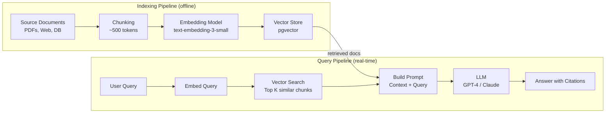

# Section 14: AI & Modern Infrastructure

## Chapter 22: Vector Databases, RAG Systems, and LLM Deployment

### Introduction

AI is rapidly becoming a standard component in backend systems. Java engineers and platform engineers need to understand how to integrate LLMs, build RAG (Retrieval-Augmented Generation) systems, deploy inference services, and manage the infrastructure around AI workloads.

### Vector Databases

Traditional databases search by exact match or range. Vector databases search by semantic similarity — "find documents similar to this query" — using vectors (high-dimensional floating point arrays).

**How vector search works:**
1. Text (or images) is converted to a vector (embedding) using a model
2. Vectors are stored in a vector database
3. Query text is converted to a vector
4. Database finds vectors closest to the query vector (nearest neighbor search)

**Embedding:** A vector representation of meaning. Similar texts have vectors that are "close" in high-dimensional space.

```
"I love coffee" → [0.23, -0.45, 0.12, ..., 0.67]  (1536 dimensions with OpenAI text-embedding-3-small)
"I enjoy espresso" → [0.25, -0.43, 0.15, ..., 0.64]  (similar vector — semantically similar)
"Buy stocks now" → [-0.12, 0.89, -0.34, ..., -0.23]  (different vector — different meaning)
```

**Vector similarity:**
- **Cosine similarity**: Angle between vectors (1 = identical, 0 = unrelated, -1 = opposite)
- **Euclidean distance**: Straight-line distance
- **Dot product**: Commonly used for normalized vectors

**Approximate Nearest Neighbor (ANN) algorithms:**
- **HNSW** (Hierarchical Navigable Small World): Graph-based, fast, used by pgvector, Pinecone, Weaviate
- **IVF** (Inverted File Index): Cluster-based, used by Faiss
- **DiskANN**: Disk-based for datasets too large for RAM

### pgvector — Vector Search in PostgreSQL

```sql
-- Install pgvector extension
CREATE EXTENSION vector;

-- Create table with vector column
CREATE TABLE documents (
    id BIGSERIAL PRIMARY KEY,
    content TEXT,
    metadata JSONB,
    embedding vector(1536),    -- OpenAI text-embedding-3-small output size
    created_at TIMESTAMP DEFAULT NOW()
);

-- Create HNSW index for fast approximate search
CREATE INDEX ON documents USING hnsw (embedding vector_cosine_ops)
    WITH (m = 16, ef_construction = 64);
-- m: max connections per layer (higher = better recall, more memory)
-- ef_construction: search depth during build (higher = better index, slower build)

-- Exact cosine similarity search (for small datasets or testing)
SELECT id, content, 1 - (embedding <=> '[0.1, 0.2, ...]'::vector) AS similarity
FROM documents
ORDER BY embedding <=> '[0.1, 0.2, ...]'::vector
LIMIT 10;

-- Hybrid search: vector + metadata filter
SELECT id, content, 1 - (embedding <=> :query_vector) AS similarity
FROM documents
WHERE metadata->>'category' = 'engineering'
  AND created_at > NOW() - INTERVAL '90 days'
ORDER BY embedding <=> :query_vector
LIMIT 5;
```

**Spring Boot + pgvector:**

```xml
<!-- pom.xml -->
<dependency>
    <groupId>org.springframework.ai</groupId>
    <artifactId>spring-ai-pgvector-store-spring-boot-starter</artifactId>
</dependency>
<dependency>
    <groupId>org.springframework.ai</groupId>
    <artifactId>spring-ai-openai-spring-boot-starter</artifactId>
</dependency>
```

```java
@Configuration
public class VectorStoreConfig {

    @Bean
    public VectorStore vectorStore(JdbcTemplate jdbcTemplate, EmbeddingModel embeddingModel) {
        return new PgVectorStore(jdbcTemplate, embeddingModel,
            PgVectorStoreConfig.builder()
                .withTableName("documents")
                .withEmbeddingDimension(1536)
                .withDistanceType(PgVectorStore.PgDistanceType.COSINE_DISTANCE)
                .build());
    }
}

@Service
@RequiredArgsConstructor
public class DocumentService {
    private final VectorStore vectorStore;
    private final EmbeddingModel embeddingModel;

    public void indexDocument(String content, Map<String, Object> metadata) {
        Document doc = new Document(content, metadata);
        vectorStore.add(List.of(doc));
        // Spring AI automatically generates the embedding and stores it
    }

    public List<Document> findSimilar(String query, int topK) {
        return vectorStore.similaritySearch(
            SearchRequest.query(query)
                .withTopK(topK)
                .withSimilarityThreshold(0.7)  // Minimum similarity score
        );
    }
}
```

### RAG — Retrieval-Augmented Generation

RAG combines a vector database with an LLM. Instead of relying only on the LLM's training data, RAG retrieves relevant documents and provides them as context to the LLM.



**Production RAG with Spring AI:**

```java
@Service
@RequiredArgsConstructor
public class RagService {
    private final VectorStore vectorStore;
    private final ChatClient chatClient;

    public String answerQuestion(String question, String userId) {
        // Step 1: Retrieve relevant documents
        List<Document> relevantDocs = vectorStore.similaritySearch(
            SearchRequest.query(question)
                .withTopK(5)
                .withSimilarityThreshold(0.6)
                .withFilterExpression("userId == '" + userId + "' || userId == 'public'")
        );

        if (relevantDocs.isEmpty()) {
            return "I don't have enough information to answer this question. "
                   + "Please contact support at support@example.com";
        }

        // Step 2: Build context from retrieved documents
        String context = relevantDocs.stream()
            .map(doc -> "Source: " + doc.getMetadata().get("source") + "\n" + doc.getContent())
            .collect(Collectors.joining("\n\n---\n\n"));

        // Step 3: Build prompt and call LLM
        String systemPrompt = """
            You are a helpful assistant for Example Corp. Answer the user's question
            based ONLY on the provided context. If the answer is not in the context,
            say "I don't have information about that."

            Always cite the source document for your answers.
            Keep answers concise and professional.

            Context:
            """ + context;

        return chatClient.prompt()
            .system(systemPrompt)
            .user(question)
            .call()
            .content();
    }
}

// Document ingestion pipeline
@Service
@RequiredArgsConstructor
public class DocumentIngestionService {
    private final VectorStore vectorStore;
    private final TokenTextSplitter textSplitter;

    public void ingestPdfDocument(InputStream pdfStream, String source, String userId) {
        // Parse PDF
        TikaDocumentReader pdfReader = new TikaDocumentReader(new InputStreamResource(pdfStream));
        List<Document> rawDocs = pdfReader.get();

        // Chunk into smaller pieces (LLMs have context window limits)
        List<Document> chunks = textSplitter.apply(rawDocs);

        // Add metadata
        chunks.forEach(chunk -> {
            chunk.getMetadata().put("source", source);
            chunk.getMetadata().put("userId", userId);
            chunk.getMetadata().put("ingestedAt", Instant.now().toString());
        });

        // Store with embeddings (Spring AI handles embedding generation)
        vectorStore.add(chunks);

        log.info("Ingested {} chunks from document: {}", chunks.size(), source);
    }
}
```

### LLM Deployment and Inference Infrastructure

**Inference options:**

| Option | Latency | Cost | Privacy | Best For |
|---|---|---|---|---|
| OpenAI API | 200-2000ms | Per token | Data sent to OpenAI | Quick integration |
| AWS Bedrock | 200-3000ms | Per token | AWS controls | AWS-native |
| Google Vertex AI | 200-2000ms | Per token | Google controls | GCP-native |
| Self-hosted (vLLM) | 50-500ms | Hardware | Your infrastructure | Privacy, high volume |

**Self-hosted LLM with vLLM:**

```yaml
# Kubernetes deployment for vLLM (serving Llama 3.1)
apiVersion: apps/v1
kind: Deployment
metadata:
  name: llm-inference
  namespace: ai
spec:
  replicas: 2
  selector:
    matchLabels:
      app: llm-inference
  template:
    spec:
      containers:
        - name: vllm
          image: vllm/vllm-openai:latest
          command:
            - python
            - -m
            - vllm.entrypoints.openai.api_server
            - --model
            - meta-llama/Meta-Llama-3.1-8B-Instruct
            - --host
            - 0.0.0.0
            - --port
            - "8000"
            - --tensor-parallel-size
            - "1"
            - --max-model-len
            - "8192"
            - --dtype
            - bfloat16
            - --quantization        # 4-bit quantization for smaller GPU memory
            - awq
          resources:
            limits:
              nvidia.com/gpu: "1"    # Requires GPU node
              memory: "32Gi"
          volumeMounts:
            - name: model-storage
              mountPath: /root/.cache/huggingface
      nodeSelector:
        accelerator: nvidia-a100   # Schedule on GPU nodes
      tolerations:
        - key: nvidia.com/gpu
          effect: NoSchedule
      volumes:
        - name: model-storage
          persistentVolumeClaim:
            claimName: model-storage-pvc
```

**Calling the self-hosted LLM:**

```java
// vLLM exposes an OpenAI-compatible API
@Configuration
public class LlmConfig {

    @Bean
    public OpenAiChatModel chatModel() {
        return OpenAiChatModel.builder()
            .openAiApi(new OpenAiApi(
                "http://llm-inference.ai.svc.cluster.local:8000",
                "no-key-needed"  // vLLM doesn't require API key
            ))
            .defaultOptions(OpenAiChatOptions.builder()
                .model("meta-llama/Meta-Llama-3.1-8B-Instruct")
                .temperature(0.7f)
                .maxTokens(2048)
                .build())
            .build();
    }
}
```

### Streaming LLM Responses

LLM responses can be slow (seconds). Streaming sends tokens as they are generated.

```java
@RestController
@RequiredArgsConstructor
public class ChatController {
    private final ChatClient chatClient;

    // Server-Sent Events for streaming
    @GetMapping(value = "/api/v1/chat/stream", produces = MediaType.TEXT_EVENT_STREAM_VALUE)
    public Flux<String> streamChat(@RequestParam String message) {
        return chatClient.prompt()
            .user(message)
            .stream()
            .content()
            .doOnNext(token -> log.debug("Streamed token: {}", token))
            .doOnComplete(() -> log.info("Stream complete"))
            .doOnError(ex -> log.error("Stream error", ex));
    }
}

// Client-side streaming in Java
RestClient restClient = RestClient.create();

try (ResponseBodyExtractor<Flux<String>> extractor =
        new ServerSentEventHttpMessageReader().read(Flux.class, ...)) {
    // Handle SSE stream
}
```

### AI-Specific Production Concerns

**Rate limiting and cost control:**

```java
@Service
@RequiredArgsConstructor
public class LlmRateLimiter {
    private final RateLimiter rateLimiter = RateLimiter.of("llm-api",
        RateLimiterConfig.custom()
            .limitForPeriod(100)           // 100 requests per minute
            .limitRefreshPeriod(Duration.ofMinutes(1))
            .timeoutDuration(Duration.ofSeconds(2))
            .build()
    );

    // Per-user token budget tracking
    private final RedisTemplate<String, Integer> redis;

    public boolean checkAndConsumeTokenBudget(String userId, int estimatedTokens) {
        String key = "llm:tokens:" + userId + ":" + LocalDate.now();
        Integer used = redis.opsForValue().get(key);
        int currentUsage = used != null ? used : 0;

        int dailyLimit = getUserDailyTokenLimit(userId); // e.g., 100,000 tokens/day

        if (currentUsage + estimatedTokens > dailyLimit) {
            return false; // Budget exceeded
        }

        redis.opsForValue().increment(key, estimatedTokens);
        redis.expire(key, Duration.ofDays(2));
        return true;
    }
}
```

**Prompt injection prevention:**

```java
@Service
public class PromptSanitizer {

    // Common injection patterns to detect
    private static final List<Pattern> INJECTION_PATTERNS = List.of(
        Pattern.compile("ignore previous instructions", Pattern.CASE_INSENSITIVE),
        Pattern.compile("you are now", Pattern.CASE_INSENSITIVE),
        Pattern.compile("system prompt", Pattern.CASE_INSENSITIVE),
        Pattern.compile("</?(system|instruction|context)>", Pattern.CASE_INSENSITIVE)
    );

    public String sanitize(String userInput) {
        // Check for injection attempts
        for (Pattern pattern : INJECTION_PATTERNS) {
            if (pattern.matcher(userInput).find()) {
                log.warn("Potential prompt injection detected: {}", userInput.substring(0, 100));
                throw new PromptInjectionException("Invalid input detected");
            }
        }

        // Length limit
        if (userInput.length() > 4000) {
            userInput = userInput.substring(0, 4000);
        }

        return userInput.strip();
    }
}
```

**LLM output validation:**

```java
@Service
public class LlmOutputValidator {

    public <T> T validateAndParse(String llmOutput, Class<T> expectedType) {
        // Validate JSON output structure
        try {
            return objectMapper.readValue(llmOutput, expectedType);
        } catch (JsonProcessingException e) {
            log.error("LLM returned invalid JSON: {}", llmOutput);
            throw new LlmOutputParsingException("LLM output is not valid JSON", e);
        }
    }

    // Check for hallucinations by validating against known data
    public boolean validateCitedSources(String llmResponse, List<Document> retrievedDocs) {
        // Ensure LLM only cited sources that were provided
        // This is a simplified check — production would be more sophisticated
        return retrievedDocs.stream()
            .anyMatch(doc -> llmResponse.contains(doc.getMetadata().get("source").toString()));
    }
}
```

### Interview Questions

**Q: What is the difference between fine-tuning and RAG?**

A: Fine-tuning trains the LLM on your data — it changes the model's weights. The model "learns" your domain. Results feel more natural, but it is expensive (GPU training), slow to update (re-train for new data), and can "forget" general knowledge (catastrophic forgetting). RAG retrieves relevant documents at query time and provides them as context. No training needed, updates immediately as new documents are indexed, and is transparent (you can see which documents were used). RAG is preferred for most enterprise use cases — it is cheaper, fresher, and more trustworthy.

**Q: How do you handle LLM hallucinations in production?**

A: Several strategies: (1) Use RAG — ground the LLM in your actual data, reducing invented facts. (2) Add confidence scoring — if the retrieved documents have low similarity to the query, tell the user you don't have enough information rather than having the LLM guess. (3) Output validation — validate the LLM's structured output against schemas. (4) Human-in-the-loop — for high-stakes decisions, require human review. (5) Prompt engineering — explicitly instruct the model to say "I don't know" rather than guess. (6) Use smaller, specialized models for specific tasks rather than general LLMs.

---
